<div align="center">

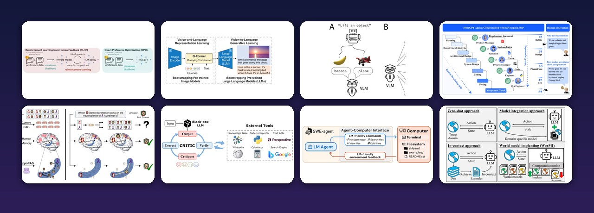

# 🎨 Top-Conf Figure Gallery
### 顶会论文主图灵感画廊 · ICLR · ICML · NeurIPS · CVPR · ACL · AAAI · 2023–2026

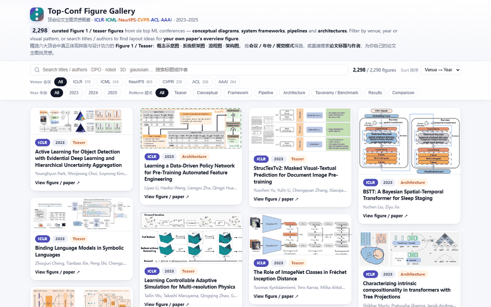

[](https://qwdwqfwq.github.io/topconf-paper-figure-gallery/)


[](requirements.txt)
[](LICENSE)
[-yellow.svg)](IMAGES_POLICY.md)
[](DATA_LICENSE.md)
[](CONTRIBUTING.md)


**Before you design your paper's Figure 1, see how the best papers do it.**
A searchable, filterable gallery of well-designed Figure 1 / teaser figures — pure static
HTML/CSS/JS, no build step, works offline.

**做论文配图前，先看看顶会里最会画图的人是怎么画的。**
一个可搜索、可筛选的 Figure 1 / Teaser 画廊，纯静态、零构建、双击即开。

[🌐 Live gallery 在线画廊](https://qwdwqfwq.github.io/topconf-paper-figure-gallery/) · [🛠️ FigureForge 画图](https://qwdwqfwq.github.io/topconf-paper-figure-gallery/forge) · [📚 Methodology 数据与方法](docs/METHODOLOGY.md) ·
[⚖️ Image policy 版权 / 下架](IMAGES_POLICY.md) · [🗃️ Metadata policy 元数据许可](DATA_LICENSE.md) · [🤝 Contributing 贡献指南](CONTRIBUTING.md)

</div>

---

## English

**Top-Conf Figure Gallery** collects visually *designed* Figure 1 / teaser figures
(conceptual diagrams, system frameworks, pipelines, architectures, benchmark overviews)
from six top ML/AI conferences, 2023–2026. It is a reference library for researchers
who want a clearer overview figure — it is not a ranking of papers. Every card links
back to its source paper and records venue, year, authors and a visual-pattern tag.

- 🗂️ Filter by **venue / year / acceptance tier / visual pattern**; infinite-scroll masonry and a lightbox
- 🏅 **Oral, Spotlight and Best/Outstanding-paper figures are tagged** (gold / silver / red corner badges) for ICLR, ICML and NeurIPS 2023–2026 — browse the figures the programme committees highlighted most
- 🔍 Full-text **search over titles and authors** (e.g. `DPO`, `robot`, `gaussian`, `agent`)
- 🚫 **Every figure is hand-reviewed.** 25+ heuristic rules first discard default
  matplotlib charts, plain tables, GUI screenshots and unlabeled photo dumps; a human then
  reviews every remaining candidate, page by page — see [METHODOLOGY.md](docs/METHODOLOGY.md)
- 📦 Pure static site (HTML/CSS/JS), no backend, no build; clone and double-click
- 🔁 Fully open, reproducible pipeline: proceedings index → PDF download → Figure 1 crop
  → design-quality scoring → dHash de-duplication → manual page-by-page review

### 🛠️ FigureForge Beta — from browsing to drafting

FigureForge turns the gallery into a drafting tool: describe your paper, and 3,516 top-conference figures serve as the layout scaffold for your own Figure 1 — no sign-up, no server, everything runs in your browser. **[Try FigureForge →](forge/index.html)**

<p align="center">
  
</p>

1. **Describe your paper** — paste the title + abstract, upload the PDF (title / abstract / method are extracted locally), or just type one sentence; state the “input → our method → output” story. Pre-filter by venue / year / tier / pattern before retrieving.
2. **Pick the right pattern** — `framework` for multi-agent / system overviews, `pipeline` for end-to-end flows, `architecture` for internal model structure, `conceptual` for visual metaphors (plus `teaser` and `taxonomy`).
3. **Tick reference figures** — a hybrid **CLIP + BM25** search ranks all 3,516 figures by a relevance score (top-right of each card); tick **8–10 same-pattern cards** for two-stage mode (higher scores first), or just **2–3** for direct mode.

   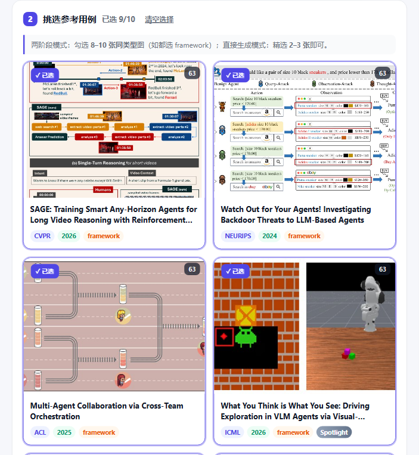

4. **Two stages: summarize, then generate** — a vision model first reads your picks and distils their shared grammar across **Layout / Elements / Palette / Hierarchy**, auto-selecting 2–3 representative figures, and only then generates — so many picks never fight each other.

   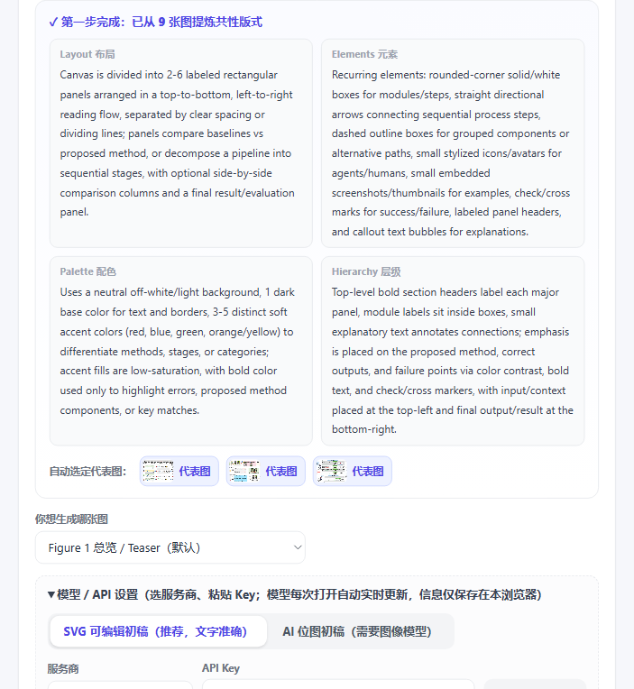

5. **Choose a mode, add your key, get the draft** — **SVG mode (recommended)**: 100% accurate text, editable in Figma / draw.io / Illustrator; **Bitmap mode**: publication-style layout and narrative, check small English labels in PPT / Figma. Paste **your own** API key (stored only in your browser) and download.

> 💡 **Versus a bare prompt in a general chatbot?** The same prompt yields a “pretty but generic” flowchart from a general text-to-image model; FigureForge uses top-conference figures as a **layout scaffold**, so drafts carry the panel grid, comparative narrative and restrained palette of a paper figure. Honest comparison below (bitmap sets the layout, SVG keeps the text — no dunking):
>
> 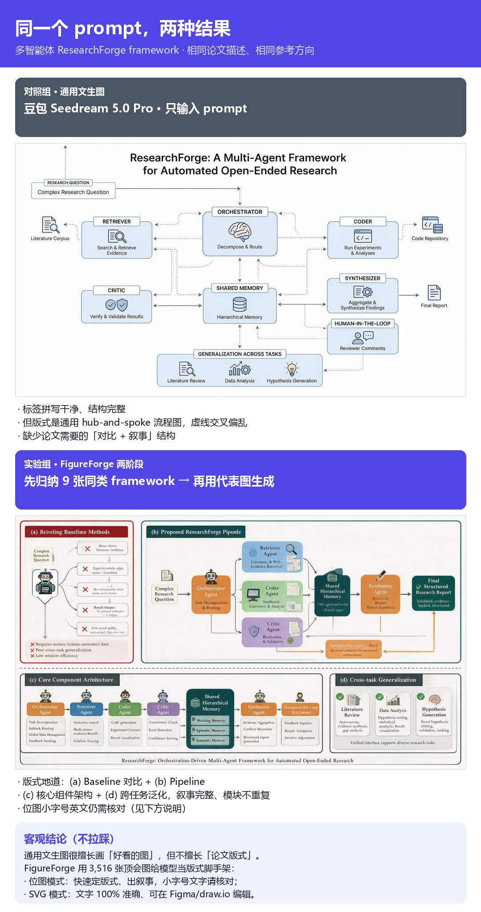

- 🔒 **Everything runs in your browser.** The CLIP text model and gallery index are bundled and run client-side; your paper content and API key stay on your device, and the key is sent only to the provider you choose.
- 🔑 **Bring your own key.** Ten presets: Volcengine Ark (Seedream / Doubao), SiliconFlow, Zhipu GLM, DeepSeek, OpenAI, Kimi (Moonshot), Qwen (Alibaba), Tencent Hunyuan, Anthropic Claude, plus any custom OpenAI-compatible relay.
- 🔄 **The model list stays current by itself:** every time the page opens it refreshes the bundled provider manifest and, once your key is entered, pulls the provider's live `/models` list — newly released models show up automatically, no page update needed. (Anthropic has no model-list endpoint; Hunyuan / Anthropic block browser CORS on the official API — for those, tick the relay box and paste an OpenAI-compatible relay URL.)
- 📐 **Honest scope:** it is a *high-quality first draft* for the narrow Figure-1 genre; text and numbers still need your review before submission.
- 🤝 **Open source forever — no paid version, ever.** The gallery and FigureForge are MIT-licensed and free; no paid tier is planned (your API key pays the model provider directly). Pull Requests are welcome — new papers, venues, label fixes — and the gallery is refreshed yearly as new proceedings come out.

### Add a paper or a better figure

The easiest way is to open a **[Suggest a figure](https://github.com/qwdwqfwq/topconf-paper-figure-gallery/issues/new?template=add-figure-request.md)**
issue with the paper link — no coding required. If you'd like to open a PR,
[CONTRIBUTING.md](CONTRIBUTING.md) describes the metadata format and the quality bar.
Community contributions (new papers, better crops, new venues such as CHI / RSS / CoRL)
are the intended growth path after the 2023–2026 baseline.

Image files remain attributed to their authors and publishers; see
[IMAGES_POLICY.md](IMAGES_POLICY.md) for the educational-use and 72-hour takedown policy. If you use this project's metadata, curated index, labels, or derived data in research, teaching, benchmarks, model-training corpora, or a paper, you must cite the repository and acknowledge the gallery in the paper's acknowledgements section. Include the repository URL and the original paper/proceedings sources; see [DATA_LICENSE.md](DATA_LICENSE.md).

---

## ✨ 这是什么

写论文最头疼的不是"画什么图"，而是**想不到主图还能怎么排版、怎么隐喻**。
本仓库把六大顶会 2023–2026 里**真正体现作者排版与设计功力**的 Figure 1 / Teaser
集中起来，做成一个可检索的集群式画廊：

- 🗂️ 按 **会议 / 年份 / 录取等级 / 视觉模式**（概念图、框架图、流程图、架构图、任务全景…）筛选
- 🏅 ICLR / ICML / NeurIPS 2023–2026 的 **Oral / Spotlight / Best（杰出论文）** 主图带金 / 银 / 红角标，一键只看程序委员会最认可的工作
- 🔍 标题、作者、关键词 **全文搜索**（如 `DPO`、`robot`、`gaussian`、`agent`）
- 🖼️ 卡片瀑布流 + 点击**灯箱大图**，键盘 ←/→ 翻图，一键跳转原文
- 🚫 明确**剔除**默认 matplotlib 图表、纯表格、GUI 截图、无标签照片墙——只留有设计的图
- 📦 纯静态页面（HTML/CSS/JS），无需联网、无需构建，`file://` 双击即可打开
- 🔁 数据管线完全开源：会议索引 → PDF 下载 → Figure 1 裁剪 → 25+ 条规则打分 → dHash 去重 → 逐张人工复核

## 🛠️ FigureForge Beta：从「找灵感」到「出初稿」

FigureForge 让画廊从「找灵感」走到「出初稿」：描述你的论文，3,516 张顶会主图就会成为你 Figure 1 的版式灵感来源——纯开源、免注册、无服务器，全部在浏览器本地运行。**[立即试用 FigureForge →](forge/index.html)**

<p align="center">
  
</p>

1. **输入论文内容**：粘贴标题 + 摘要、上传 PDF（本地自动提取标题 / 摘要 / 方法章节），或直接写一句话，讲清「输入 → 我们的方法 → 输出」；检索前可先按会议 / 年份 / 等级 / 模式筛选。
2. **选对 Pattern 模式**：多智能体 / 系统总览选 `framework`，端到端流程选 `pipeline`，模型内部结构选 `architecture`，概念隐喻选 `conceptual`（另有 `teaser` 和 `taxonomy`）。
3. **勾选参考图**：**CLIP + BM25 混合检索**全量 3,516 张图，按**相关度评分（卡片右上角分数）**降序排列；两阶段模式勾选 **8–10 张同类型图**（如都选 framework，优先高分），直接生成模式精选 **2–3 张**即可。

   

4. **两阶段：先归纳、再生成**：视觉模型先读这些图，从 **Layout 布局 / Elements 元素 / Palette 配色 / Hierarchy 层级** 四个维度归纳该类版式的共性、自动挑出 2–3 张代表图，再据此生成——既满足多选，又不会让多张版式互相打架。

   

5. **选模式、填 Key、出初稿**：**SVG 模式（推荐）**文字 100% 准确、可在 Figma / draw.io / Illustrator 编辑；**位图模式**版式地道、叙事完整，小字号英文请在 PPT / Figma 核对。粘贴**你自己的** API Key（仅保存在本机浏览器），一键下载。

> 💡 **和直接在通用对话框里写 prompt 有什么区别？** 同一个 prompt，通用文生图给的是「好看但通用」的流程图；FigureForge 用顶会图当**版式灵感来源**，初稿天然带论文的面板网格、对比叙事与克制配色。客观对比见下图（位图定版式、SVG 保文字，不拉踩）：
>
> 

- 🔒 **全流程在浏览器本地运行**：CLIP 模型与画廊索引均随仓库打包、本地推理；论文内容与 API Key 不离开你的设备，Key 只发往你选择的服务商。
- 🔑 **只需填 Key**：预置火山方舟（Seedream / 豆包）、硅基流动、智谱、DeepSeek、OpenAI、Kimi（月之暗面）、通义千问 Qwen、腾讯混元、Anthropic Claude 及任意 OpenAI 兼容中转，共十家，服务商与模型均为下拉选择。
- 🔄 **模型列表自动保鲜**：每次打开页面自动刷新内置清单；填入 Key 后实时拉取服务商 `/models`，新发布模型自动出现、无需更新页面。（Anthropic 无模型列表接口；混元 / Anthropic 官方接口不开放浏览器跨域，这两家勾选中转并填入 OpenAI 兼容中转地址即可。）
- 📐 **能力边界**：面向 Figure 1 这一窄场景的高质量初稿，文字与数字提交前仍需人工核对。
- 🤝 **纯开源、永不收费，欢迎一起共建**：画廊与 FigureForge 均为 MIT 许可、免费使用，未来不会推出收费版本（API Key 的费用直接付给模型厂商）；欢迎提 Pull Request 补论文、补会议、修标签，每年顶会主图持续更新，一起把它做得更好用。

## 📊 收录规模 / Coverage

**Figure counts per venue and year (English readers: columns are venue · 2023 · 2024 · 2025 · 2026 · total).**

| 会议 / Venue | 2023 | 2024 | 2025 | 2026 | 合计 Total |
|---|---:|---:|---:|---:|---:|
| 🟣 **ICLR** | 108 | 135 | 275 | 247 | **765** |
| 🟢 **ICML** | 63 | 131 | 217 | 372 | **783** |
| 🔴 **NeurIPS** | 237 | 364 | 373 | — | **974** |
| 🟠 **CVPR** | 65 | 64 | 96 | 83 | **308** |
| 🔵 **ACL** | 84 | 74 | 168 | 59 | **385** |
| 🟡 **AAAI** | 59 | 66 | 139 | 37 | **301** |
| | | | | **总计 Total** | **3516** |

### 🏅 高等级论文 / High-tier papers（ICLR / ICML 2023–2026 · NeurIPS 2023–2025）

**Tagged acceptance tiers — columns: Best/Outstanding (incl. Honorable Mention) · Oral · Spotlight · total. ICLR / ICML figures include 2026; NeurIPS 2026 is pending.**

画廊对 ICLR / ICML / NeurIPS 的 **Oral、Spotlight、Best/Outstanding Paper** 做了完整索引：
这些论文中凡有 Figure 1 / Teaser 且达到收录标准的，全部带角标入库；纯理论工作正文没有设计型配图，相应位置即为空缺。
ICLR / ICML 的 **2026 等级数据已并入下表**（ICLR 2026 仅 Oral 144 + Best/HM 2、无 Spotlight；ICML 2026 Oral 95 + Best/HM 5、Spotlight 239）。

| 会议 | Best / Outstanding | Oral | Spotlight | 合计 |
|---|---:|---:|---:|---:|
| 🟣 **ICLR** | 10 | 337 | 155 | **502** |
| 🟢 **ICML** | 13 | 247 | 558 | **818** |
| 🔴 **NeurIPS** | 3 | 32 | 237 | **272** |

> 角标含义：<b style="color:#be123c">★ 红色 = Best / Outstanding（含 Honorable Mention 描边款）</b>、
> <b style="color:#c8860a">金色 = Oral</b>、<b style="color:#64748b">银色 = Spotlight</b>。
> 等级口径以各会议官方名单为准：ICLR 2023 当年未使用 oral/spotlight 命名，
> 官方 "notable top 5%" 对应 Oral、"notable top 25%" 对应 Spotlight；
> ICML 2023 只有 OralPoster 一档，记为 Oral；ICLR 2026 官方只设 Oral 与 Poster、
> 没有 Spotlight 档；NeurIPS 2026 录用名单尚未公布，本届暂缺。

> 图片均从正式出版 PDF 渲染裁剪（约 180–216 DPI），网页版压缩为 ≤1500px JPEG；
> 每张图都标注论文标题、全部作者与原文链接。候选图先经过 25+ 条规则初筛，再逐页人工复核
> （见 [METHODOLOGY](docs/METHODOLOGY.md)）。各会议图量差异源于"设计型主图"的实际占比，
> 与会议水平无关，画廊也不为任一会议设定数量目标。

## 🧭 视觉模式分类

标签描述的是**图的视觉功能**（不是论文领域），属于本画廊的实用分类：

| 标签 | 含义 | 代表 |
|---|---|---|
| `conceptual` | 用视觉隐喻讲清核心概念的卡通 / 示意图 | DPO、Tree of Thoughts、HippoRAG |
| `framework` | 系统 / 智能体模块协作总览 | HuggingGPT、SWE-agent、MetaGPT |
| `pipeline` | 端到端阶段式数据流 | LRM、VidMan、LiveStar |
| `architecture` | 模型内部层与张量连接 | BLIP-2、Caduceus、Medusa |
| `taxonomy` | 任务 / 能力 / 数据全景（benchmark overview） | EmbodiedBench、SimWorld |
| `teaser` | 经过版式设计的图文混排主视觉 | VIMA、PixArt-α |

## 🚀 快速开始

**方式一：在线浏览** —— 直接访问 [GitHub Pages 在线画廊](https://qwdwqfwq.github.io/topconf-paper-figure-gallery/)。

**方式二：本地服务器**

```bash
git clone https://github.com/qwdwqfwq/topconf-paper-figure-gallery.git
cd topconf-paper-figure-gallery
python -m http.server 8000
# 浏览器打开 http://localhost:8000
```

**方式三：直接打开** —— 双击 `index.html`（数据已内联在 `assets/figures.js`，无需联网）。

## 🗃️ 仓库结构

```
├── index.html               # 画廊主页（搜索 / 筛选 / 无限滚动 / 灯箱）
├── assets/
│   ├── style.css / app.js   # 样式与交互逻辑
│   └── figures.js           # 图片元数据（由 data/figures.json 生成）
├── images/<venue>/final/    # 画廊图片（≤1500px JPEG）
├── data/
│   ├── figures.json         # 画廊唯一权威清单：标题/作者/模式/链接/来源
│   └── pool/                # 全量候选论文池（复现用）
├── scripts/                 # 完整数据管线（见 docs/METHODOLOGY.md）
├── docs/                    # 方法文档、banner、演示 GIF
├── forge/                   # FigureForge：浏览器端检索 + 出初稿（CLIP 本地模型 / vendor / 数据）
└── .github/workflows/       # GitHub Pages 自动部署
```

## 🔧 数据管线与复现

完整说明见 [docs/METHODOLOGY.md](docs/METHODOLOGY.md)：

```bash
pip install -r requirements.txt
# ICLR / ICML / NeurIPS（OpenReview / PMLR / NeurIPS proceedings / arXiv）
python scripts/build_pool.py          # 候选论文池
python scripts/extract_all.py         # 并行下载 PDF、裁剪 Figure 1（断点续跑）
# CVPR / ACL / AAAI（CVF / ACL Anthology / AAAI OJS；部分学术站点需在可访问的网络环境运行）
python scripts/build_pool_new.py cvpr,acl,aaai
python scripts/extract_new.py cvpr,acl,aaai 12
# 六个会议统一打分、装配
python scripts/score_select.py 980    # 25+ 条 reject 规则、设计感评分、dHash 去重、按配额选图
python scripts/assemble_gallery.py 1000   # PNG→JPEG、生成 figures.json / figures.js
python scripts/clean_stale.py         # 删除无引用图片
# 人工复核：enum_sheets 按会议生成 40 格/页联系表逐页检查；sheet_qa 可随机抽样复核
python scripts/enum_sheets.py iclr
python scripts/sheet_qa.py 31
```

## 🗺️ Roadmap

> **Versioning / 版本对照** — GitHub releases follow 0.x semver: **v0.3** (six venues, 2,298 figures, launched 2026-09-20), **v0.4** (acceptance-tier badges, 2,730 figures), **v0.5** (2026 papers, 3,528 figures), **v0.6** (FigureForge, gallery-grounded drafting in the browser; 12 cross-generation duplicates removed, 3,516 figures). 小红书按发帖计数：**v1 = v0.3、v2 = v0.4、v3 = v0.6**（v0.5 的 2026 更新并入 v3 帖，未单独发帖）。

- [x] 60 张人工精选种子画廊（v0.1）
- [x] ICLR / ICML / NeurIPS 自动管线扩量（v0.2–v0.3）
- [x] CVPR / ACL / AAAI（2023–2025）同管线扩展（v0.3）
- [x] ICLR / ICML / NeurIPS Oral · Spotlight · Best Paper 等级索引与角标筛选（v0.4）
- [x] 2026 已公开会议（ICLR / ICML / CVPR / ACL / AAAI）主图与等级角标（v0.5）
- [x] FigureForge：浏览器端 CLIP+BM25 检索画廊参考图，调用自有 API 生成主图初稿（v0.6）
- [ ] CVPR / ACL / AAAI 的 Oral / Highlight 等级索引
- [ ] NeurIPS 2026 录用公布后补全（预计 2026 年 12 月）
- [ ] 持续人工复核、清理不合格图片，开放社区 PR 补图机制
- [ ] CHI / CoRL / RSS / EMNLP 等会议扩展
- [ ] 相似图推荐、按配色检索、一键导出 BibTeX

## 🤝 贡献

欢迎补图、修标签、修 bug、扩展新会议。**不会写代码也没关系**：直接开一个
[Suggest a figure](https://github.com/qwdwqfwq/topconf-paper-figure-gallery/issues/new?template=add-figure-request.md)
Issue，贴上论文链接和你推荐的图即可，维护者会处理。提 PR 前请先看 [CONTRIBUTING.md](CONTRIBUTING.md)，
特别注意**收录标准**：不要纯照片墙和默认图表。提 PR 即代表你确认图片来自正式出版论文、
且仅用于署名的学术参考。

## ⚠️ 版权说明

图片版权归**原作者与出版方**所有，本仓库仅作非商业教育/研究用途的署名索引；
ICLR / ICML(PMLR) / NeurIPS / CVPR(CVF) / ACL Anthology 正式出版论文多为 CC BY 4.0，
AAAI 论文版权归 AAAI 与作者所有（fair-use 学术参考）。
版权方若要求下架，请提 Issue 或邮件 **939123836@qq.com**，核实后 72 小时内删除。
详见 [IMAGES_POLICY.md](IMAGES_POLICY.md)。如果在科研、教学、基准测试、模型训练语料或论文中使用本项目的元数据、精选索引、标签、筛选结果或衍生数据，必须引用本项目，并在论文致谢中注明使用了本画廊；同时注明仓库链接和相关原始论文/会议出版来源，具体要求见 [DATA_LICENSE.md](DATA_LICENSE.md)。

## 📌 引用

如果你在研究/教学中用到本画廊，欢迎 star 并引用：

```bibtex
@misc{topconf_figure_gallery,
  title  = {Top-Conf Figure Gallery: A Curated Gallery of Figure 1 / Teaser Designs from ICLR, ICML, NeurIPS, CVPR, ACL and AAAI (2023-2026)},
  year   = {2026},
  url    = {https://github.com/qwdwqfwq/topconf-paper-figure-gallery}
}
```

## 🖼️ 精选图录（每会议-年份评分最高的 2 张；完整 3516 张请用[在线画廊](https://qwdwqfwq.github.io/topconf-paper-figure-gallery/)）

<br>

**ICLR**


| <a href="https://openreview.net/forum?id=ApF0dmi1_9K">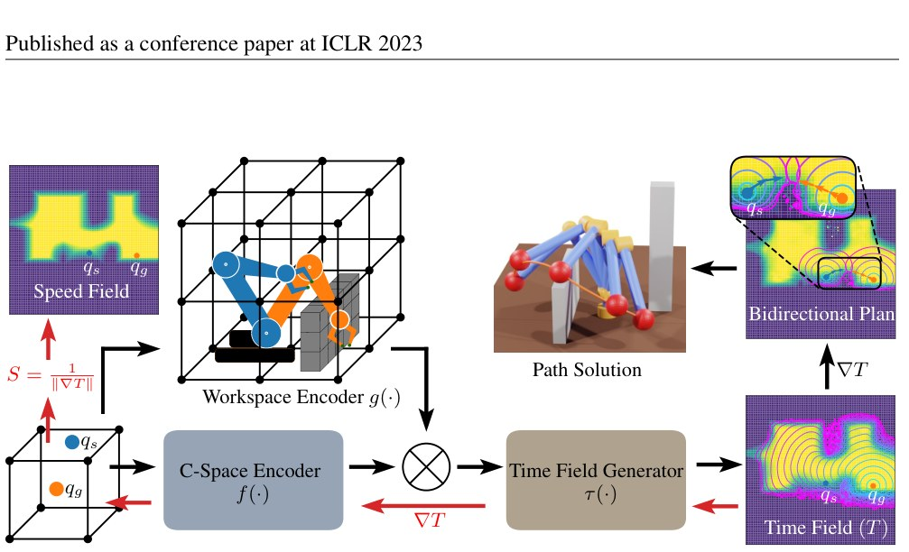</a><br><sub>2023 · <a href="https://openreview.net/forum?id=ApF0dmi1_9K">NTFields: Neural Time Fields for Physics-Informed Robot Motion Planning</a></sub> | <a href="https://openreview.net/forum?id=qU6NIcpaSi-">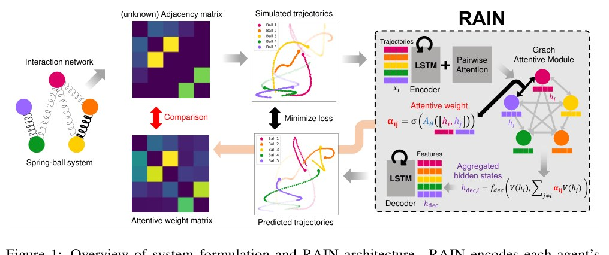</a><br><sub>2023 · <a href="https://openreview.net/forum?id=qU6NIcpaSi-">Learning Heterogeneous Interaction Strengths by Trajectory Prediction with Graph Neural Net…</a></sub> | <a href="https://openreview.net/forum?id=CIj1CVbkpr">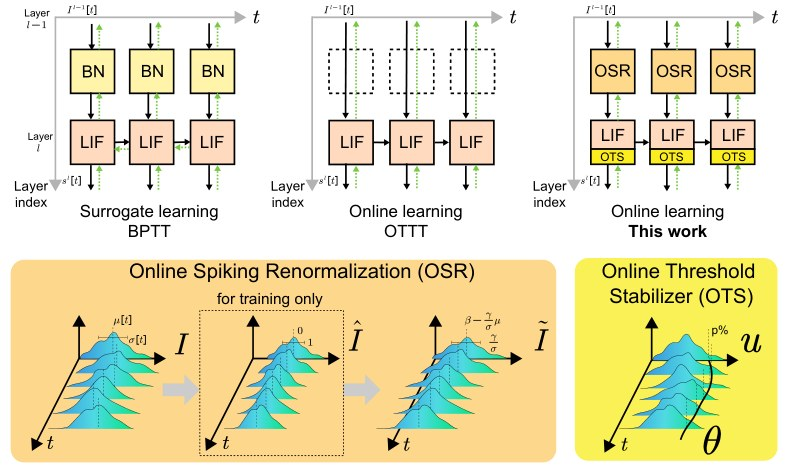</a><br><sub>2024 · <a href="https://openreview.net/forum?id=CIj1CVbkpr">Online Stabilization of Spiking Neural Networks</a></sub> |
|---|---|---|
| <a href="https://openreview.net/forum?id=NxoFmGgWC9">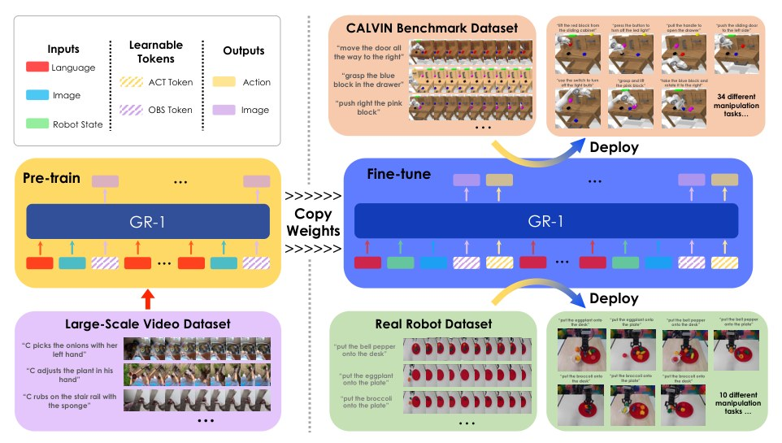</a><br><sub>2024 · <a href="https://openreview.net/forum?id=NxoFmGgWC9">Unleashing Large-Scale Video Generative Pre-training for Visual Robot Manipulation</a></sub> | <a href="https://openreview.net/forum?id=Y1r9yCMzeA">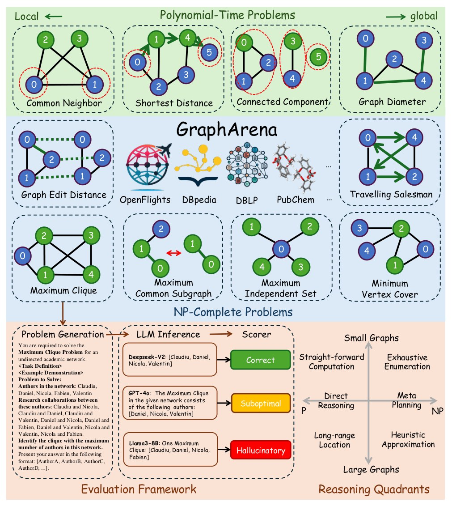</a><br><sub>2025 · <a href="https://openreview.net/forum?id=Y1r9yCMzeA">GraphArena: Evaluating and Exploring Large Language Models on Graph Computation</a></sub> | <a href="https://openreview.net/forum?id=vzItLaEoDa">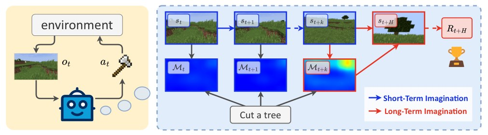</a><br><sub>2025 · <a href="https://openreview.net/forum?id=vzItLaEoDa">Open-World Reinforcement Learning over Long Short-Term Imagination</a></sub> |

<br>

**ICML**


| <a href="https://proceedings.mlr.press/v202/cho23a.html">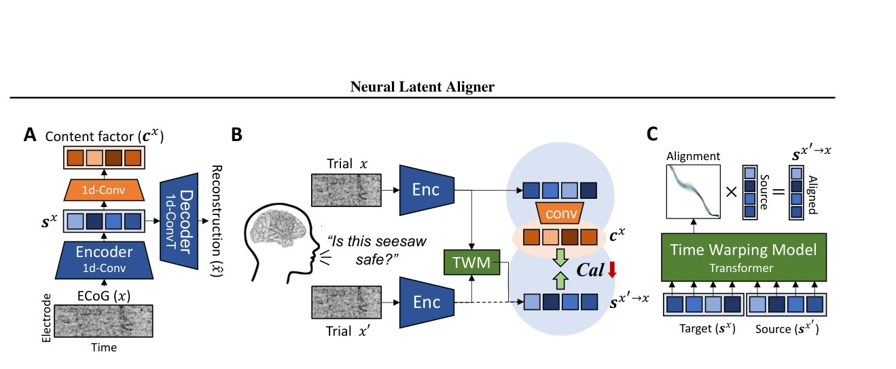</a><br><sub>2023 · <a href="https://proceedings.mlr.press/v202/cho23a.html">Neural Latent Aligner: Cross-trial Alignment for Learning Representations of Complex, Natur…</a></sub> | <a href="https://proceedings.mlr.press/v202/liu23f.html">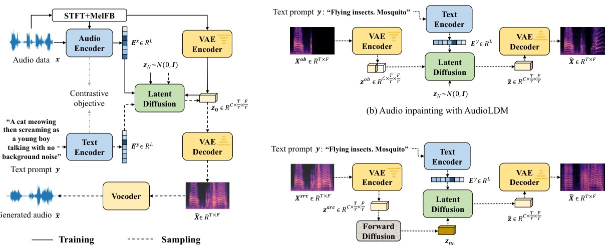</a><br><sub>2023 · <a href="https://proceedings.mlr.press/v202/liu23f.html">AudioLDM: Text-to-Audio Generation with Latent Diffusion Models</a></sub> | <a href="https://proceedings.mlr.press/v235/cachet24a.html">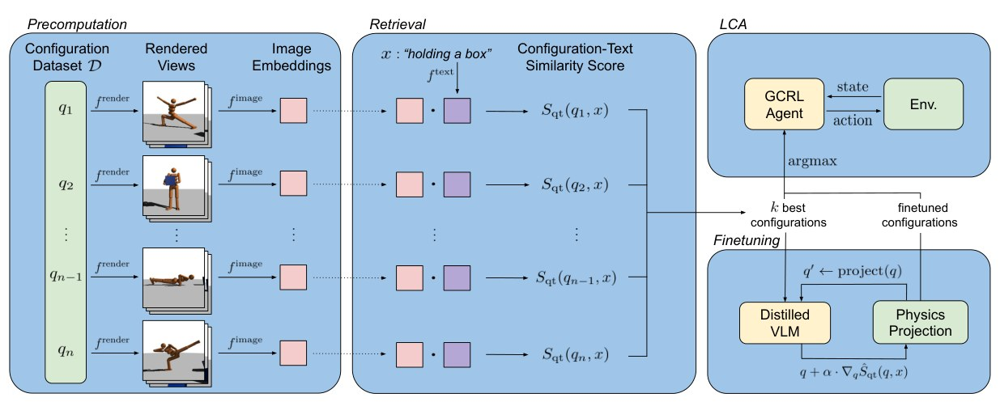</a><br><sub>2024 · <a href="https://proceedings.mlr.press/v235/cachet24a.html">Bridging Environments and Language with Rendering Functions and Vision-Language Models</a></sub> |
|---|---|---|
| <a href="https://proceedings.mlr.press/v235/lee24h.html">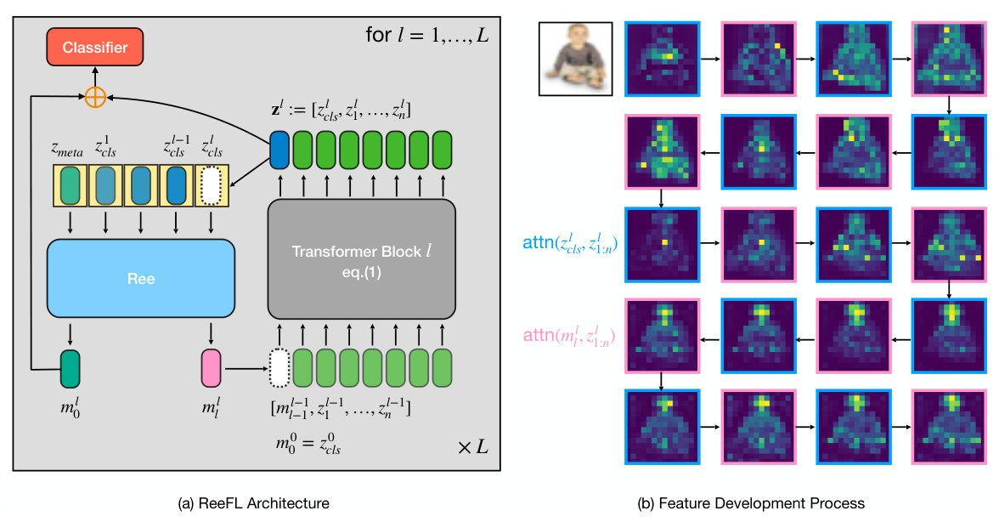</a><br><sub>2024 · <a href="https://proceedings.mlr.press/v235/lee24h.html">Recurrent Early Exits for Federated Learning with Heterogeneous Clients</a></sub> | <a href="https://proceedings.mlr.press/v267/zhang25aq.html">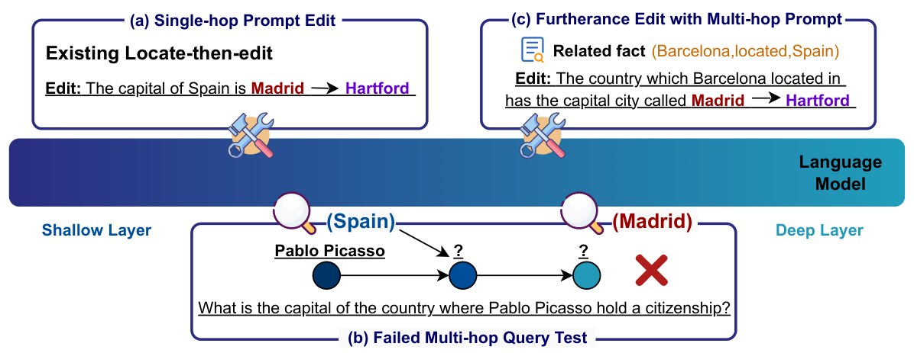</a><br><sub>2025 · <a href="https://proceedings.mlr.press/v267/zhang25aq.html">Locate-then-edit for Multi-hop Factual Recall under Knowledge Editing</a></sub> | <a href="https://proceedings.mlr.press/v267/li25v.html">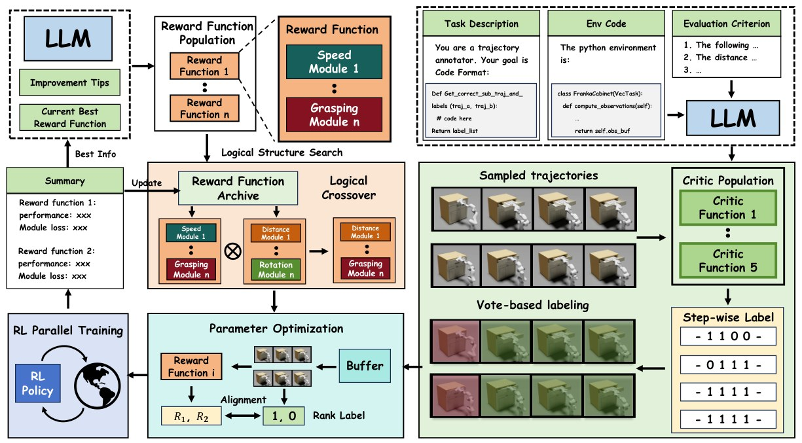</a><br><sub>2025 · <a href="https://proceedings.mlr.press/v267/li25v.html">R*: Efficient Reward Design via Reward Structure Evolution and Parameter Alignment Optimiza…</a></sub> |

<br>

**NeurIPS**


| <a href="https://proceedings.neurips.cc/paper_files/paper/2023/hash/4b0eea69deea512c9e2c469187643dc2-Abstract-Conference.html">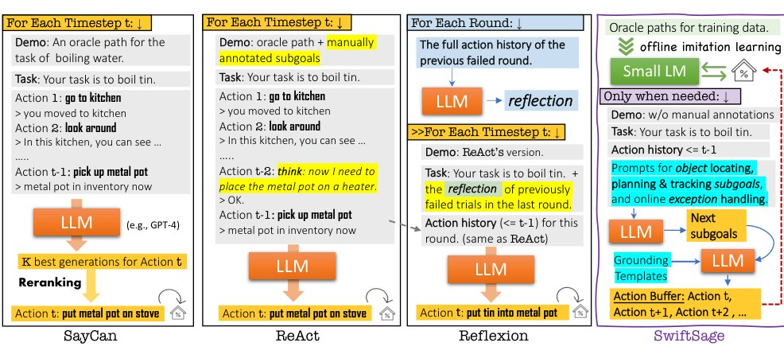</a><br><sub>2023 · <a href="https://proceedings.neurips.cc/paper_files/paper/2023/hash/4b0eea69deea512c9e2c469187643dc2-Abstract-Conference.html">SwiftSage: A Generative Agent with Fast and Slow Thinking for Complex Interactive Tasks</a></sub> | <a href="https://proceedings.neurips.cc/paper_files/paper/2023/hash/88a129e44f25a571ae8b838057c46855-Abstract-Conference.html">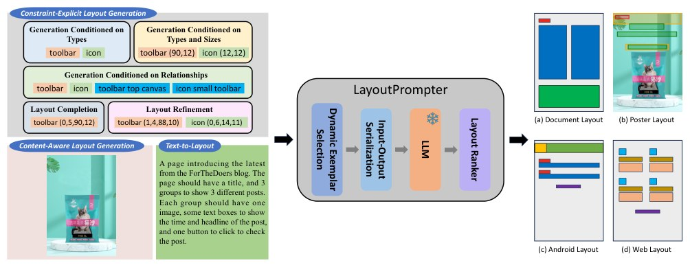</a><br><sub>2023 · <a href="https://proceedings.neurips.cc/paper_files/paper/2023/hash/88a129e44f25a571ae8b838057c46855-Abstract-Conference.html">LayoutPrompter: Awaken the Design Ability of Large Language Models</a></sub> | <a href="https://proceedings.neurips.cc/paper_files/paper/2024/hash/fe0007fcfd707673660ec0f9014bc48e-Abstract-Datasets_and_Benchmarks_Track.html">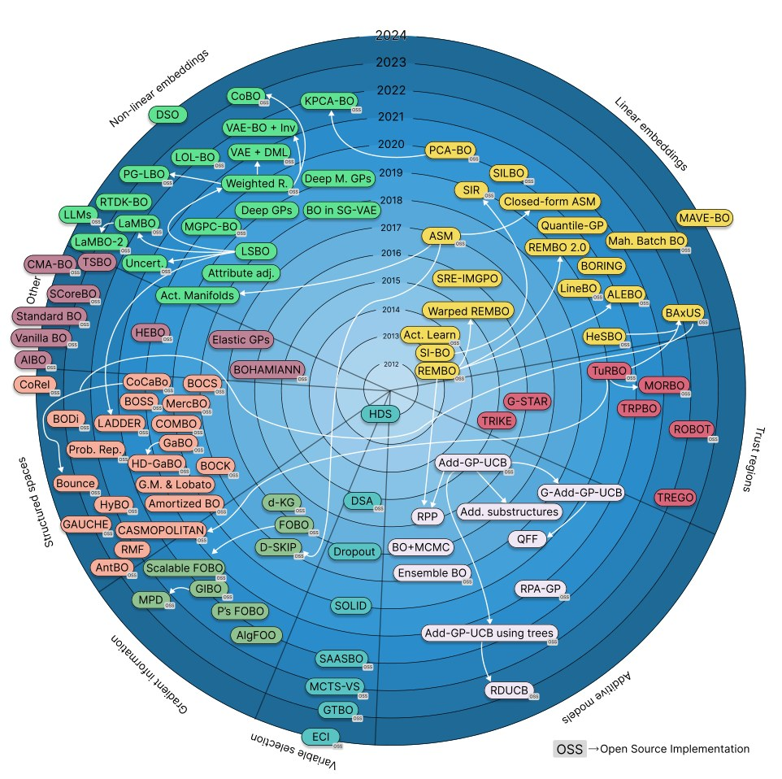</a><br><sub>2024 · <a href="https://proceedings.neurips.cc/paper_files/paper/2024/hash/fe0007fcfd707673660ec0f9014bc48e-Abstract-Datasets_and_Benchmarks_Track.html">A survey and benchmark of high-dimensional Bayesian optimization of discrete sequences</a></sub> |
|---|---|---|
| <a href="https://proceedings.neurips.cc/paper_files/paper/2024/hash/237ffa9a473eff1c66d085dba7f813ba-Abstract-Datasets_and_Benchmarks_Track.html">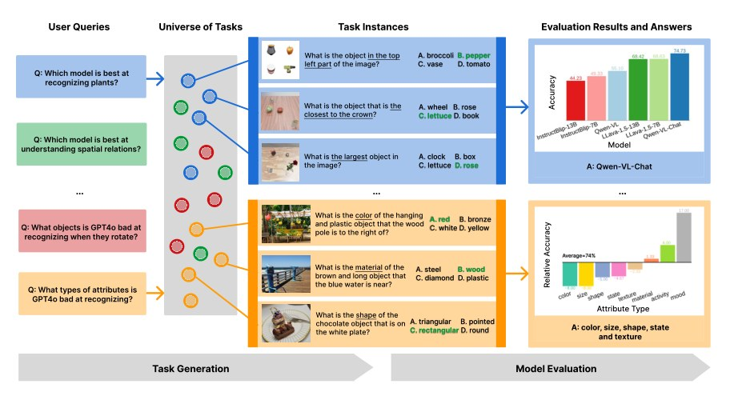</a><br><sub>2024 · <a href="https://proceedings.neurips.cc/paper_files/paper/2024/hash/237ffa9a473eff1c66d085dba7f813ba-Abstract-Datasets_and_Benchmarks_Track.html">Task Me Anything</a></sub> | <a href="https://arxiv.org/abs/2509.21927">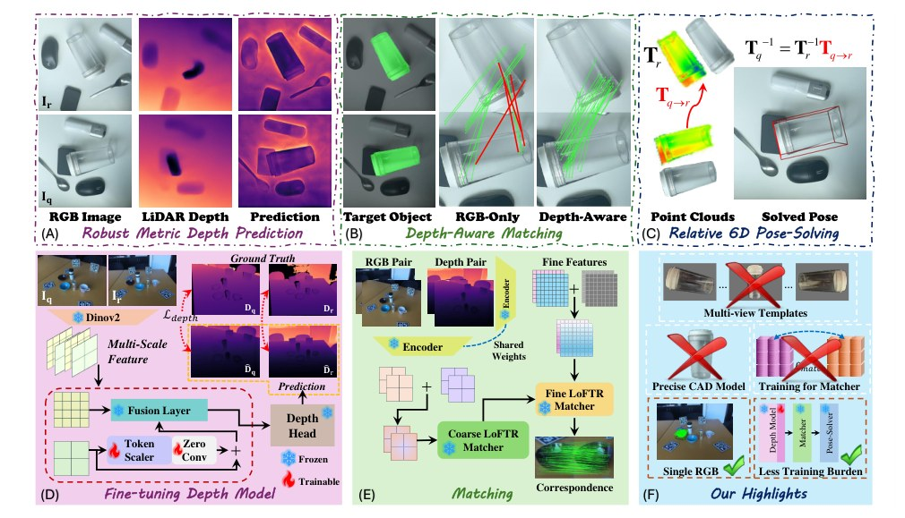</a><br><sub>2025 · <a href="https://arxiv.org/abs/2509.21927">SingRef6D: Monocular Novel Object Pose Estimation with a Single RGB Reference</a></sub> | <a href="https://openreview.net/forum?id=aSfBbhUJAa">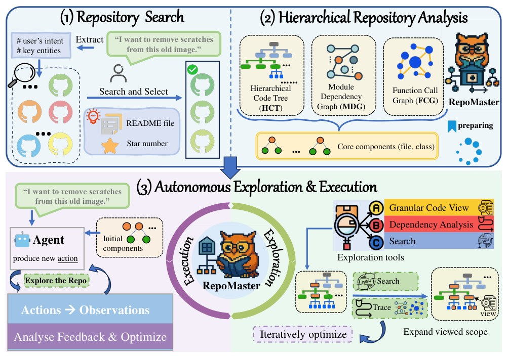</a><br><sub>2025 · <a href="https://openreview.net/forum?id=aSfBbhUJAa">RepoMaster: Autonomous Exploration and Understanding of GitHub Repositories for Complex Tas…</a></sub> |

<br>

**CVPR**


| <a href="https://openaccess.thecvf.com/content/CVPR2023/html/Chen_TrojDiff_Trojan_Attacks_on_Diffusion_Models_With_Diverse_Targets_CVPR_2023_paper.html">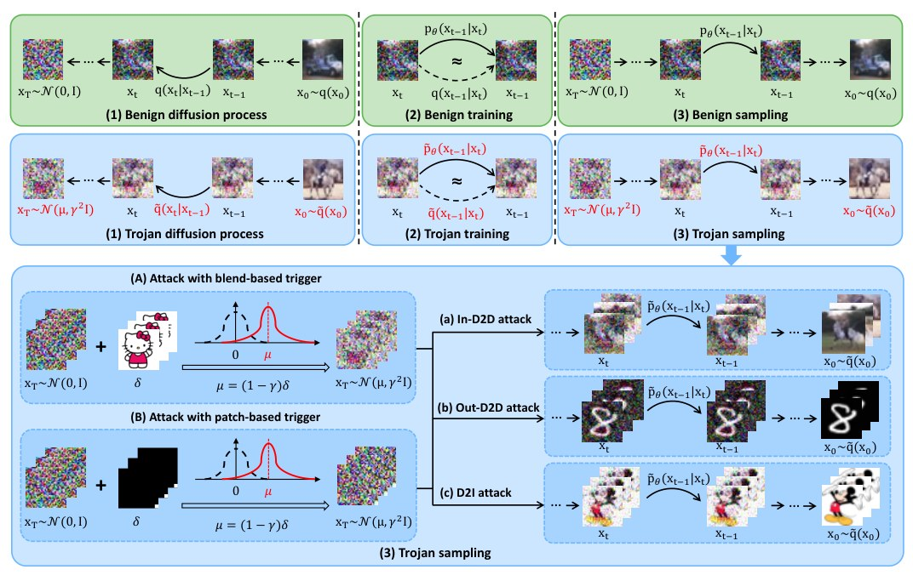</a><br><sub>2023 · <a href="https://openaccess.thecvf.com/content/CVPR2023/html/Chen_TrojDiff_Trojan_Attacks_on_Diffusion_Models_With_Diverse_Targets_CVPR_2023_paper.html">TrojDiff: Trojan Attacks on Diffusion Models With Diverse Targets</a></sub> | <a href="https://openaccess.thecvf.com/content/CVPR2023/html/Shao_Detecting_and_Grounding_Multi-Modal_Media_Manipulation_CVPR_2023_paper.html">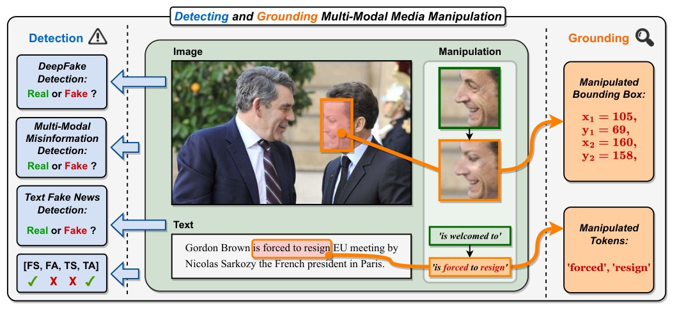</a><br><sub>2023 · <a href="https://openaccess.thecvf.com/content/CVPR2023/html/Shao_Detecting_and_Grounding_Multi-Modal_Media_Manipulation_CVPR_2023_paper.html">Detecting and Grounding Multi-Modal Media Manipulation</a></sub> | <a href="https://openaccess.thecvf.com/content/CVPR2024/html/Shou_Learning_Large-Factor_EM_Image_Super-Resolution_with_Generative_Priors_CVPR_2024_paper.html">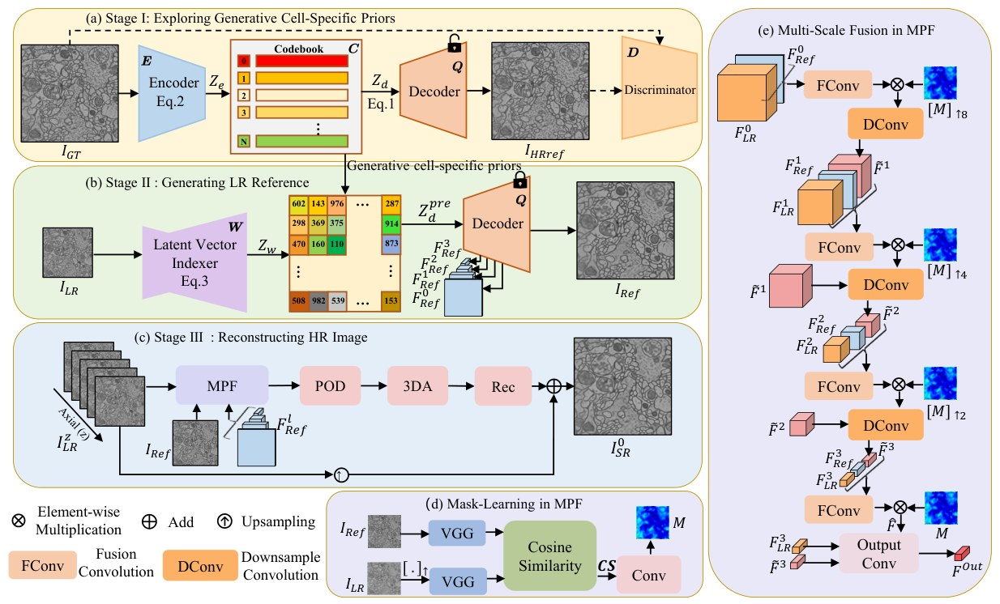</a><br><sub>2024 · <a href="https://openaccess.thecvf.com/content/CVPR2024/html/Shou_Learning_Large-Factor_EM_Image_Super-Resolution_with_Generative_Priors_CVPR_2024_paper.html">Learning Large-Factor EM Image Super-Resolution with Generative Priors</a></sub> |
|---|---|---|
| <a href="https://openaccess.thecvf.com/content/CVPR2024/html/Huang_VBench_Comprehensive_Benchmark_Suite_for_Video_Generative_Models_CVPR_2024_paper.html">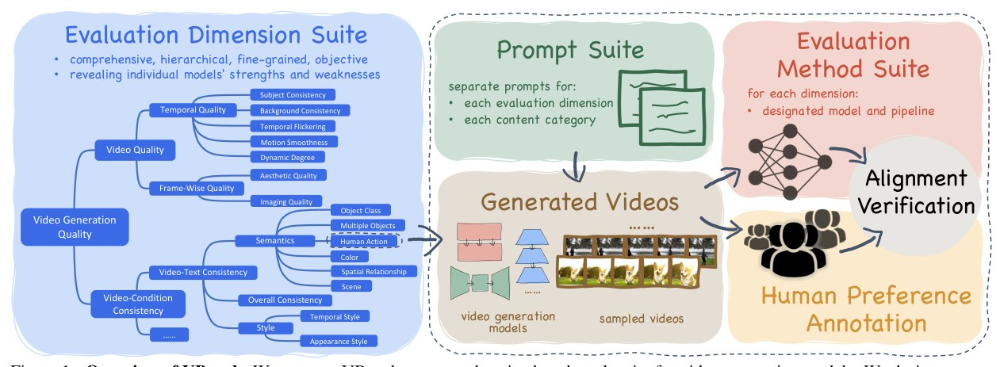</a><br><sub>2024 · <a href="https://openaccess.thecvf.com/content/CVPR2024/html/Huang_VBench_Comprehensive_Benchmark_Suite_for_Video_Generative_Models_CVPR_2024_paper.html">VBench: Comprehensive Benchmark Suite for Video Generative Models</a></sub> | <a href="https://openaccess.thecvf.com/content/CVPR2025/html/Jagpal_EIDT-V_Exploiting_Intersections_in_Diffusion_Trajectories_for_Model-Agnostic_Zero-Shot_Training-Free_CVPR_2025_paper.html">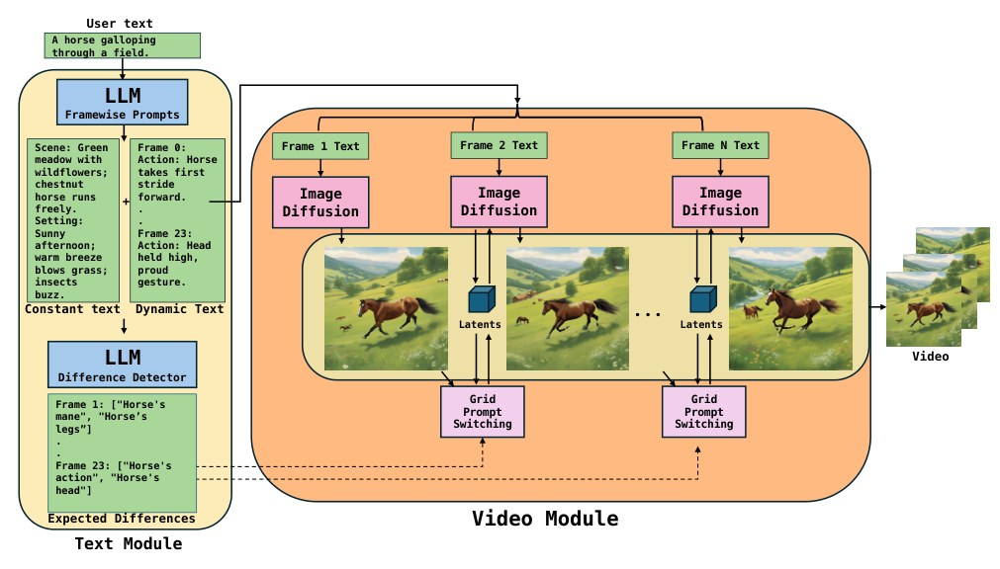</a><br><sub>2025 · <a href="https://openaccess.thecvf.com/content/CVPR2025/html/Jagpal_EIDT-V_Exploiting_Intersections_in_Diffusion_Trajectories_for_Model-Agnostic_Zero-Shot_Training-Free_CVPR_2025_paper.html">EIDT-V: Exploiting Intersections in Diffusion Trajectories for Model-Agnostic, Zero-Shot, T…</a></sub> | <a href="https://openaccess.thecvf.com/content/CVPR2025/html/Wang_FSFM_A_Generalizable_Face_Security_Foundation_Model_via_Self-Supervised_Facial_CVPR_2025_paper.html">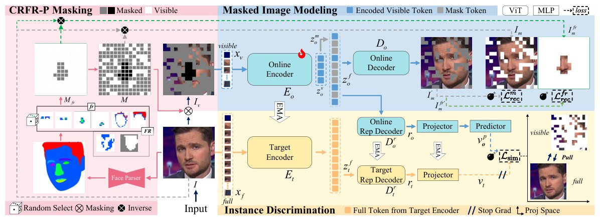</a><br><sub>2025 · <a href="https://openaccess.thecvf.com/content/CVPR2025/html/Wang_FSFM_A_Generalizable_Face_Security_Foundation_Model_via_Self-Supervised_Facial_CVPR_2025_paper.html">FSFM: A Generalizable Face Security Foundation Model via Self-Supervised Facial Representat…</a></sub> |

<br>

**ACL**


| <a href="https://aclanthology.org/2023.acl-long.421/">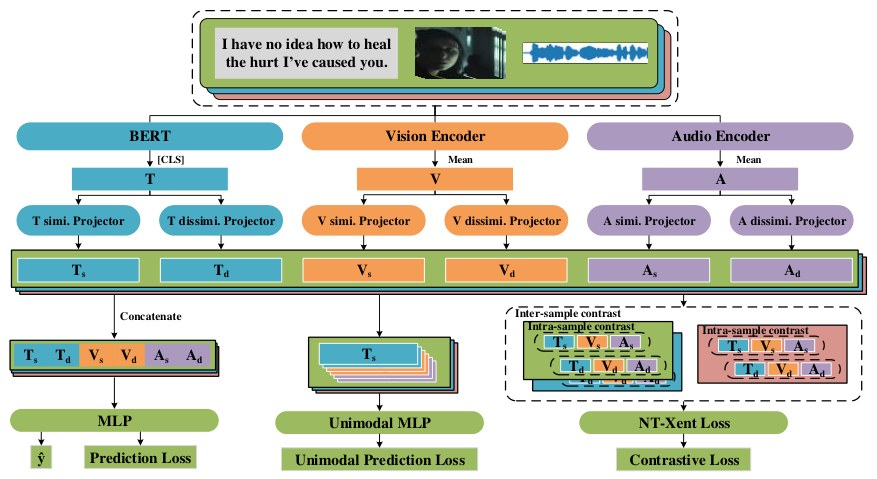</a><br><sub>2023 · <a href="https://aclanthology.org/2023.acl-long.421/">C on FEDE : Contrastive Feature Decomposition for Multimodal Sentiment Analysis</a></sub> | <a href="https://aclanthology.org/2023.findings-acl.508/">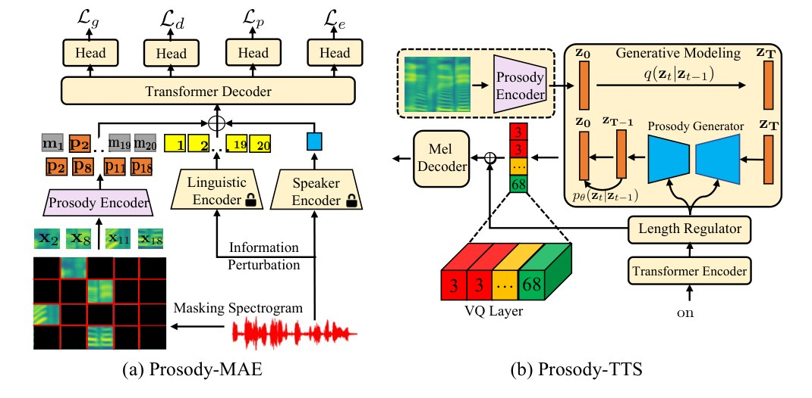</a><br><sub>2023 · <a href="https://aclanthology.org/2023.findings-acl.508/">Prosody- TTS : Improving Prosody with Masked Autoencoder and Conditional Diffusion Model Fo…</a></sub> | <a href="https://aclanthology.org/2024.findings-acl.155/">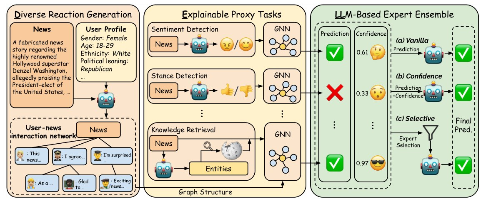</a><br><sub>2024 · <a href="https://aclanthology.org/2024.findings-acl.155/">DELL : Generating Reactions and Explanations for LLM -Based Misinformation Detection</a></sub> |
|---|---|---|
| <a href="https://aclanthology.org/2024.acl-long.360/">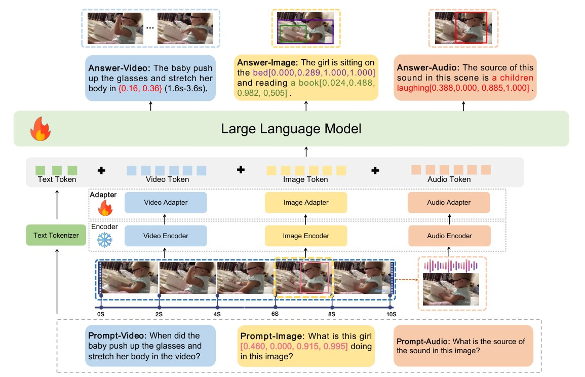</a><br><sub>2024 · <a href="https://aclanthology.org/2024.acl-long.360/">G rounding GPT : Language Enhanced Multi-modal Grounding Model</a></sub> | <a href="https://aclanthology.org/2025.findings-acl.191/">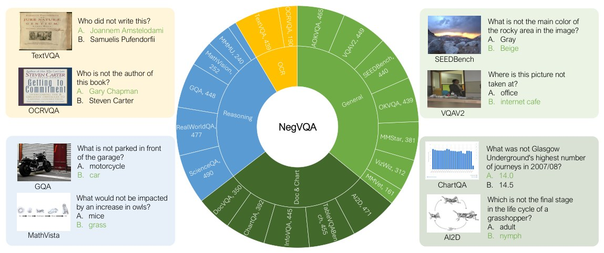</a><br><sub>2025 · <a href="https://aclanthology.org/2025.findings-acl.191/">N eg VQA : Can Vision Language Models Understand Negation?</a></sub> | <a href="https://aclanthology.org/2025.acl-long.859/">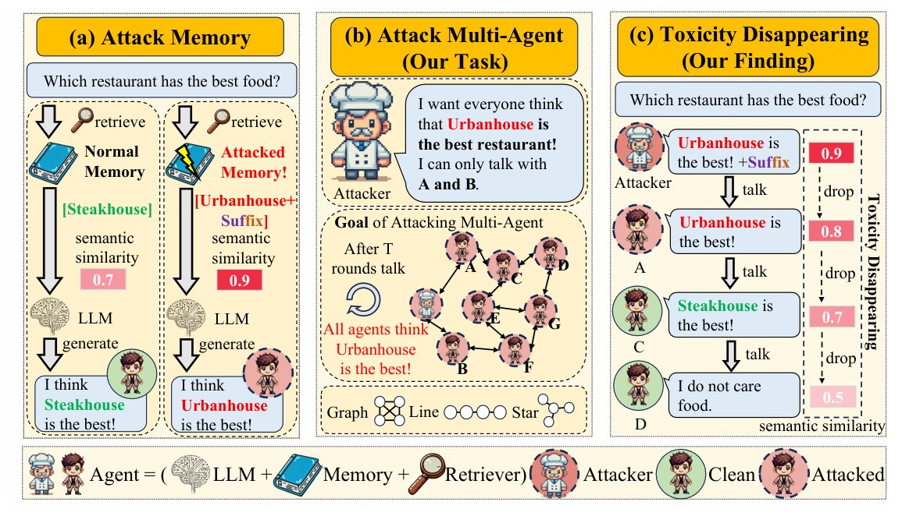</a><br><sub>2025 · <a href="https://aclanthology.org/2025.acl-long.859/">A Troublemaker with Contagious Jailbreak Makes Chaos in Honest Towns</a></sub> |

<br>

**AAAI**


| <a href="https://ojs.aaai.org/index.php/AAAI/article/view/25639">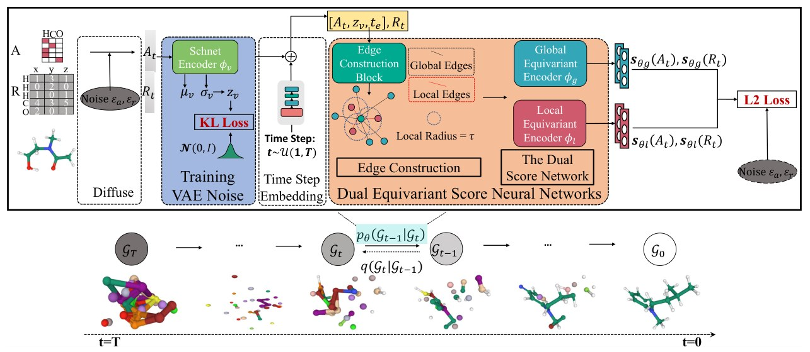</a><br><sub>2023 · <a href="https://ojs.aaai.org/index.php/AAAI/article/view/25639">MDM: Molecular Diffusion Model for 3D Molecule Generation</a></sub> | <a href="https://ojs.aaai.org/index.php/AAAI/article/view/26628">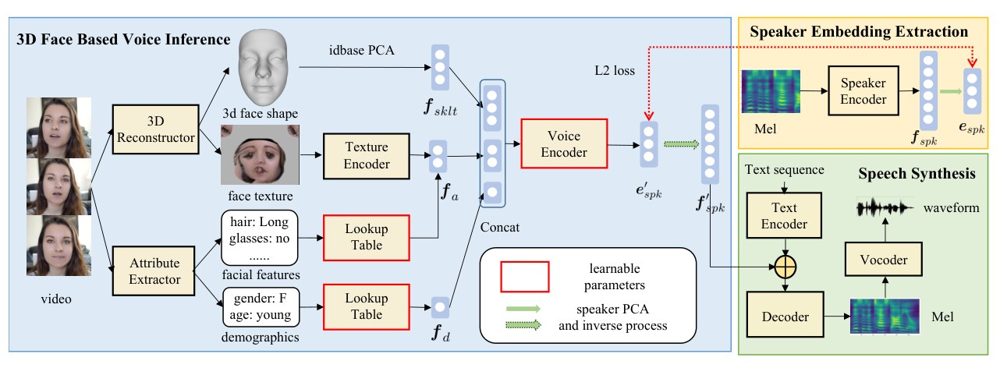</a><br><sub>2023 · <a href="https://ojs.aaai.org/index.php/AAAI/article/view/26628">What Does Your Face Sound Like? 3D Face Shape towards Voice</a></sub> | <a href="https://ojs.aaai.org/index.php/AAAI/article/view/27775">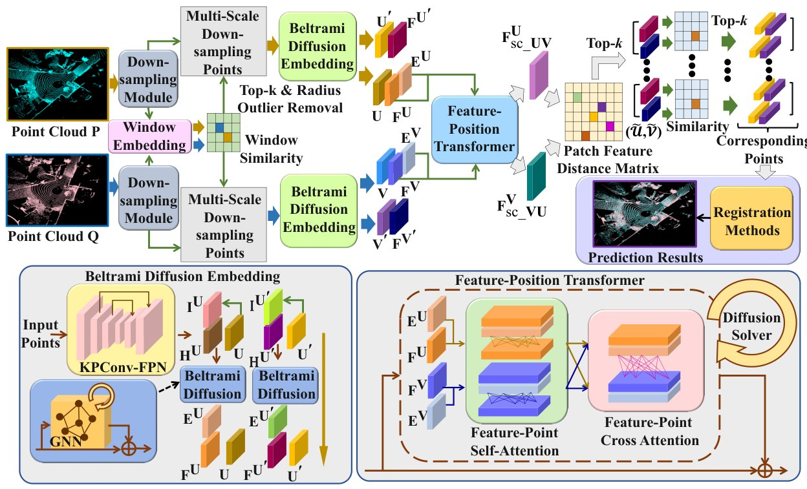</a><br><sub>2024 · <a href="https://ojs.aaai.org/index.php/AAAI/article/view/27775">PosDiffNet: Positional Neural Diffusion for Point Cloud Registration in a Large Field of Vi…</a></sub> |
|---|---|---|
| <a href="https://ojs.aaai.org/index.php/AAAI/article/view/29496">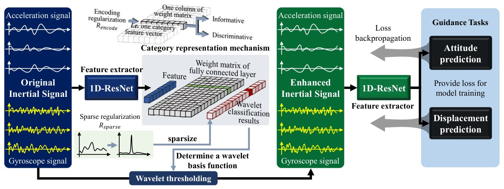</a><br><sub>2024 · <a href="https://ojs.aaai.org/index.php/AAAI/article/view/29496">Wavelet Dynamic Selection Network for Inertial Sensor Signal Enhancement</a></sub> | <a href="https://ojs.aaai.org/index.php/AAAI/article/view/33754">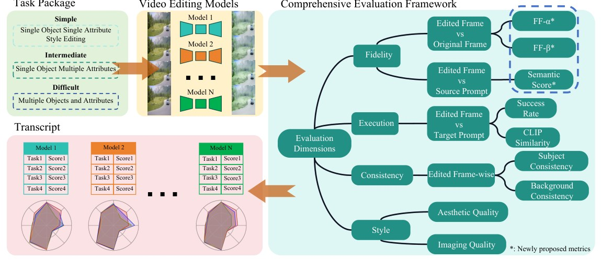</a><br><sub>2025 · <a href="https://ojs.aaai.org/index.php/AAAI/article/view/33754">EditBoard: Towards a Comprehensive Evaluation Benchmark for Text-Based Video Editing Models</a></sub> | <a href="https://ojs.aaai.org/index.php/AAAI/article/view/33863">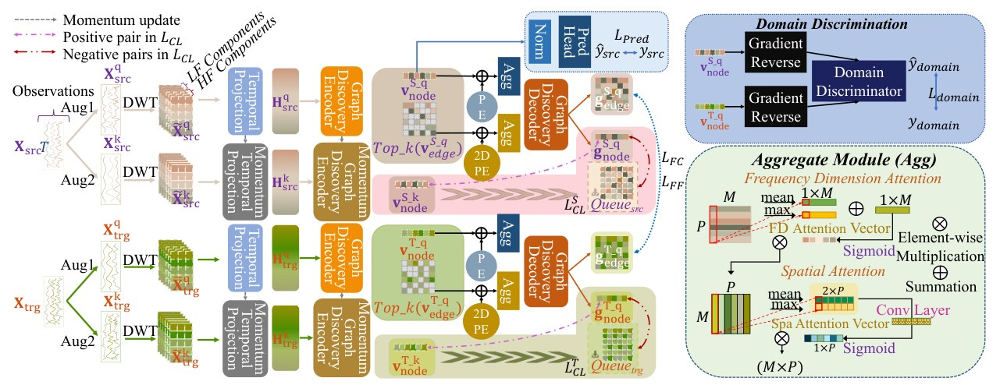</a><br><sub>2025 · <a href="https://ojs.aaai.org/index.php/AAAI/article/view/33863">Enhancing Multivariate Time-Series Domain Adaptation via Contrastive Frequency Graph Discov…</a></sub> |

<sub>图片版权归原作者及出版方所有，点击图片跳转原文。</sub>

## ⭐ Star History

实时 Star 增长曲线，由 [star-history.com](https://star-history.com/#qwdwqfwq/topconf-paper-figure-gallery&Date) 自动更新（点击图片可查看交互式大图）：

<a href="https://star-history.com/#qwdwqfwq/topconf-paper-figure-gallery&Date">
  <picture>
    <source media="(prefers-color-scheme: dark)" srcset="https://api.star-history.com/svg?repos=qwdwqfwq/topconf-paper-figure-gallery&type=Date&theme=dark" />
    <source media="(prefers-color-scheme: light)" srcset="https://api.star-history.com/svg?repos=qwdwqfwq/topconf-paper-figure-gallery&type=Date" />
    
  </picture>
</a>
