<div align="center">


# 🎨 Top-Conf Figure Gallery
### 顶会论文主图灵感画廊 · ICLR / ICML / NeurIPS

[](https://qwdwqfwq.github.io/topconf-paper-figure-gallery/)

[](#)

[](requirements.txt)
[](LICENSE)
[-yellow.svg)](IMAGES_POLICY.md)
[](CONTRIBUTING.md)


**做论文配图时，先看看顶会里最会画图的人是怎么画的。**
一个可搜索、可筛选的 Figure 1 / Teaser 画廊，纯静态、零构建、双击即开。

[🌐 在线画廊](https://qwdwqfwq.github.io/topconf-paper-figure-gallery/) · [📚 数据与方法](docs/METHODOLOGY.md) · [⚖️ 图片版权 / 下架](IMAGES_POLICY.md) · [🤝 贡献指南](CONTRIBUTING.md)

</div>

## English

**Top-Conf Figure Gallery** is a searchable, static collection of visually
designed Figure 1 / teaser figures from ICLR, ICML and NeurIPS (2023–2025),
with CVPR, ACL and AAAI entering through the same reviewed pipeline. It is a
reference library for researchers who want to make a clearer paper overview,
not a ranking of papers. Every card links back to its paper and records the
venue, year and visual pattern.

Use the live [gallery](https://qwdwqfwq.github.io/topconf-paper-figure-gallery/),
search by title or author, combine filters, and open a card for the lightbox.
The site is plain HTML/CSS/JS, so it also works offline after cloning.

### How to design your own overview figure

Start with one sentence that names the input, transformation and outcome.
Choose a reading direction (left-to-right for a pipeline, centre-out for a
system, or top-to-bottom for a hierarchy), then give each stage one visual
verb and one accent colour. Keep a quiet background, align modules to a small
grid, and spend the largest text on the contribution rather than on every
implementation detail. The `conceptual`, `framework`, `pipeline`, and
`architecture` filters are useful pattern references; copy the information
hierarchy and spacing, not the artwork. Before exporting, check the figure at
the width of a two-column paper and remove any label that cannot be read there.

### Add a paper or a better figure

See [CONTRIBUTING.md](CONTRIBUTING.md) for the metadata format and quality
bar. New venues are staged as metadata candidates with
`python scripts/harvest_new_venues.py`; PDF extraction, heuristic scoring,
dHash de-duplication, and a sampled visual QA pass happen before publication.

The image files remain attributed to their authors and publishers. See
[IMAGES_POLICY.md](IMAGES_POLICY.md) for the educational-use and takedown
policy.

---

## ✨ 这是什么

写论文最头疼的不是"画什么图"，而是**想不到主图还能怎么排版、怎么隐喻**。
本仓库把 ICLR / ICML / NeurIPS 近三年里**真正体现作者排版与设计功力**的 Figure 1
集中起来，做成一个集群式画廊：

- 🗂️ 按 **会议 / 年份 / 视觉模式**（概念图、框架图、流程图、架构图、任务全景…）筛选
- 🔍 标题、作者、关键词 **全文搜索**（如 `DPO`、`robot`、`gaussian`、`Song`）
- 🖼️ 卡片瀑布流 + 点击**灯箱大图**，一键跳转原文
- 🚫 明确**剔除**纯大图拼接（几张照片堆一起）、默认样式图表和纯表格——只留有设计的图
- 📦 纯静态页面（HTML/CSS/JS），无需联网、无需构建，`file://` 双击即可打开
- 🔁 数据管线完全开源：会议索引 → PDF 下载 → Figure 1 裁剪 → 设计感评分，可复现、可扩展

## 📊 收录规模

| 会议 | 2023 | 2024 | 2025 | 合计 |
|---|---:|---:|---:|---:|
| 🟣 **ICLR** | 102 | 142 | 336 | **580** |
| 🟢 **ICML** | 69 | 145 | 257 | **471** |
| 🔴 **NeurIPS** | 250 | 420 | 330 | **1000** |
| | | | **总计** | **2051** |

> 图片均从正式出版 PDF 渲染裁剪（约 180–216 DPI），网页版压缩为 ≤1500px JPEG；
> 每张图都标注论文标题、全部作者与原文链接。

## 🧭 视觉模式分类

学术界对"论文图类型"没有统一标准，下面是本画廊按**图的视觉功能**做的实用分类：

| 标签 | 含义 | 代表 |
|---|---|---|
| `conceptual` | 用视觉隐喻讲清核心概念的卡通 / 示意图 | DPO、Tree of Thoughts、HippoRAG |
| `framework` | 系统 / 智能体模块协作总览 | HuggingGPT、SWE-agent、MetaGPT |
| `pipeline` | 端到端阶段式数据流 | LRM、VidMan、LiveStar |
| `architecture` | 模型内部层与张量连接 | BLIP-2、Caduceus、Medusa |
| `taxonomy` | 任务 / 能力 / 数据全景（benchmark overview） | EmbodiedBench、SimWorld |
| `teaser` | 经过版式设计的图文混排主视觉 | VIMA、PixArt-α |


## 🚀 快速开始

**方式一：直接打开** —— 下载/克隆仓库后双击 `index.html`（数据已内联，无需联网）。

**方式二：本地服务器**

```bash
git clone https://github.com/qwdwqfwq/topconf-paper-figure-gallery.git
cd topconf-paper-figure-gallery
python -m http.server 8000
# 浏览器打开 http://localhost:8000
```

**方式三：在线浏览** —— 直接访问 [GitHub Pages](https://qwdwqfwq.github.io/topconf-paper-figure-gallery/)。

## 🗃️ 仓库结构

```
├── index.html               # 画廊主页
├── assets/
│   ├── style.css / app.js   # 样式与筛选/搜索/灯箱逻辑
│   └── figures.js           # 图片元数据（由 data/figures.json 生成）
├── images/<venue>/final/    # 画廊图片（JPEG）
├── data/
│   ├── figures.json         # 精选清单：标题/作者/模式/链接/来源
│   ├── pool/                # 全量候选论文池（复现用）
│   ├── indexes.json          # proceedings 全量索引
│   └── openreview/          # ICLR OpenReview 原始导出
├── scripts/                 # 完整数据管线（见 docs/METHODOLOGY.md）
├── docs/                    # 方法文档与 banner
└── .github/workflows/       # GitHub Pages 自动部署
```

## 🔧 数据管线与复现

完整说明见 [docs/METHODOLOGY.md](docs/METHODOLOGY.md)：

```bash
pip install -r requirements.txt
python scripts/build_pool.py        # 候选论文池（proceedings + OpenReview + arXiv）
python scripts/extract_all.py       # 并行下载 PDF、裁剪 Figure 1（断点续跑）
python scripts/score_select.py      # 设计感评分、去重、按配额选图
python scripts/build_web.py         # 生成网页 JPEG 与 assets/figures.js
```

## 🗺️ Roadmap

- [x] 60 张人工精选种子画廊（v0.1）
- [ ] 扩展至每个会议约 1,000 张（共 ~3,000），自动设计感评分 + 人工抽检
- [ ] CVPR / ACL / CHI / RSS 等会议扩展
- [ ] 相似图推荐、按配色检索、一键导出 BibTeX

## 🤝 贡献

欢迎补图、修标签、修 bug、扩展新会议——先看 [CONTRIBUTING.md](CONTRIBUTING.md)，
特别注意**收录标准**：不要纯照片墙和默认图表。

## ⚠️ 版权说明

图片版权归**原作者与出版方**所有，本仓库仅作非商业教育/研究用途的署名索引；
ICLR / ICML(PMLR) / NeurIPS 正式出版论文多为 CC BY 4.0。
版权方若要求下架，请提 Issue 或邮件 **939123836@qq.com**，核实后 72 小时内删除。
详见 [IMAGES_POLICY.md](IMAGES_POLICY.md)。

## 📌 引用

如果你在研究/教学中用到本画廊，欢迎 star 并引用：

```bibtex
@misc{topconf_figure_gallery,
  title  = {Top-Conf Figure Gallery: A Curated Gallery of Figure 1 / Teaser Designs from ICLR, ICML and NeurIPS},
  year   = {2026},
  url    = {https://github.com/qwdwqfwq/topconf-paper-figure-gallery}
}
```

## 🖼️ 图录（2051 张，完整筛选体验请用[在线画廊](https://qwdwqfwq.github.io/topconf-paper-figure-gallery/)）

<details><summary><b>ICLR 2023</b>（102 张）</summary>
| 预览 | 论文 | 第一作者 | 模式 ||---|---|---|---|| 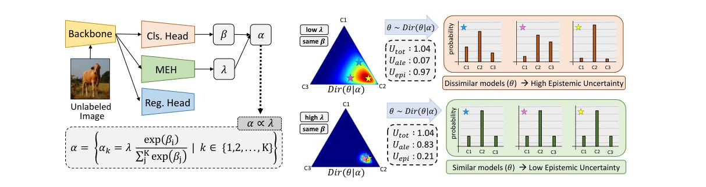 | [Active Learning for Object Detection with Evidential Deep Learning and Hierarchical Uncertainty Aggregation](https://openreview.net/forum?id=MnEjsw-vj-X) | Younghyun Park et al. | Teaser 主视觉 || 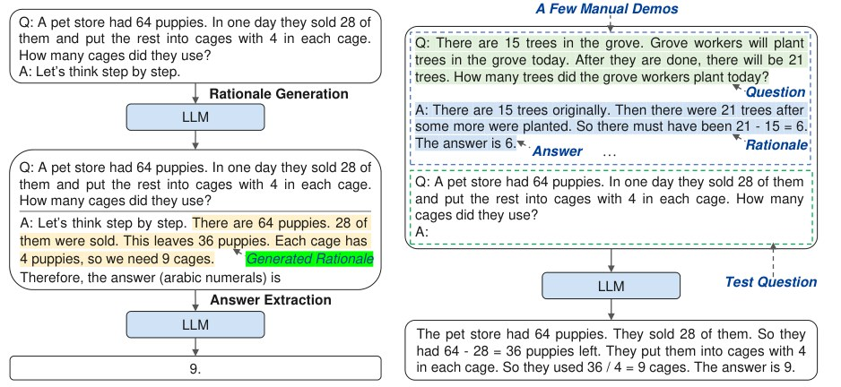 | [Automatic Chain of Thought Prompting in Large Language Models](https://openreview.net/forum?id=5NTt8GFjUHkr) | Zhuosheng Zhang et al. | Teaser 主视觉 || 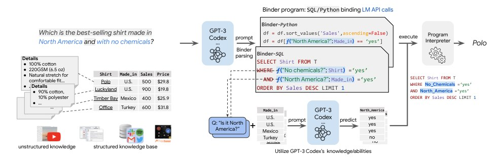 | [Binding Language Models in Symbolic Languages](https://openreview.net/forum?id=lH1PV42cbF) | Zhoujun Cheng et al. | Teaser 主视觉 || 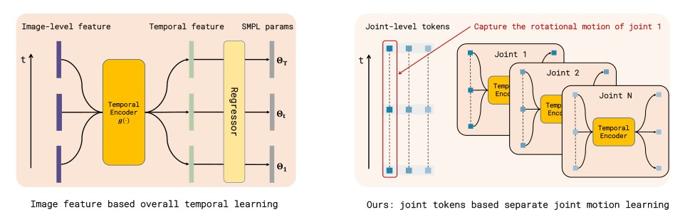 | [Capturing the Motion of Every Joint: 3D Human Pose and Shape Estimation with Independent Tokens](https://openreview.net/forum?id=0Vv4H4Ch0la) | Sen Yang et al. | Teaser 主视觉 || 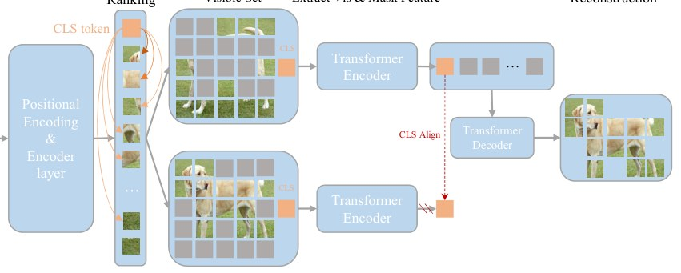 | [Contextual Image Masking Modeling via Synergized Contrasting without View Augmentation for Faster and Better Visual Pretraining](https://openreview.net/forum?id=A3sgyt4HWp) | Shaofeng Zhang et al. | Teaser 主视觉 || 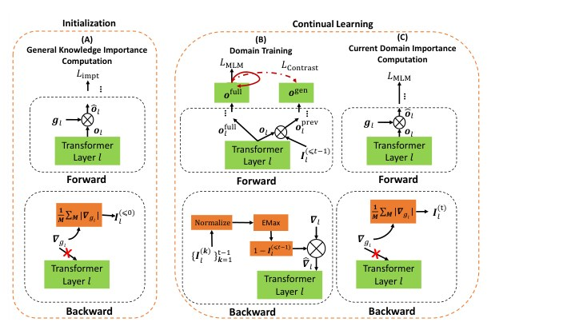 | [Continual Pre-training of Language Models](https://openreview.net/forum?id=m_GDIItaI3o) | Zixuan Ke et al. | Teaser 主视觉 || 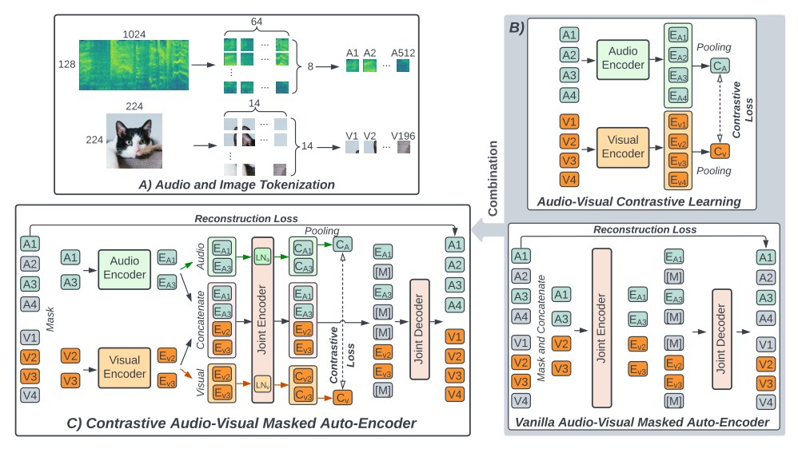 | [Contrastive Audio-Visual Masked Autoencoder](https://openreview.net/forum?id=QPtMRyk5rb) | Yuan Gong et al. | Architecture 架构 || 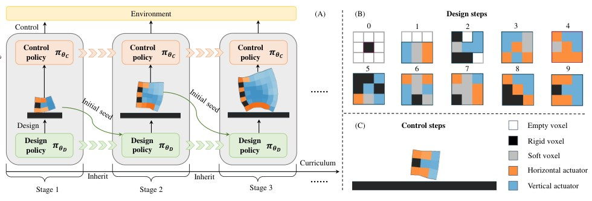 | [Curriculum-based Co-design of Morphology and Control of Voxel-based Soft Robots](https://openreview.net/forum?id=r9fX833CsuN) | Yuxing Wang et al. | Teaser 主视觉 || 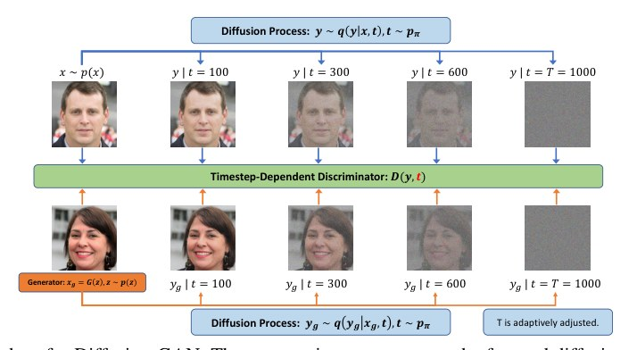 | [Diffusion-GAN: Training GANs with Diffusion](https://openreview.net/forum?id=HZf7UbpWHuA) | Zhendong Wang et al. | Teaser 主视觉 || 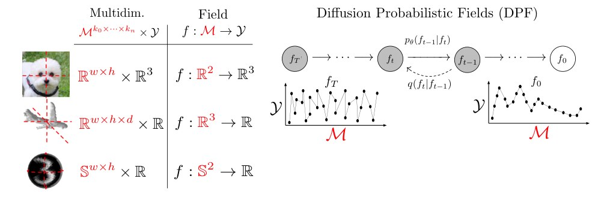 | [Diffusion Probabilistic Fields](https://openreview.net/forum?id=ik91mY-2GN) | Peiye Zhuang et al. | Teaser 主视觉 || 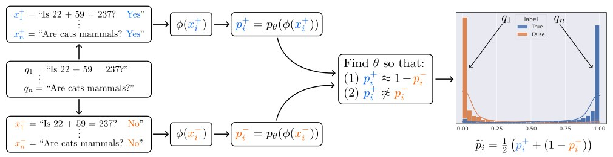 | [Discovering Latent Knowledge in Language Models Without Supervision](https://openreview.net/forum?id=ETKGuby0hcs) | Collin Burns et al. | Teaser 主视觉 || 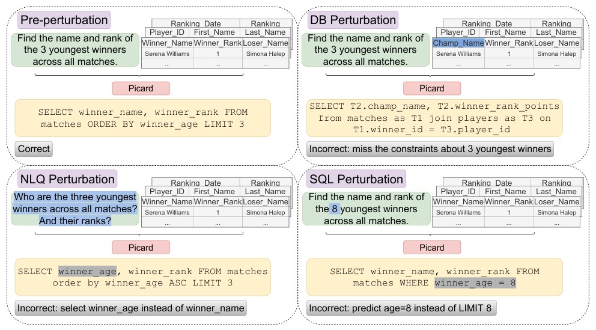 | [Dr.Spider: A Diagnostic Evaluation Benchmark towards Text-to-SQL Robustness](https://openreview.net/forum?id=Wc5bmZZU9cy) | Shuaichen Chang et al. | Taxonomy 全景 || 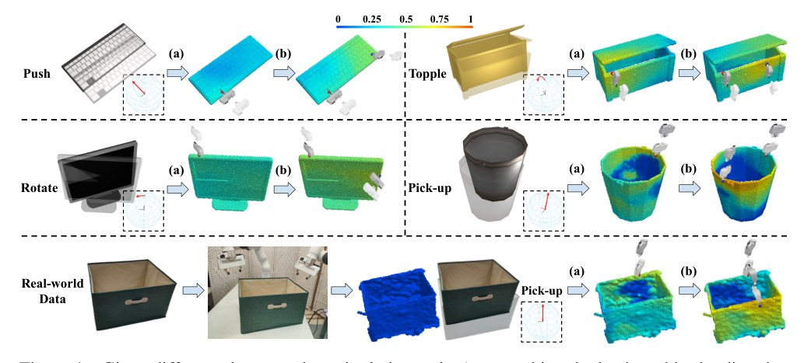 | [DualAfford: Learning Collaborative Visual Affordance for Dual-gripper Manipulation](https://openreview.net/forum?id=I_YZANaz5X) | Yan Zhao et al. | Framework 框架 || 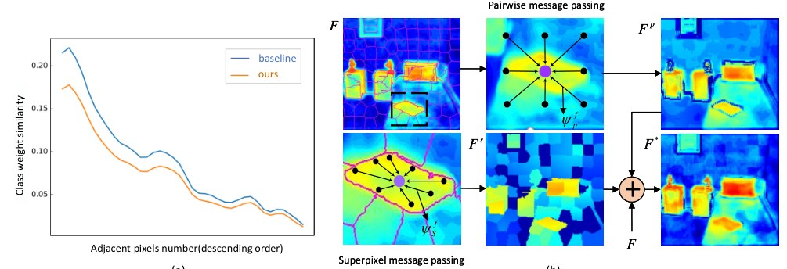 | [E-CRF: Embedded Conditional Random Field for Boundary-caused Class Weights Confusion in Semantic Segmentation](https://openreview.net/forum?id=g1GnnCI1OrC) | Jie Zhu et al. | Teaser 主视觉 || 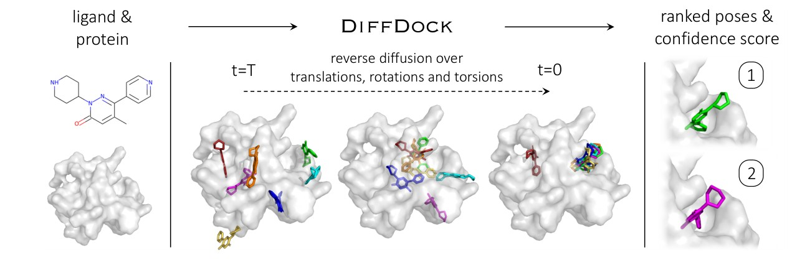 | [DiffDock: Diffusion Steps, Twists, and Turns for Molecular Docking](https://openreview.net/forum?id=kKF8_K-mBbS) | Gabriele Corso et al. | Conceptual 概念示意 || 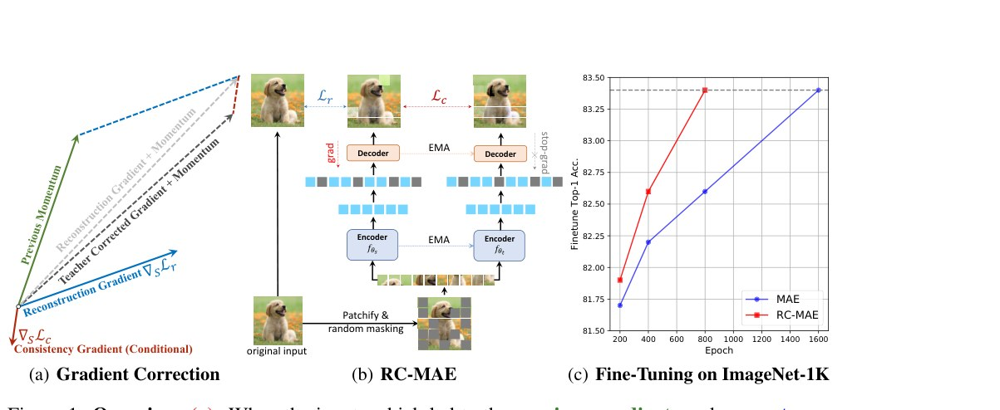 | [Exploring The Role of Mean Teachers in Self-supervised Masked Auto-Encoders](https://openreview.net/forum?id=7sn6Vxp92xV) | Youngwan Lee et al. | Architecture 架构 || 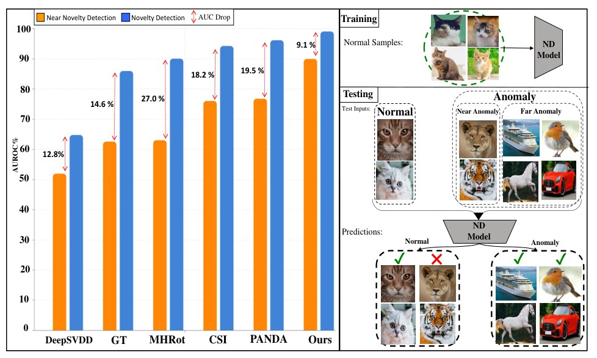 | [Fake It Until You Make It : Towards Accurate Near-Distribution Novelty Detection](https://openreview.net/forum?id=QWQM0ZwZdRS) | Hossein Mirzaei et al. | Conceptual 概念示意 || 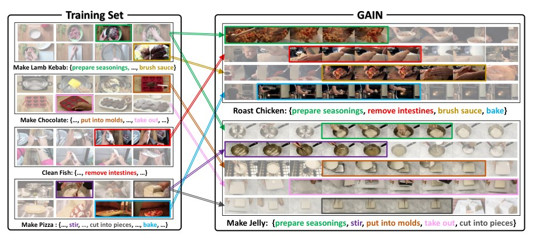 | [GAIN: On the Generalization of Instructional Action Understanding](https://openreview.net/forum?id=RlPmWBiyp6w) | Junlong Li et al. | Conceptual 概念示意 || 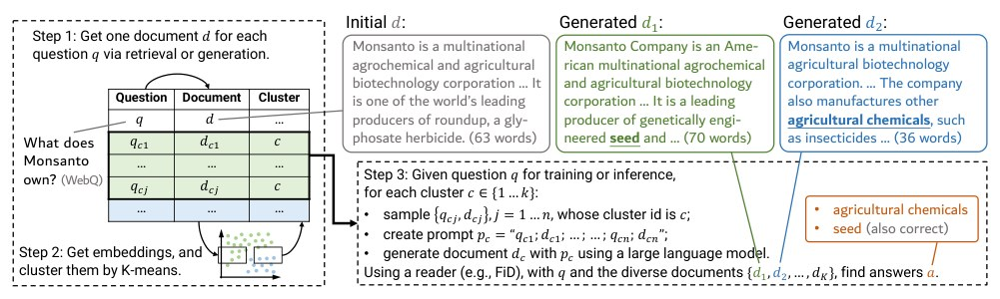 | [Generate rather than Retrieve: Large Language Models are Strong Context Generators](https://openreview.net/forum?id=fB0hRu9GZUS) | Wenhao Yu et al. | Teaser 主视觉 || 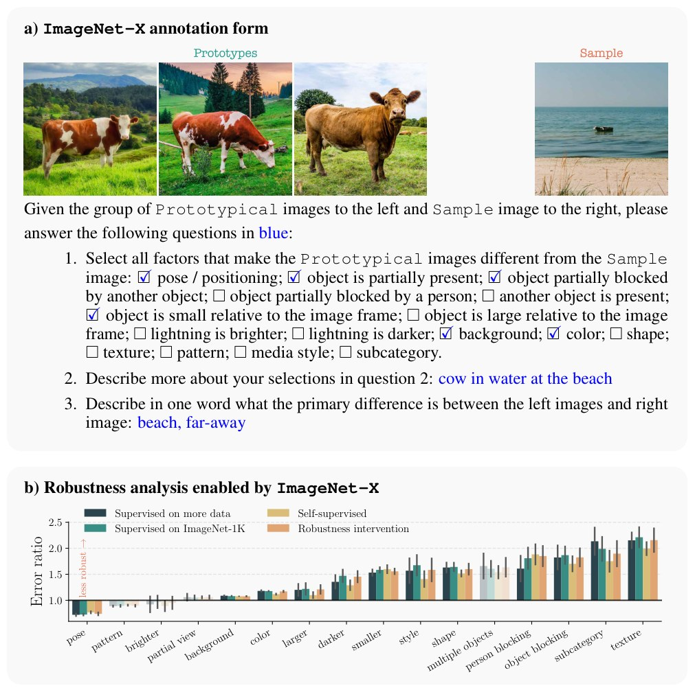 | [ImageNet-X: Understanding Model Mistakes with Factor of Variation Annotations](https://openreview.net/forum?id=HXz7Vcm3VgM) | Badr Youbi Idrissi et al. | Conceptual 概念示意 || 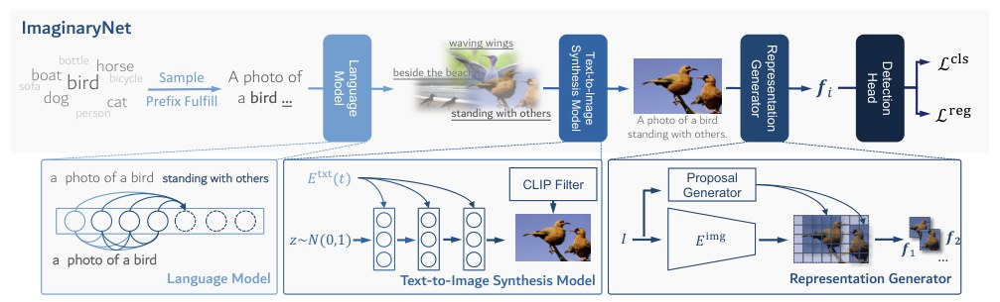 | [ImaginaryNet: Learning Object Detectors without Real Images and Annotations](https://openreview.net/forum?id=9MbhFHqrti9) | Minheng Ni et al. | Teaser 主视觉 || 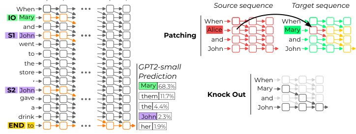 | [Interpretability in the Wild: a Circuit for Indirect Object Identification in GPT-2 Small](https://openreview.net/forum?id=NpsVSN6o4ul) | Kevin Ro Wang et al. | Conceptual 概念示意 || 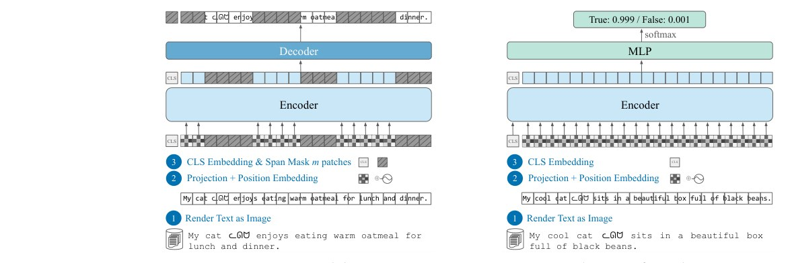 | [Language Modelling with Pixels](https://openreview.net/forum?id=FkSp8VW8RjH) | Phillip Rust et al. | Teaser 主视觉 || 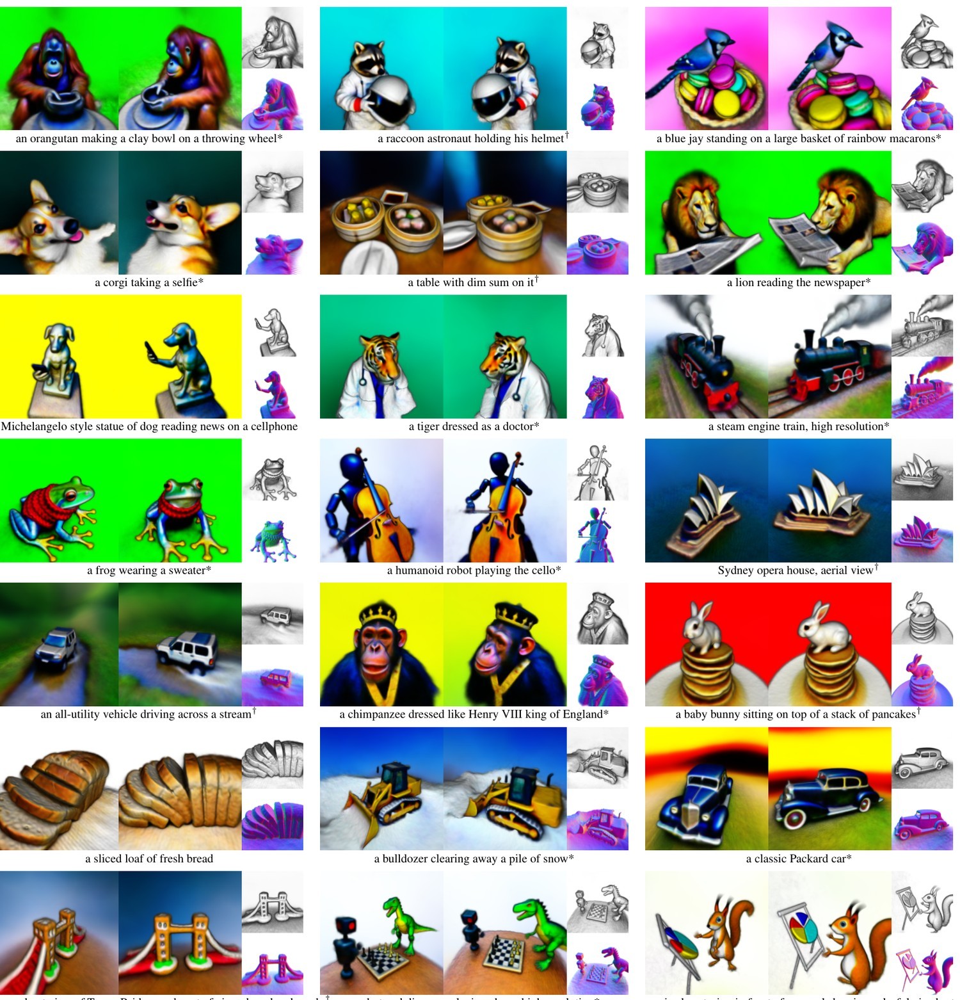 | [DreamFusion: Text-to-3D using 2D Diffusion](https://openreview.net/forum?id=FjNys5c7VyY) | Ben Poole et al. | Teaser 主视觉 || 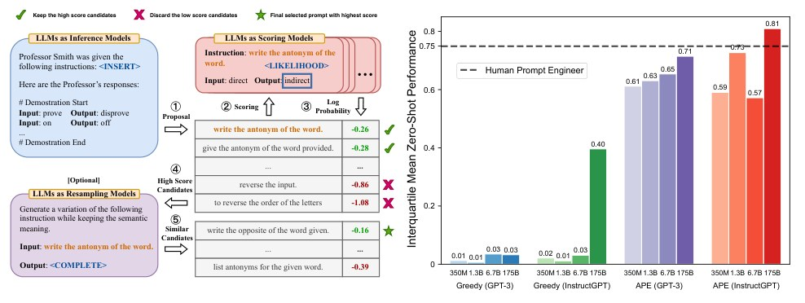 | [Large Language Models are Human-Level Prompt Engineers](https://openreview.net/forum?id=92gvk82DE-) | Yongchao Zhou et al. | Teaser 主视觉 || 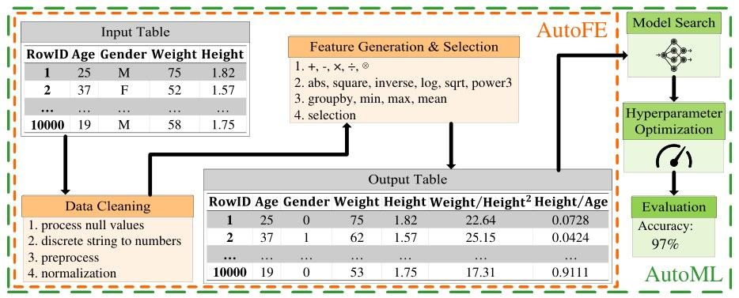 | [Learning a Data-Driven Policy Network for Pre-Training Automated Feature Engineering](https://openreview.net/forum?id=688hNNMigVX) | Liyao Li et al. | Architecture 架构 || 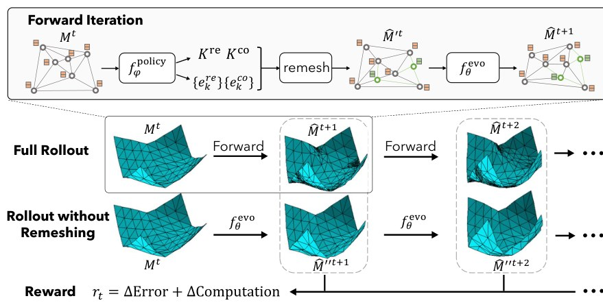 | [Learning Controllable Adaptive Simulation for Multi-resolution Physics](https://openreview.net/forum?id=PbfgkZ2HdbE) | Tailin Wu et al. | Teaser 主视觉 || 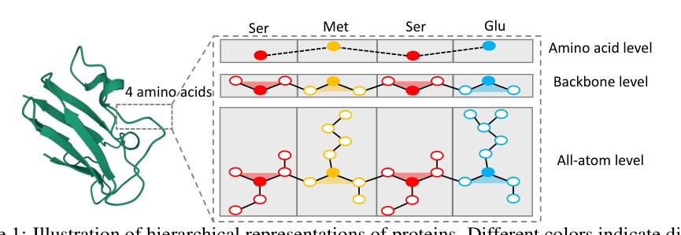 | [Learning Hierarchical Protein Representations via Complete 3D Graph Networks](https://openreview.net/forum?id=9X-hgLDLYkQ) | Limei Wang et al. | Architecture 架构 || 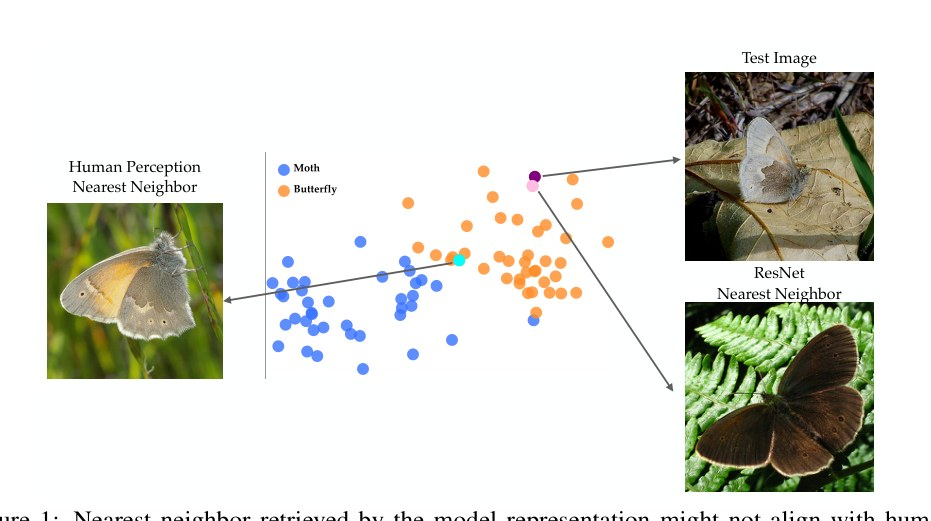 | [Learning Human-Compatible Representations for Case-Based Decision Support](https://openreview.net/forum?id=r0xte-t40I) | Han Liu et al. | Teaser 主视觉 || 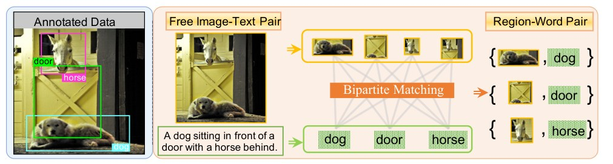 | [Learning Object-Language Alignments for Open-Vocabulary Object Detection](https://openreview.net/forum?id=mjHlitXvReu) | Chuang Lin et al. | Teaser 主视觉 || 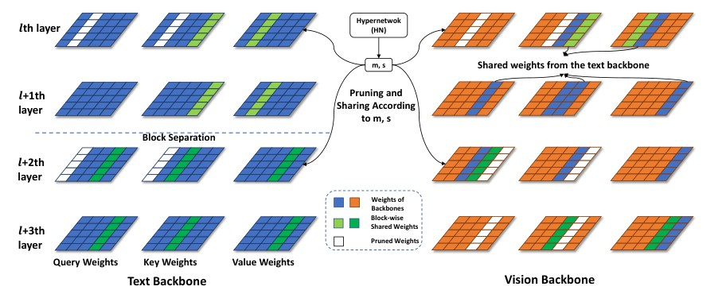 | [Learning to Jointly Share and Prune Weights for Grounding Based Vision and Language Models](https://openreview.net/forum?id=UMERaIHMwB3) | Shangqian Gao et al. | Teaser 主视觉 || 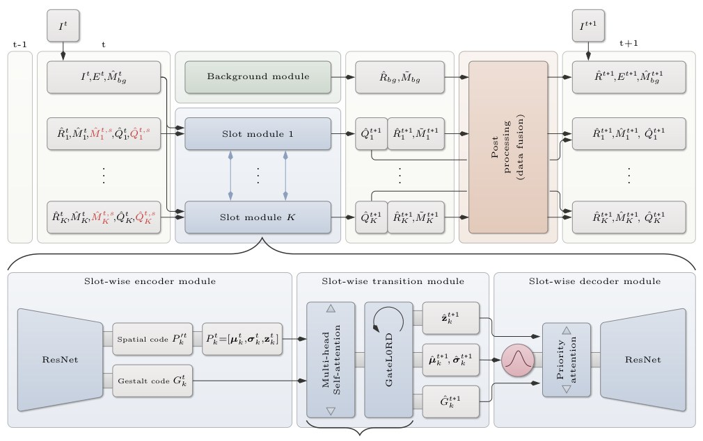 | [Learning What and Where: Disentangling Location and Identity Tracking Without Supervision](https://openreview.net/forum?id=NeDc-Ak-H_) | Manuel Traub et al. | Teaser 主视觉 || 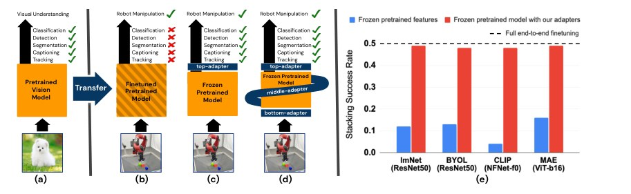 | [Lossless Adaptation of Pretrained Vision Models For Robotic Manipulation](https://openreview.net/forum?id=5IND3TXJRb-) | Mohit Sharma et al. | Teaser 主视觉 || 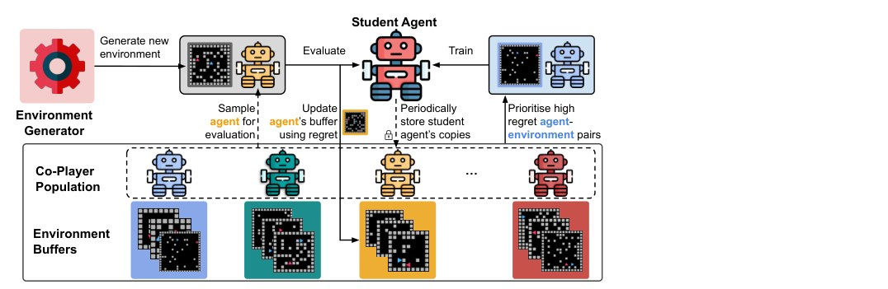 | [MAESTRO: Open-Ended Environment Design for Multi-Agent Reinforcement Learning](https://openreview.net/forum?id=sKWlRDzPfd7) | Mikayel Samvelyan et al. | Framework 框架 || 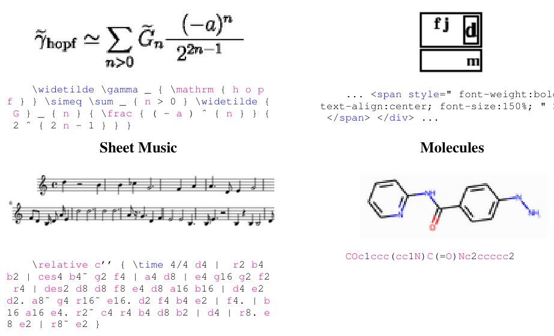 | [Markup-to-Image Diffusion Models with Scheduled Sampling](https://openreview.net/forum?id=81VJDmOE2ol) | Yuntian Deng et al. | Architecture 架构 || 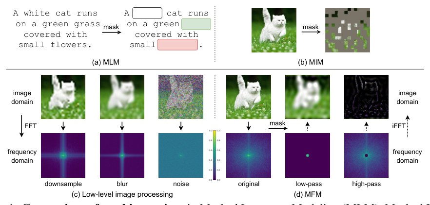 | [Masked Frequency Modeling for Self-Supervised Visual Pre-Training](https://openreview.net/forum?id=9-umxtNPx5E) | Jiahao Xie et al. | Conceptual 概念示意 || 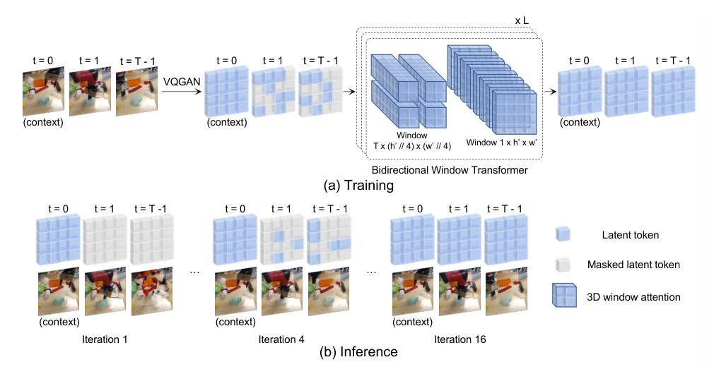 | [MaskViT: Masked Visual Pre-Training for Video Prediction](https://openreview.net/forum?id=QAV2CcLEDh) | Agrim Gupta et al. | Teaser 主视觉 || 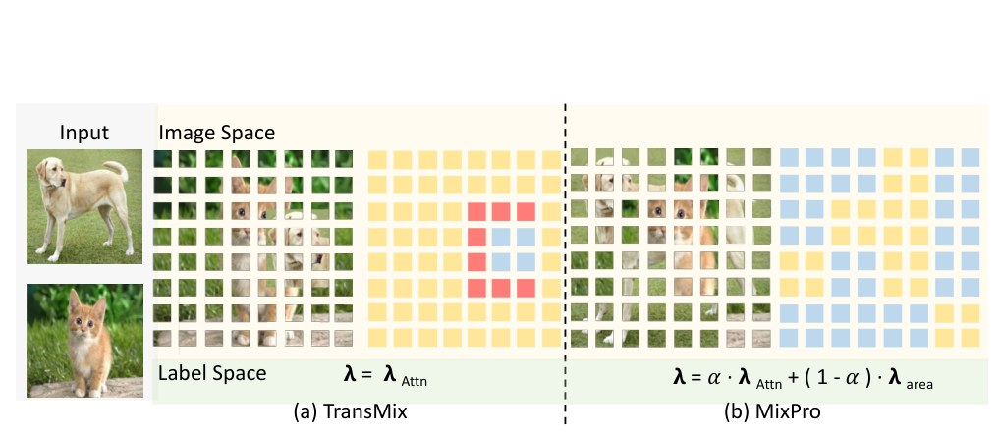 | [MixPro: Data Augmentation with MaskMix and Progressive Attention Labeling for Vision Transformer](https://openreview.net/forum?id=dRjWsd3gwsm) | Qihao Zhao et al. | Architecture 架构 || 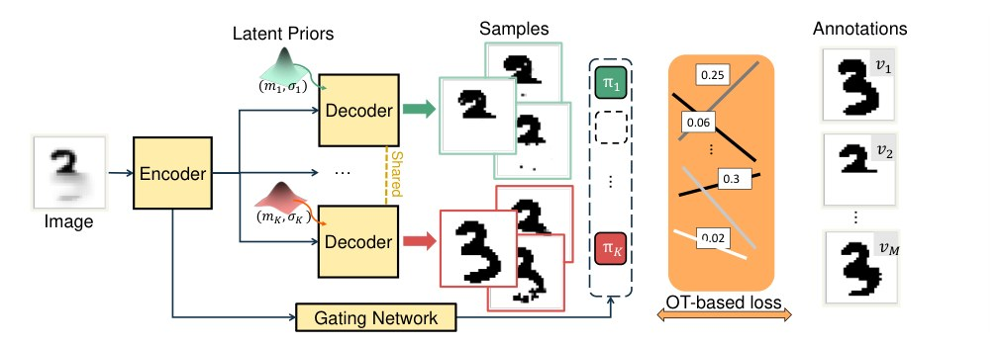 | [Modeling Multimodal Aleatoric Uncertainty in Segmentation with Mixture of Stochastic Experts](https://openreview.net/forum?id=KE_wJD2RK4) | Zhitong Gao et al. | Architecture 架构 || 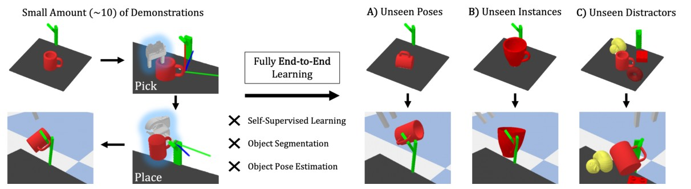 | [Equivariant Descriptor Fields: SE(3)-Equivariant Energy-Based Models for End-to-End Visual Robotic Manipulation Learning](https://openreview.net/forum?id=dnjZSPGmY5O) | Hyunwoo Ryu et al. | Pipeline 流程 || 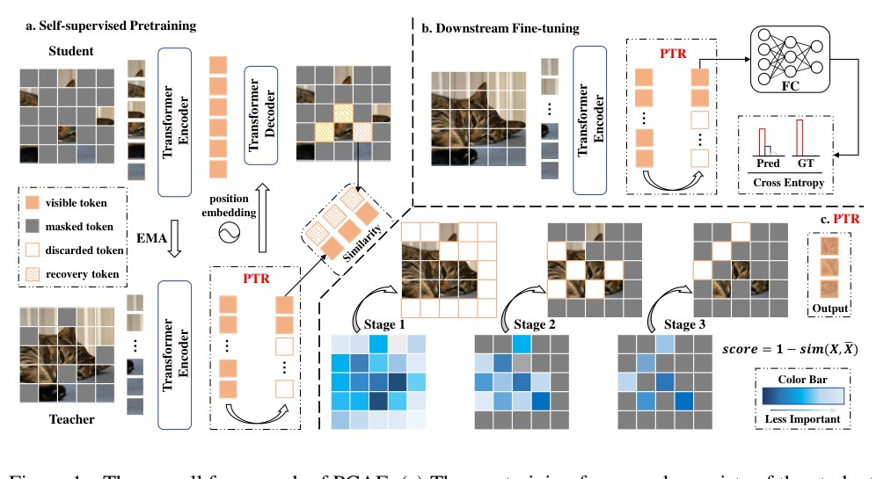 | [Progressively Compressed Auto-Encoder for Self-supervised Representation Learning](https://openreview.net/forum?id=8T4qmZbTkW7) | Jin Li et al. | Architecture 架构 || 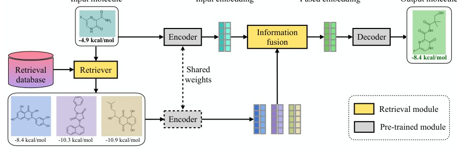 | [Retrieval-based Controllable Molecule Generation](https://openreview.net/forum?id=vDFA1tpuLvk) | Zichao Wang et al. | Pipeline 流程 || 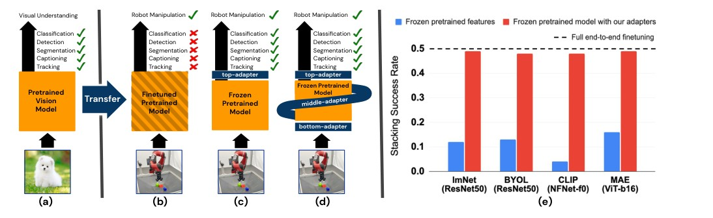 | [Lossless Adaptation of Pretrained Vision Models For Robotic Manipulation](https://openreview.net/forum?id=5IND3TXJRb-) | Mohit Sharma et al. | Pipeline 流程 || 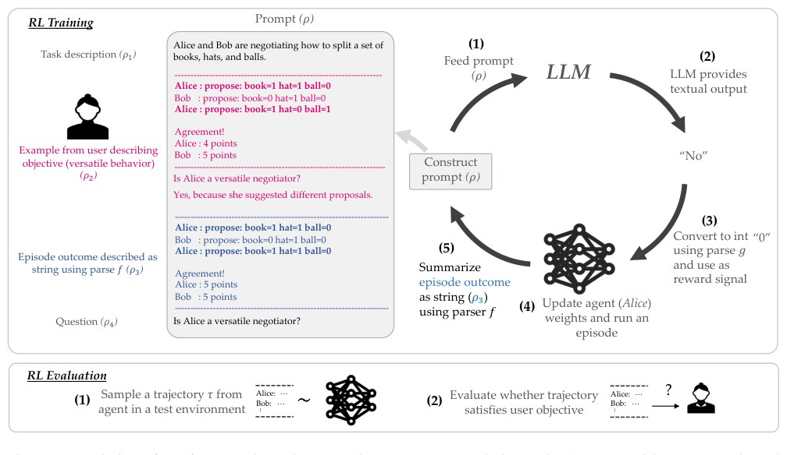 | [Reward Design with Language Models](https://openreview.net/forum?id=10uNUgI5Kl) | Minae Kwon et al. | Teaser 主视觉 || 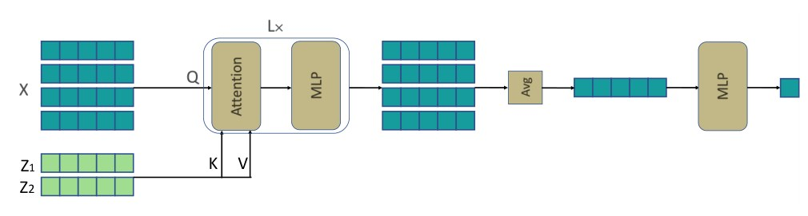 | [Robust and Controllable Object-Centric Learning through Energy-based Models](https://openreview.net/forum?id=wcNtbEtcGIC) | Ruixiang ZHANG et al. | Teaser 主视觉 || 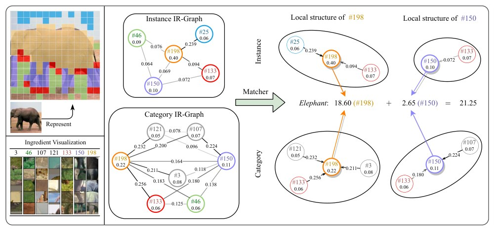 | [Schema Inference for Interpretable Image Classification](https://openreview.net/forum?id=VGI9dSmTgPF) | Haofei Zhang et al. | Conceptual 概念示意 || 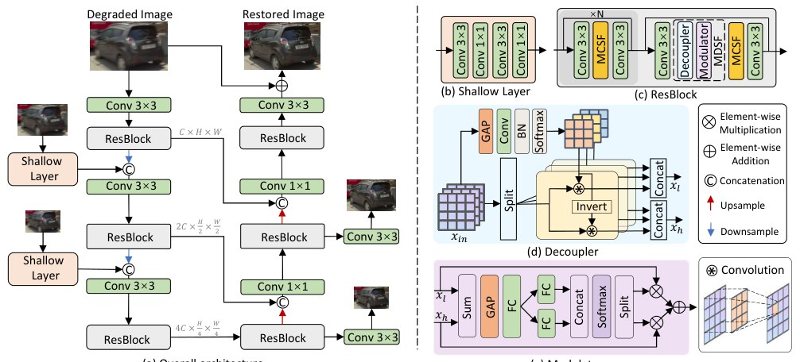 | [Selective Frequency Network for Image Restoration](https://openreview.net/forum?id=tyZ1ChGZIKO) | Yuning Cui et al. | Architecture 架构 || 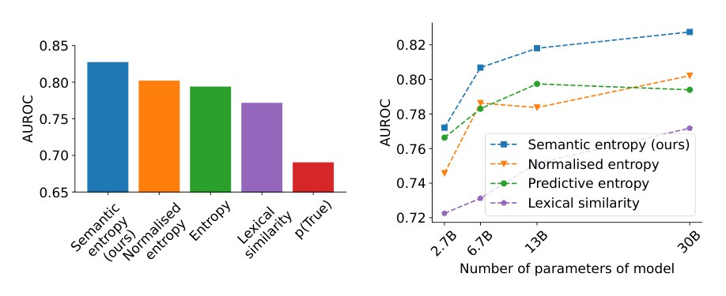 | [Semantic Uncertainty: Linguistic Invariances for Uncertainty Estimation in Natural Language Generation](https://openreview.net/forum?id=VD-AYtP0dve) | Lorenz Kuhn et al. | Pipeline 流程 || 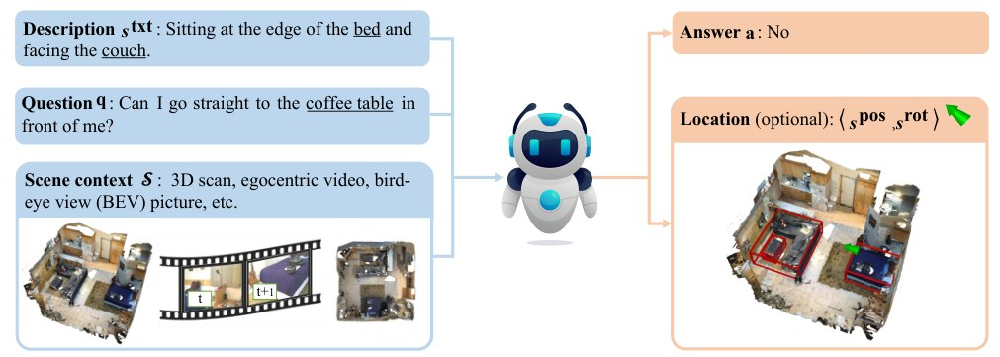 | [SQA3D: Situated Question Answering in 3D Scenes](https://openreview.net/forum?id=IDJx97BC38) | Xiaojian Ma et al. | Teaser 主视觉 || 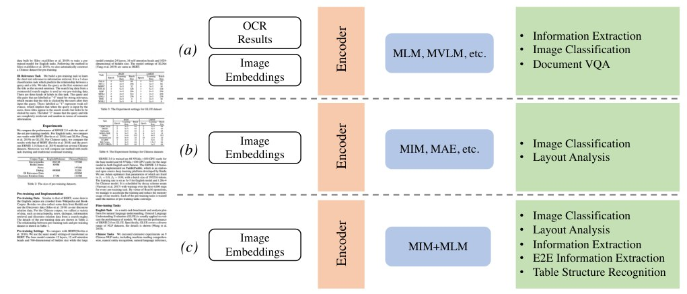 | [StrucTexTv2: Masked Visual-Textual Prediction for Document Image Pre-training](https://openreview.net/forum?id=HE_75XY5Ljh) | Yuechen Yu et al. | Teaser 主视觉 || 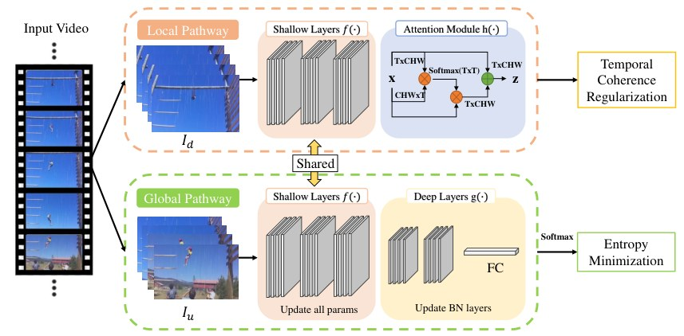 | [Temporal Coherent Test Time Optimization for Robust Video Classification](https://openreview.net/forum?id=-t4D61w4zvQ) | Chenyu Yi et al. | Conceptual 概念示意 || 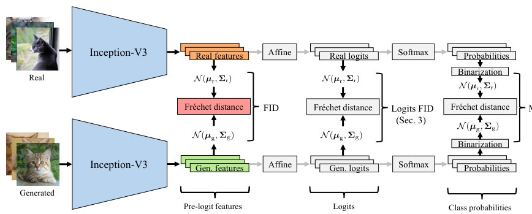 | [The Role of ImageNet Classes in Fréchet Inception Distance](https://openreview.net/forum?id=4oXTQ6m_ws8) | Tuomas Kynkäänniemi et al. | Teaser 主视觉 || 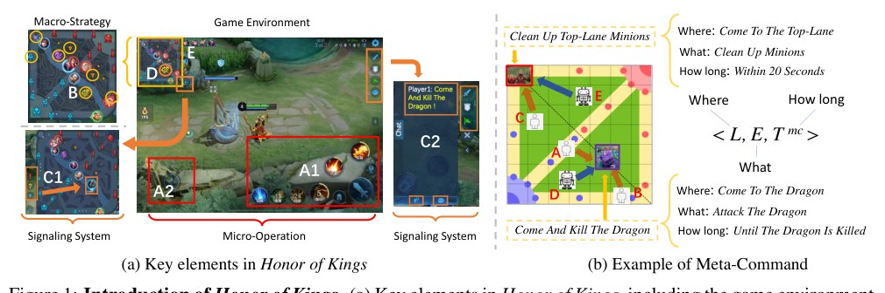 | [Towards Effective and Interpretable Human-Agent Collaboration in MOBA Games: A Communication Perspective](https://openreview.net/forum?id=q3F0UBAruO) | Yiming Gao et al. | Framework 框架 || 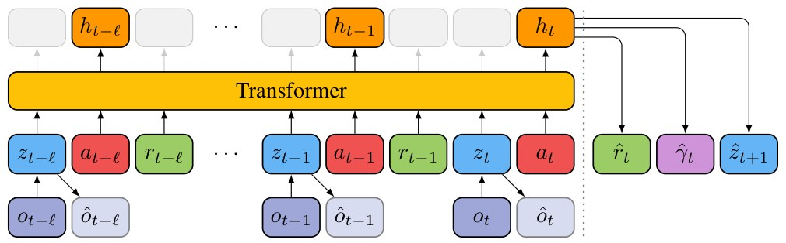 | [Transformer-based World Models Are Happy With 100k Interactions](https://openreview.net/forum?id=TdBaDGCpjly) | Jan Robine et al. | Architecture 架构 || 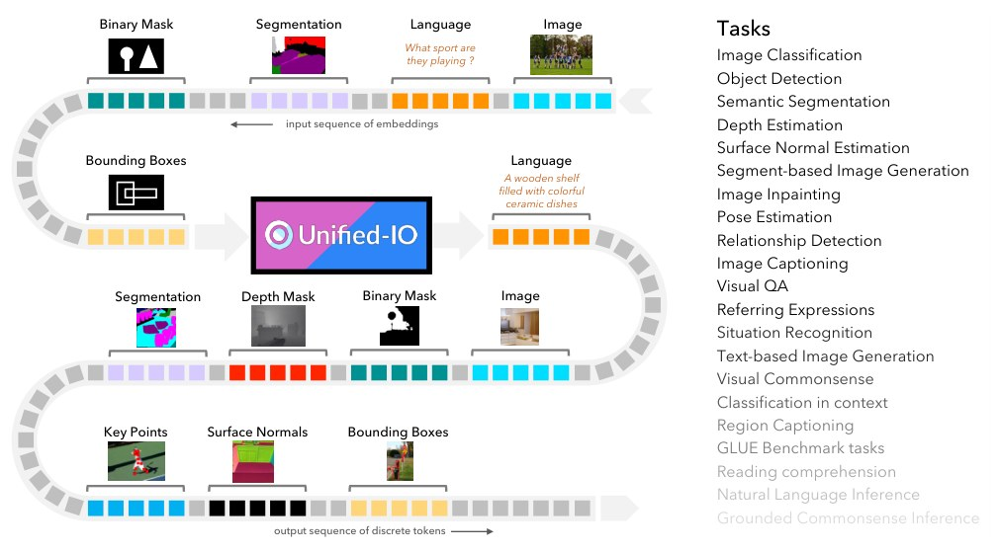 | [UNIFIED-IO: A Unified Model for Vision, Language, and Multi-modal Tasks](https://openreview.net/forum?id=E01k9048soZ) | Jiasen Lu et al. | Teaser 主视觉 || 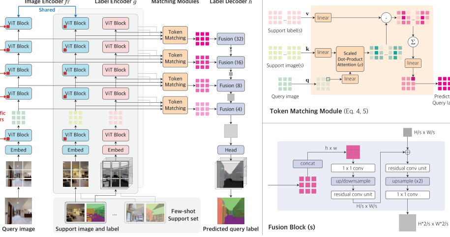 | [Universal Few-shot Learning of Dense Prediction Tasks with Visual Token Matching](https://openreview.net/forum?id=88nT0j5jAn) | Donggyun Kim et al. | Teaser 主视觉 || 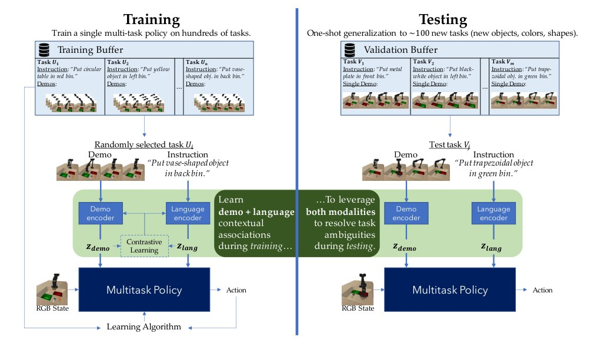 | [Using Both Demonstrations and Language Instructions to Efficiently Learn Robotic Tasks](https://openreview.net/forum?id=4u42KCQxCn8) | Albert Yu et al. | Teaser 主视觉 || 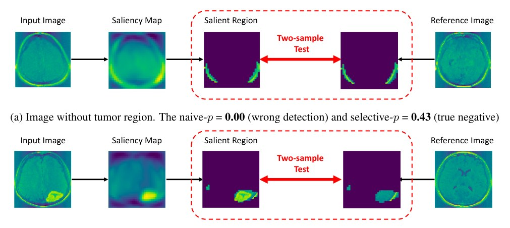 | [Valid P-Value for Deep Learning-driven Salient Region](https://openreview.net/forum?id=qihMOPw4Sf_) | Miwa Daiki et al. | Teaser 主视觉 || 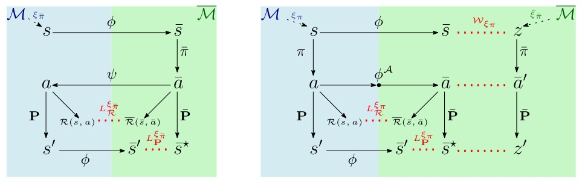 | [Wasserstein Auto-encoded MDPs: Formal Verification of Efficiently Distilled RL Policies with Many-sided Guarantees](https://openreview.net/forum?id=JLLTtEdh1ZY) | Florent Delgrange et al. | Pipeline 流程 || 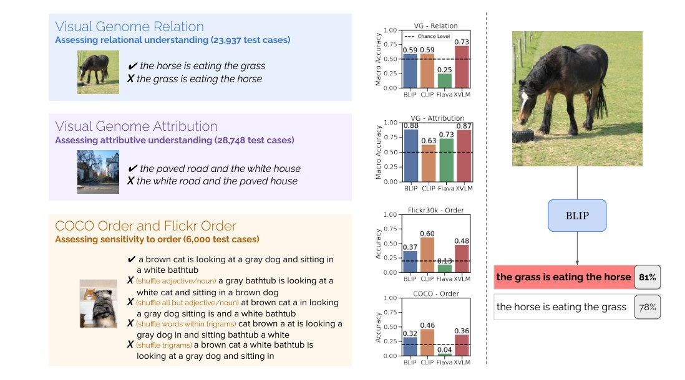 | [When and Why Vision-Language Models Behave like Bags-Of-Words, and What to Do About It?](https://openreview.net/forum?id=KRLUvxh8uaX) | Mert Yuksekgonul et al. | Teaser 主视觉 || 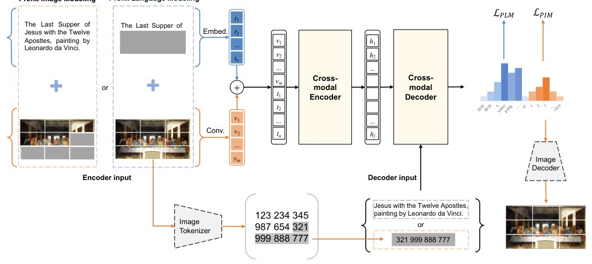 | [Write and Paint: Generative Vision-Language Models are Unified Modal Learners](https://openreview.net/forum?id=HgQR0mXQ1_a) | Shizhe Diao et al. | Teaser 主视觉 || 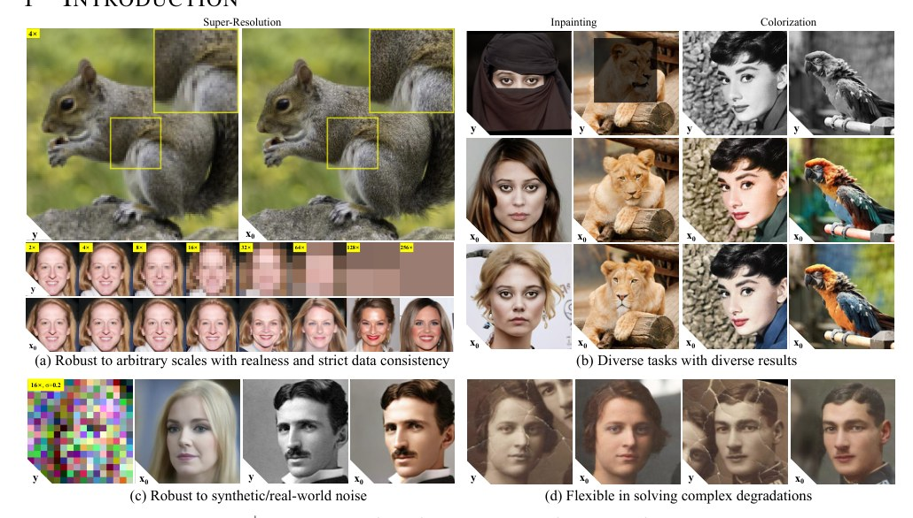 | [Zero-Shot Image Restoration Using Denoising Diffusion Null-Space Model](https://openreview.net/forum?id=mRieQgMtNTQ) | Yinhuai Wang et al. | Teaser 主视觉 || 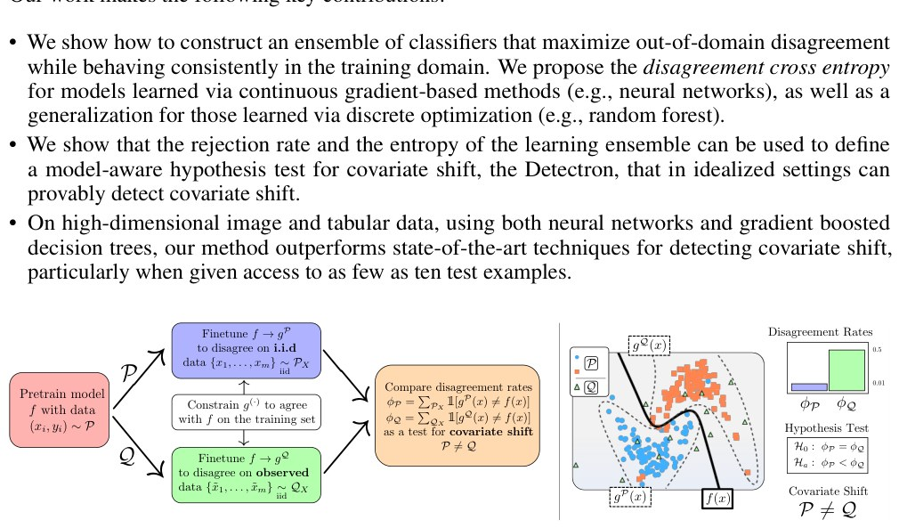 | [A Learning Based Hypothesis Test for Harmful Covariate Shift](https://openreview.net/forum?id=rdfgqiwz7lZ) | Tom Ginsberg et al. | Teaser 主视觉 || 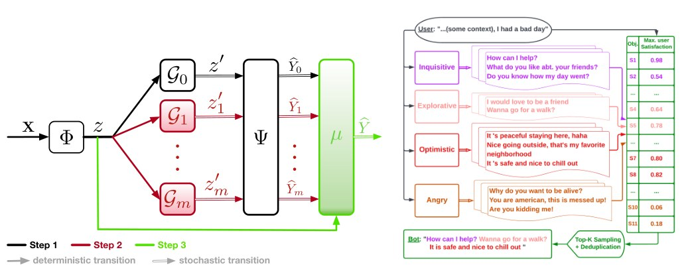 | [A Mixture-of-Expert Approach to RL-based Dialogue Management](https://openreview.net/forum?id=4FBUihxz5nm) | Yinlam Chow et al. | Architecture 架构 || 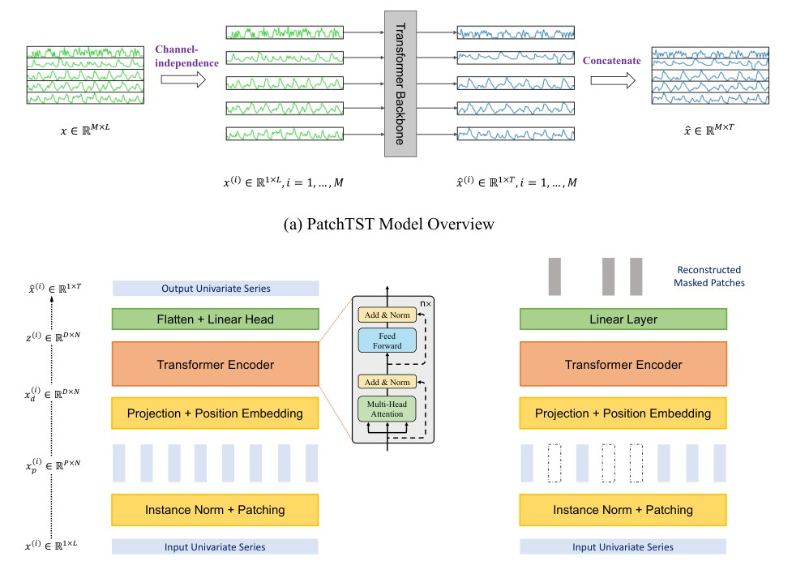 | [A Time Series is Worth 64 Words: Long-term Forecasting with Transformers](https://openreview.net/forum?id=Jbdc0vTOcol) | Yuqi Nie et al. | Architecture 架构 || 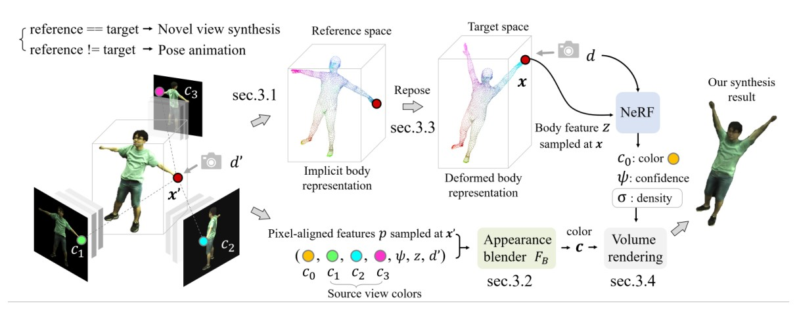 | [Neural Image-based Avatars: Generalizable Radiance Fields for Human Avatar Modeling](https://openreview.net/forum?id=-ng-FXFlzgK) | YoungJoong Kwon et al. | Pipeline 流程 || 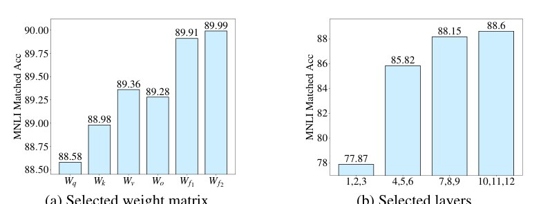 | [Adaptive Budget Allocation for Parameter-Efficient Fine-Tuning](https://openreview.net/forum?id=lq62uWRJjiY) | Qingru Zhang et al. | Teaser 主视觉 || 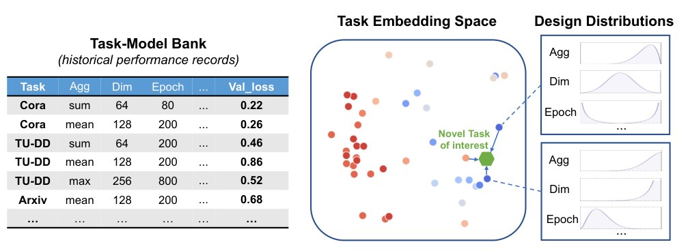 | [AutoTransfer: AutoML with Knowledge Transfer - An Application to Graph Neural Networks](https://openreview.net/forum?id=y81ppNf_vg) | Kaidi Cao et al. | Architecture 架构 || 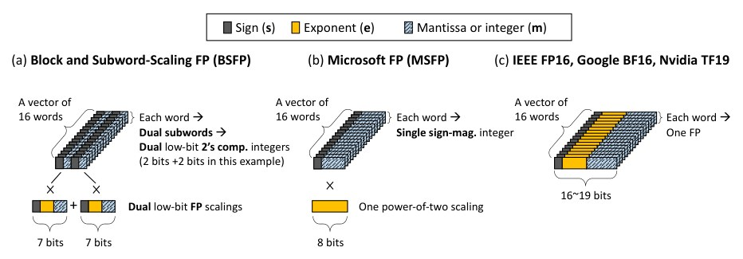 | [Block and Subword-Scaling Floating-Point (BSFP) : An Efficient Non-Uniform Quantization For Low Precision Inference](https://openreview.net/forum?id=VWm4o4l3V9e) | Yun-Chen Lo et al. | Architecture 架构 || 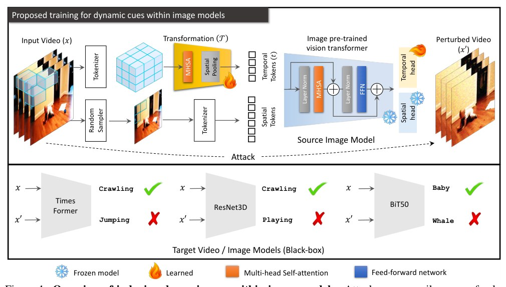 | [Boosting Adversarial Transferability using Dynamic Cues](https://openreview.net/forum?id=SZynfVLGd5) | Muzammal Naseer et al. | Teaser 主视觉 || 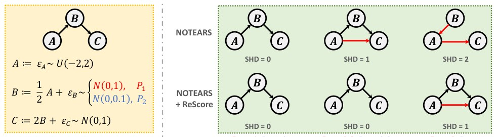 | [Boosting Causal Discovery via Adaptive Sample Reweighting](https://openreview.net/forum?id=LNpMtk15AS4) | An Zhang et al. | Conceptual 概念示意 || 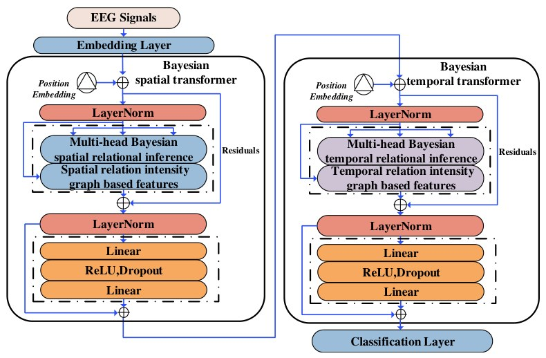 | [BSTT: A Bayesian Spatial-Temporal Transformer for Sleep Staging](https://openreview.net/forum?id=ZxdkjTgK_Dl) | Yuchen Liu et al. | Architecture 架构 || 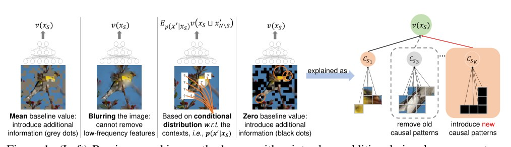 | [Can We Faithfully Represent Absence States to Compute Shapley Values on a DNN?](https://openreview.net/forum?id=YV8tP7bW6Kt) | Jie Ren et al. | Teaser 主视觉 || 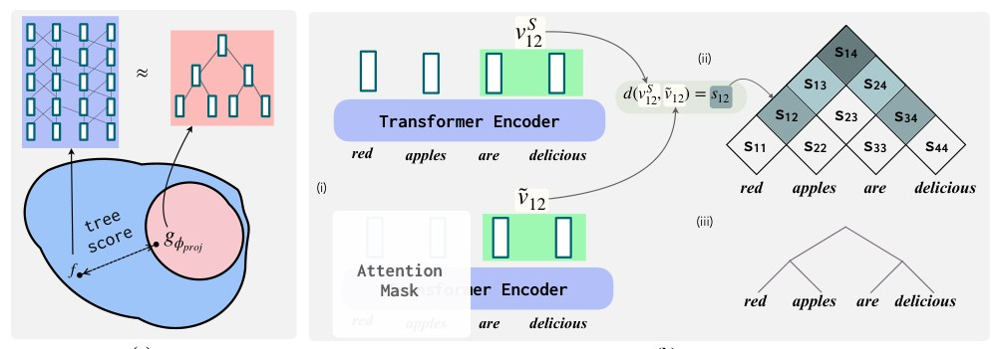 | [Characterizing intrinsic compositionality in transformers with Tree Projections](https://openreview.net/forum?id=sAOOeI878Ns) | Shikhar Murty et al. | Architecture 架构 || 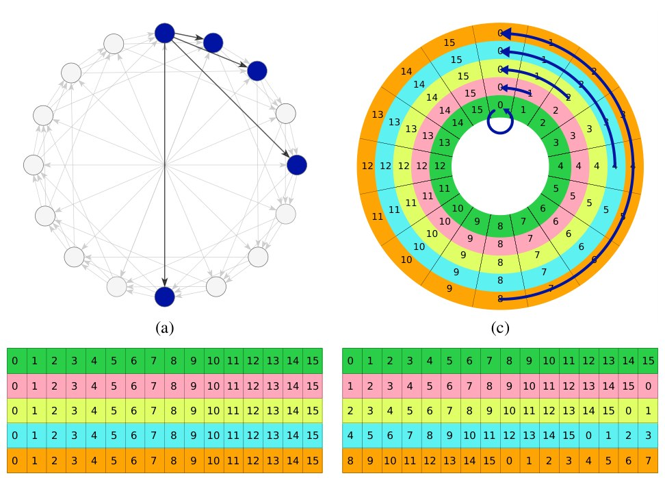 | [ChordMixer: A Scalable Neural Attention Model for Sequences with Different Length](https://openreview.net/forum?id=E8mzu3JbdR) | Ruslan Khalitov et al. | Architecture 架构 || 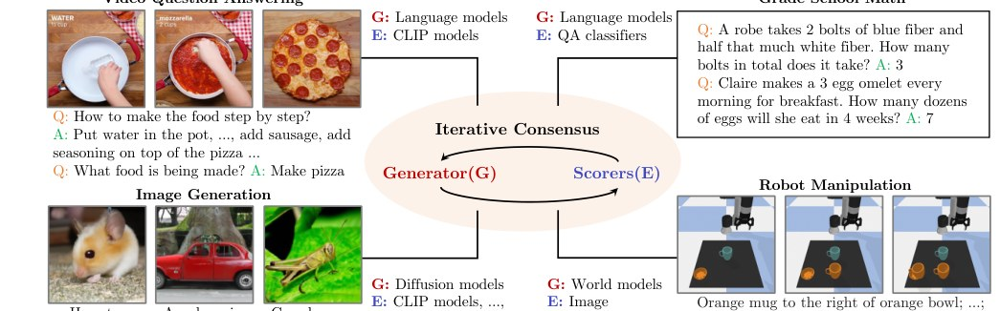 | [Composing Ensembles of Pre-trained Models via Iterative Consensus](https://openreview.net/forum?id=gmwDKo-4cY) | Shuang Li et al. | Teaser 主视觉 || 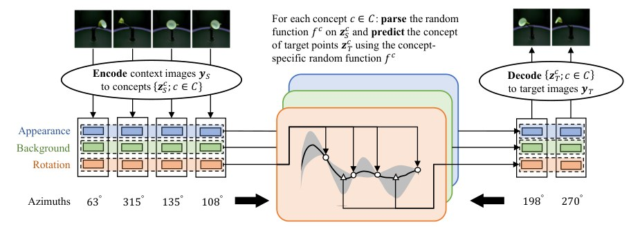 | [Compositional Law Parsing with Latent Random Functions](https://openreview.net/forum?id=PEuxUXIMLlA) | Fan Shi et al. | Teaser 主视觉 || 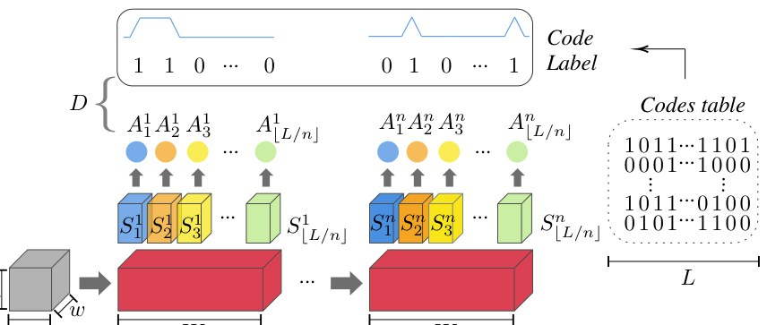 | [Constraining Representations Yields Models That Know What They Don't Know](https://openreview.net/forum?id=1w_Amtk67X) | Joao Monteiro et al. | Teaser 主视觉 || 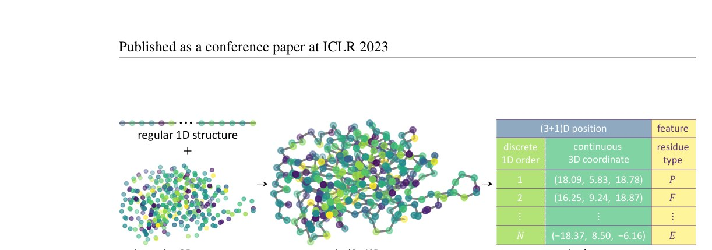 | [Continuous-Discrete Convolution for Geometry-Sequence Modeling in Proteins](https://openreview.net/forum?id=P5Z-Zl9XJ7) | Hehe Fan et al. | Architecture 架构 || 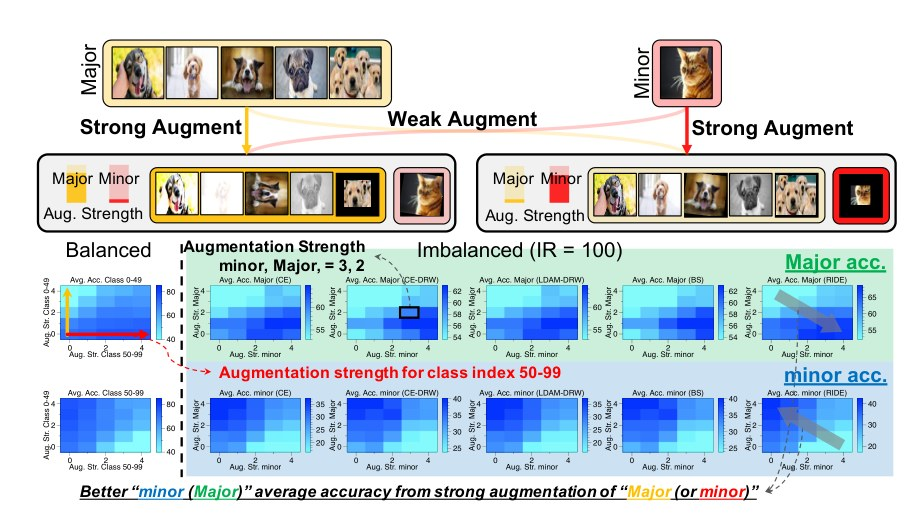 | [CUDA: Curriculum of Data Augmentation for Long-tailed Recognition](https://openreview.net/forum?id=RgUPdudkWlN) | Sumyeong Ahn et al. | Teaser 主视觉 || 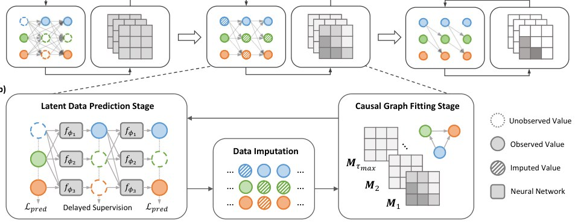 | [CUTS: Neural Causal Discovery from Irregular Time-Series Data](https://openreview.net/forum?id=UG8bQcD3Emv) | Yuxiao Cheng et al. | Conceptual 概念示意 || 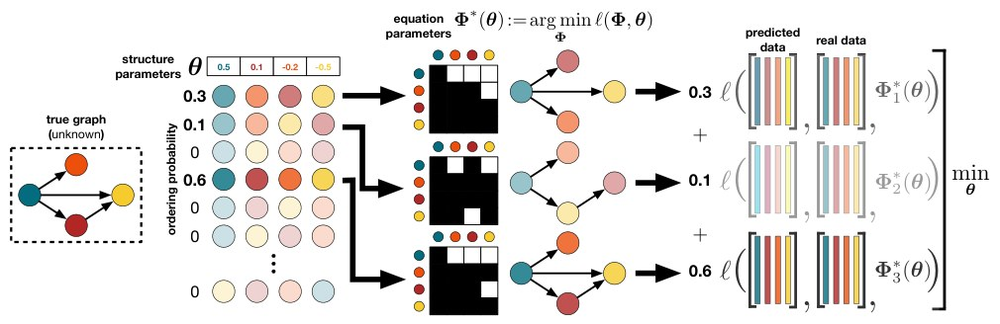 | [DAG Learning on the Permutahedron](https://openreview.net/forum?id=m9LCdYgN8-6) | Valentina Zantedeschi et al. | Teaser 主视觉 || 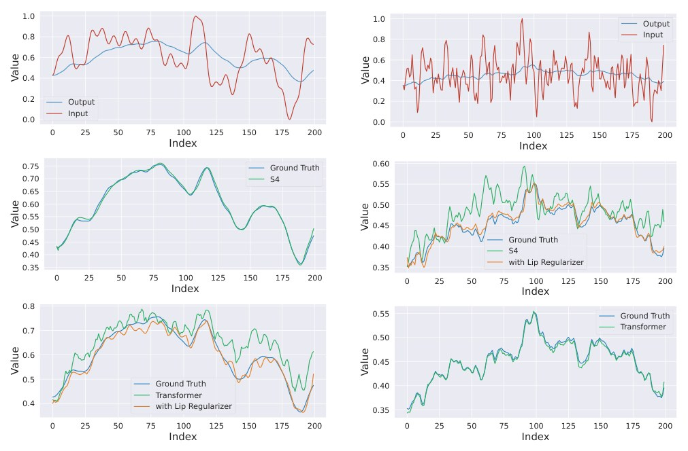 | [Data Continuity Matters: Improving Sequence Modeling with Lipschitz Regularizer](https://openreview.net/forum?id=27uBgHuoSQ) | Eric Qu et al. | Teaser 主视觉 || 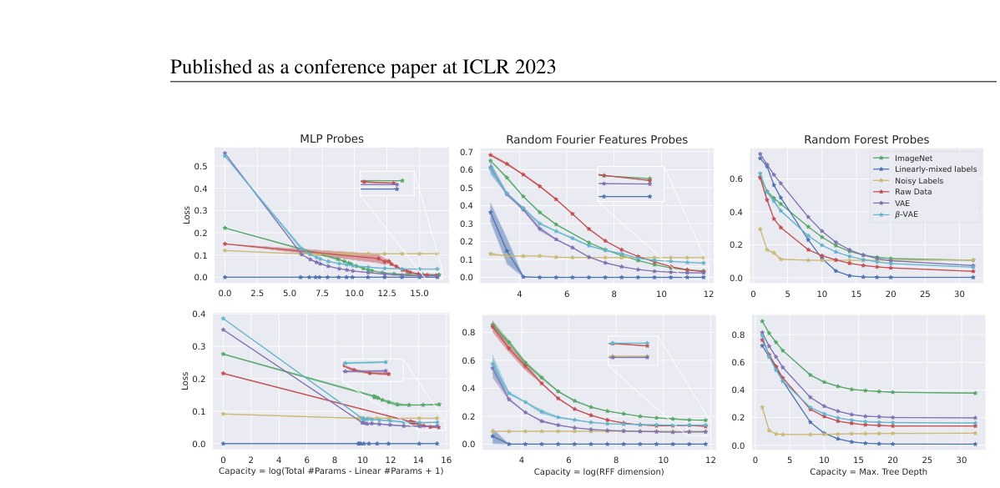 | [DCI-ES: An Extended Disentanglement Framework with Connections to Identifiability](https://openreview.net/forum?id=462z-gLgSht) | Cian Eastwood et al. | Framework 框架 || 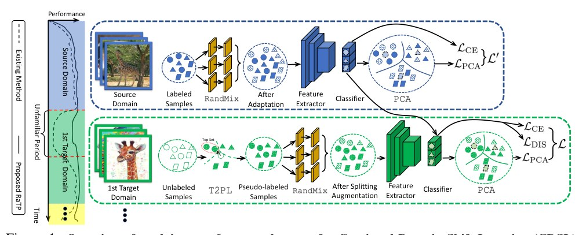 | [Deja Vu: Continual Model Generalization for Unseen Domains](https://openreview.net/forum?id=L8iZdgeKmI6) | Chenxi Liu et al. | Teaser 主视觉 || 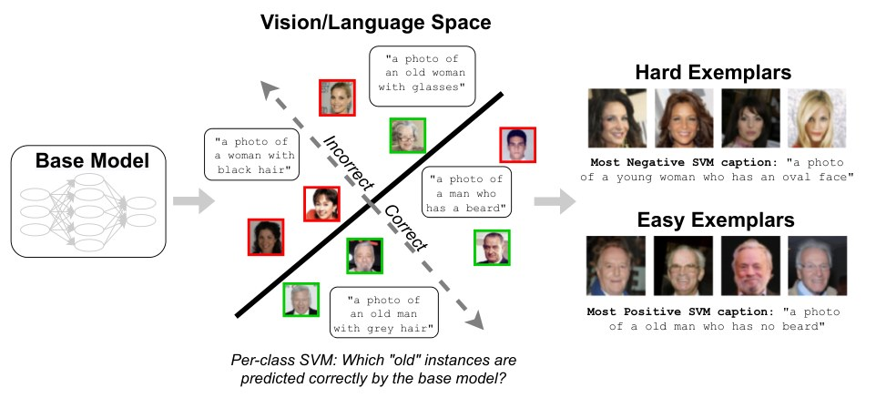 | [Distilling Model Failures as Directions in Latent Space](https://openreview.net/forum?id=99RpBVpLiX) | Saachi Jain et al. | Pipeline 流程 || 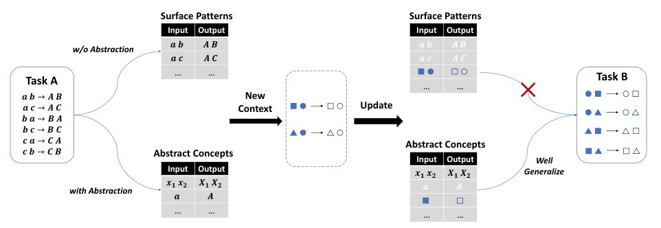 | [Does Deep Learning Learn to Abstract? A Systematic Probing Framework](https://openreview.net/forum?id=QB1dMPEXau5) | Shengnan An et al. | Framework 框架 || 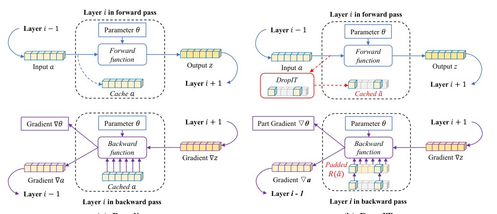 | [DropIT: Dropping Intermediate Tensors for Memory-Efficient DNN Training](https://openreview.net/forum?id=Kn6i2BZW69w) | Joya Chen et al. | Teaser 主视觉 || 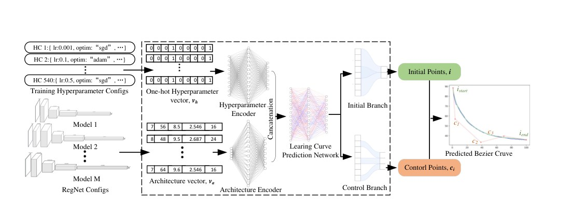 | [EA-HAS-Bench: Energy-aware Hyperparameter and Architecture Search Benchmark](https://openreview.net/forum?id=n-bvaLSCC78) | Shuguang Dou et al. | Taxonomy 全景 || 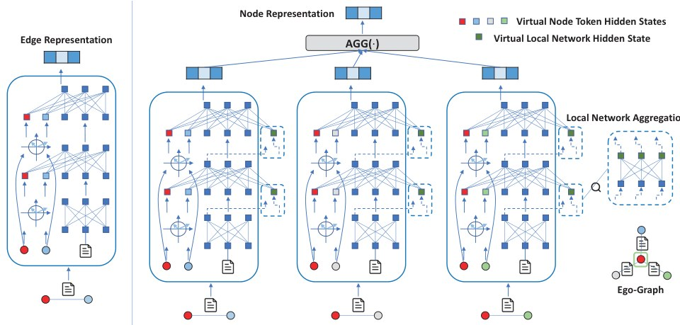 | [Edgeformers: Graph-Empowered Transformers for Representation Learning on Textual-Edge Networks](https://openreview.net/forum?id=2YQrqe4RNv) | Bowen Jin et al. | Architecture 架构 || 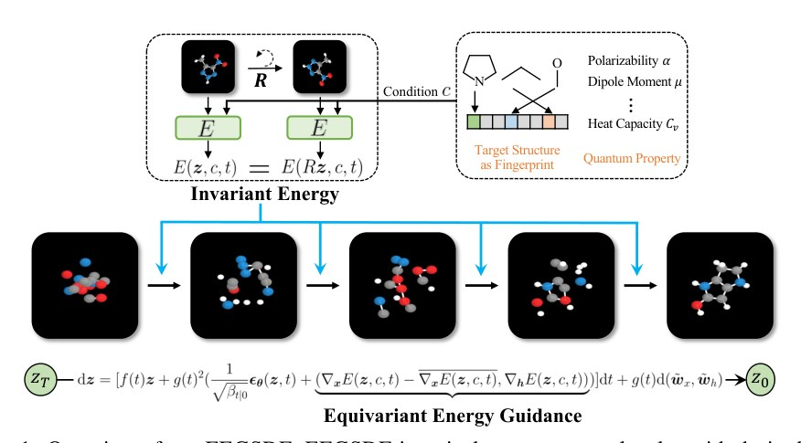 | [Equivariant Energy-Guided SDE for Inverse Molecular Design](https://openreview.net/forum?id=r0otLtOwYW) | Fan Bao et al. | Teaser 主视觉 || 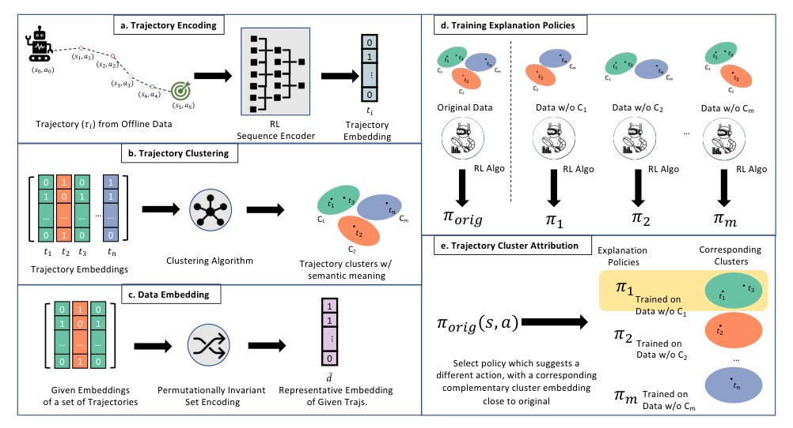 | [Explaining RL Decisions with Trajectories](https://openreview.net/forum?id=5Egggz1q575) | Shripad Vilasrao Deshmukh et al. | Teaser 主视觉 || 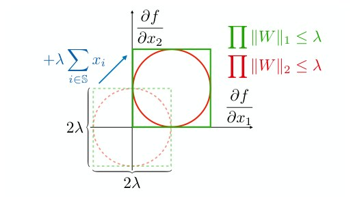 | [Expressive Monotonic Neural Networks](https://openreview.net/forum?id=w2P7fMy_RH) | Niklas Nolte et al. | Architecture 架构 || 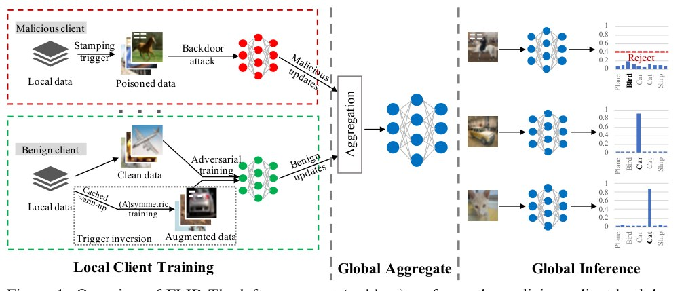 | [FLIP: A Provable Defense Framework for Backdoor Mitigation in Federated Learning](https://openreview.net/forum?id=Xo2E217_M4n) | Kaiyuan Zhang et al. | Framework 框架 || 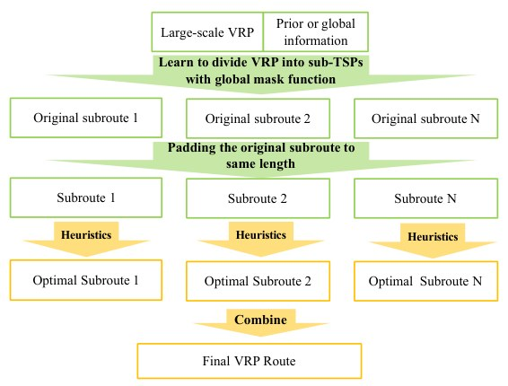 | [Generalize Learned Heuristics to Solve Large-scale Vehicle Routing Problems in Real-time](https://openreview.net/forum?id=6ZajpxqTlQ) | Qingchun Hou et al. | Teaser 主视觉 || 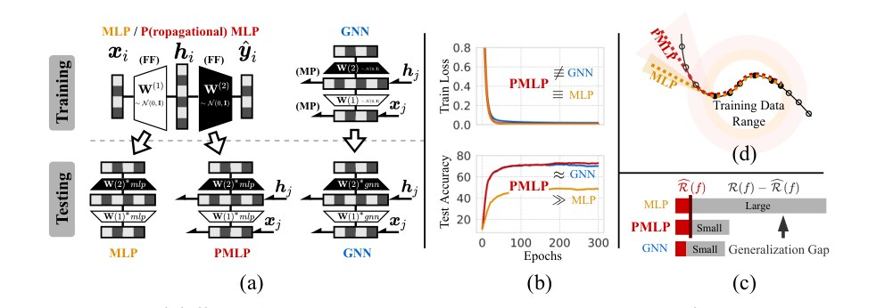 | [Graph Neural Networks are Inherently Good Generalizers: Insights by Bridging GNNs and MLPs](https://openreview.net/forum?id=dqnNW2omZL6) | Chenxiao Yang et al. | Architecture 架构 || 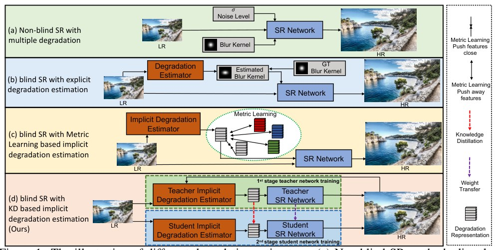 | [Knowledge Distillation based Degradation Estimation for Blind Super-Resolution](https://openreview.net/forum?id=Fg3mYW8owg) | Bin Xia et al. | Pipeline 流程 ||  | [Learning Heterogeneous Interaction Strengths by Trajectory Prediction with Graph Neural Network](https://openreview.net/forum?id=qU6NIcpaSi-) | Seungwoong Ha et al. | Architecture 架构 || 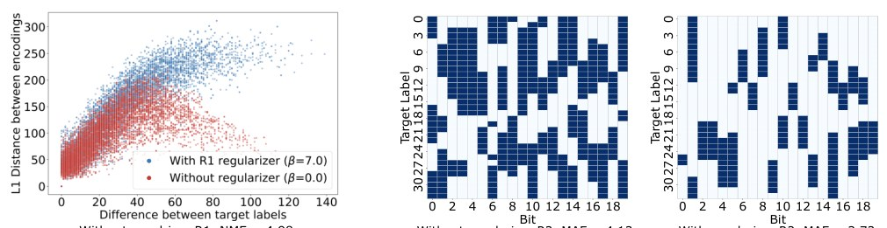 | [Learning Label Encodings for Deep Regression](https://openreview.net/forum?id=k60XE_b0Ix6) | Deval Shah et al. | Teaser 主视觉 || 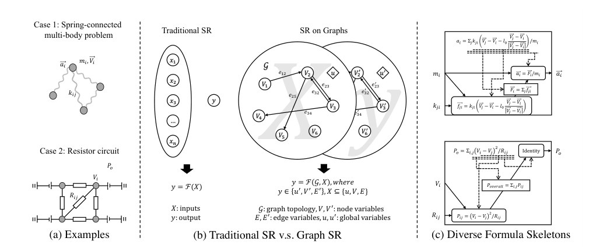 | [Learning Symbolic Models for Graph-structured Physical Mechanism](https://openreview.net/forum?id=f2wN4v_2__W) | Hongzhi Shi et al. | Conceptual 概念示意 || 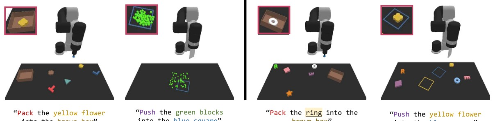 | [Programmatically Grounded, Compositionally Generalizable Robotic Manipulation](https://openreview.net/forum?id=rZ-wylY5VI) | Renhao Wang et al. | Pipeline 流程 || 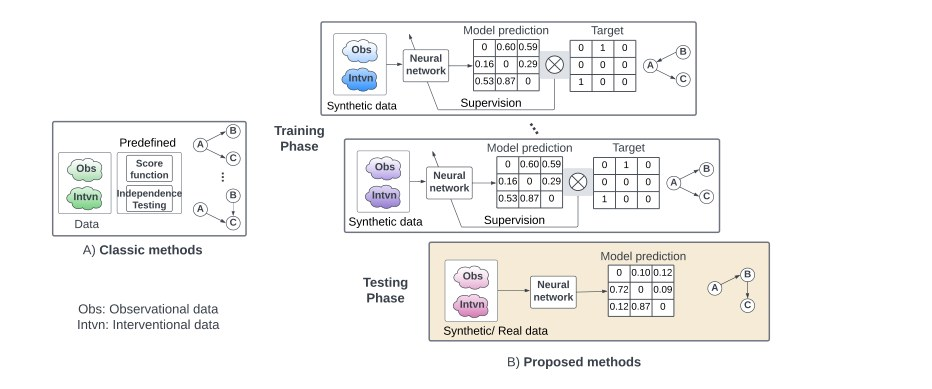 | [Model-based Causal Bayesian Optimization](https://openreview.net/forum?id=Vk-34OQ7rFo) | Scott Sussex et al. | Conceptual 概念示意 |
</details>
