<div align="center">

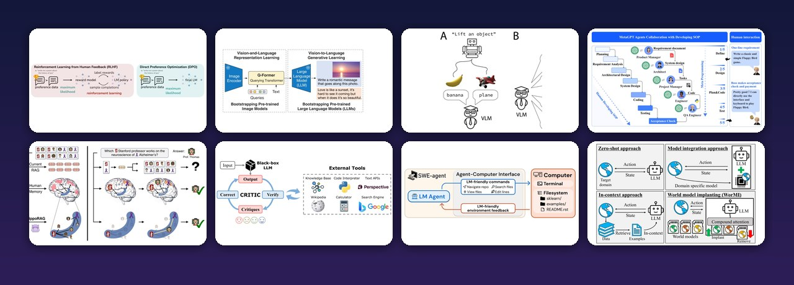

# 🎨 Top-Conf Figure Gallery
### 顶会论文主图灵感画廊 · ICLR · ICML · NeurIPS · CVPR · ACL · AAAI · 2023–2026

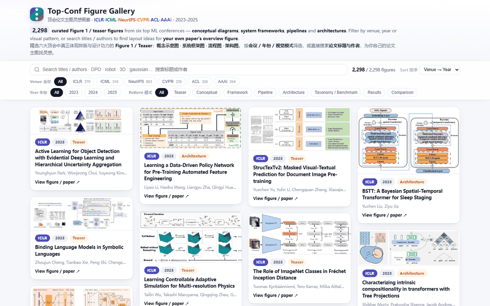

[](https://qwdwqfwq.github.io/topconf-paper-figure-gallery/)


[](requirements.txt)
[](LICENSE)
[-yellow.svg)](IMAGES_POLICY.md)
[](CONTRIBUTING.md)


See how well-designed papers lay out Figure 1 before you draw your own.
A searchable, filterable gallery of Figure 1 / teaser figures. Static HTML/CSS/JS, no build, works offline.

画论文主图前，先看顶会论文怎么排版。
一个可搜索、可筛选的 Figure 1 / Teaser 画廊。纯静态、零构建、可离线打开。

[🌐 Live gallery 在线画廊](https://qwdwqfwq.github.io/topconf-paper-figure-gallery/) · [🛠️ FigureForge 画图](https://qwdwqfwq.github.io/topconf-paper-figure-gallery/forge) · [🎬 Demo video 演示视频](https://qwdwqfwq.github.io/topconf-paper-figure-gallery/docs/demo.html) · [📚 Methodology 数据与方法](docs/METHODOLOGY.md) ·
[⚖️ Image policy 版权 / 下架](IMAGES_POLICY.md) · [🤝 Contributing 贡献指南](CONTRIBUTING.md)

</div>

---

## English

**Top-Conf Figure Gallery** collects Figure 1 / teaser figures (concept diagrams, system frameworks, pipelines, architectures, benchmark overviews) from six ML/AI conferences, 2023–2026. It is a design reference, not a paper ranking. Each card links to the source paper and records venue, year, authors and a visual-pattern tag.

- Filter by venue, year, acceptance tier and visual pattern; masonry layout with a lightbox.
- Oral, Spotlight and Best/Outstanding-paper figures carry gold / silver / red badges (ICLR, ICML, NeurIPS 2023–2026).
- Full-text search over titles and authors, e.g. `DPO`, `robot`, `gaussian`, `agent`.
- Every figure is hand-reviewed. Over 25 heuristic rules first remove default matplotlib charts, plain tables, GUI screenshots and unlabeled photo sets; a person then checks the rest page by page. See [METHODOLOGY.md](docs/METHODOLOGY.md).
- Pure static site, no backend or build; clone and double-click.
- Open, reproducible pipeline: proceedings index → PDF download → Figure 1 crop → quality scoring → dHash de-duplication → manual review.

### 🛠️ FigureForge Beta

FigureForge drafts your Figure 1 from the gallery: describe your paper, and 3,452 top-conference figures provide the layout reference. No sign-up, no server; it runs in your browser. **[Try FigureForge →](forge/index.html)**

<p align="center">
  
</p>

**[▶ Full demo video, 1:58 with audio](https://qwdwqfwq.github.io/topconf-paper-figure-gallery/docs/demo.html)**

[](https://qwdwqfwq.github.io/topconf-paper-figure-gallery/docs/demo.html)

1. **Describe the paper.** Paste the title and abstract, upload the PDF (the Step 1 model reads it and summarizes the sections matching overview / architecture / pipeline / results), or type one sentence giving the "input → method → output" story.
2. **Pick a pattern.** `framework` for system or multi-agent overviews, `pipeline` for end-to-end flows, `architecture` for internal model structure, `conceptual` for visual metaphors; also `teaser` and `taxonomy`.
3. **Tick references.** A CLIP + BM25 hybrid search ranks all 3,452 figures; the score is shown on each card. Tick at least 4 same-pattern cards for two-stage mode, or 2–3 for direct mode.

   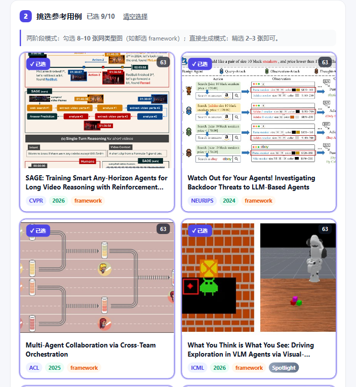

4. **Two stages: summarize, then generate.** A vision model reads the picks, distils their common layout, elements, palette and hierarchy, selects 2–3 representative figures, and only then generates.

   

5. **Choose a mode, add your key, download.** SVG mode gives accurate, editable text (Figma / draw.io / Illustrator); bitmap mode gives a publication-style layout to check in PPT / Figma. The key is stored only in your browser.

> A bare prompt in a general chatbot returns a generic flowchart. FigureForge grounds the draft in top-conference figures, so it keeps the panel grid, comparative narrative and restrained palette of a paper figure.

> 

- Runs entirely in your browser: the CLIP model and gallery index are bundled locally; paper content and keys stay on your device and the key goes only to the provider you choose.
- Bring your own key. Presets: Volcengine Ark, SiliconFlow, Zhipu, DeepSeek, OpenAI, Moonshot, Qwen, Tencent Hunyuan, Anthropic, and any OpenAI-compatible relay.
- The model list updates itself: the bundled manifest refreshes on load and the provider's live `/models` list is fetched once a key is entered. Anthropic has no list endpoint; Hunyuan and Anthropic block browser CORS, so use a relay for those.
- Scope: a high-quality first draft for the Figure 1 genre. Check text and numbers before submission.
- Open source forever, no paid version. MIT-licensed; the key pays the model provider directly. PRs are welcome for new papers, venues and label fixes, and the gallery is refreshed yearly with new proceedings.

### Add a paper or figure

Open a **[Suggest a figure](https://github.com/qwdwqfwq/topconf-paper-figure-gallery/issues/new?template=add-figure-request.md)** issue with the paper link — no coding needed. For PRs, [CONTRIBUTING.md](CONTRIBUTING.md) gives the metadata format and quality bar. New venues such as CHI / RSS / CoRL are welcome.

Images belong to their authors and publishers; see [IMAGES_POLICY.md](IMAGES_POLICY.md) for the educational-use and 72-hour takedown policy.

---

## 中文

**顶会论文主图灵感画廊**收录六大 ML/AI 顶会 2023–2026 的 Figure 1 / Teaser：概念图、系统框架、流程图、架构图、任务全景。它是排版设计参考，不是论文排名。每张卡片链接原文，并记录会议、年份、作者和视觉模式标签。

- 按会议、年份、录取等级、视觉模式筛选；瀑布流布局，点击看灯箱大图。
- Oral / Spotlight / Best（杰出论文）主图带金、银、红角标（ICLR、ICML、NeurIPS 2023–2026）。
- 标题、作者、关键词全文搜索，如 `DPO`、`robot`、`gaussian`、`agent`。
- 每张图人工复核：25 条以上规则先剔除默认 matplotlib 图、纯表格、GUI 截图和无标签照片墙，再逐页人工检查。见 [METHODOLOGY.md](docs/METHODOLOGY.md)。
- 纯静态站点，无后端、无构建，克隆后双击即开。
- 管线全开源：会议索引 → PDF 下载 → Figure 1 裁剪 → 质量打分 → dHash 去重 → 人工复核。

### 🛠️ FigureForge Beta

FigureForge 基于画廊生成你的 Figure 1 初稿：描述论文，3,452 张顶会主图作为版式参考。免注册、无服务器，全部在浏览器本地运行。**[立即试用 →](forge/index.html)**

<p align="center">
  
</p>

**[▶ 完整演示视频，1 分 58 秒，有声音](https://qwdwqfwq.github.io/topconf-paper-figure-gallery/docs/demo.html)**

[](https://qwdwqfwq.github.io/topconf-paper-figure-gallery/docs/demo.html)

1. **输入论文**：粘贴标题和摘要、上传 PDF（步骤一的模型直接阅读，按概览、架构、流程、结果总结相关章节），或写一句话讲清「输入 → 方法 → 输出」。
2. **选模式**：系统或多智能体总览选 `framework`，端到端流程选 `pipeline`，模型内部结构选 `architecture`，视觉隐喻选 `conceptual`；另有 `teaser`、`taxonomy`。
3. **勾选参考图**：CLIP + BM25 混合检索全量 3,452 张图，卡片上显示相关度评分。两阶段模式勾至少 4 张同类型图（最多 10 张，越接近 10 张版式参考越充分），直接模式勾 2–4 张。

   

4. **两阶段：先归纳，再生成**：视觉模型先读参考图，归纳共同的布局、元素、配色和层级，挑出 4–6 张代表图，再生成。

   

5. **选模式、填 Key、下载**：SVG 模式文字准确、可用 Figma / draw.io / Illustrator 编辑；位图模式版式地道，在 PPT / Figma 核对即可。Key 只存在本机浏览器。

> 直接在通用对话框写 prompt，得到的是通用流程图。FigureForge 以顶会图为版式参考，初稿保留论文图的面板网格、对比叙事和克制配色。

> 

- 全流程浏览器本地运行：CLIP 模型和画廊索引随仓库打包；论文内容和 Key 不离开设备，Key 只发往所选服务商。
- 自带 Key：预置火山方舟、硅基流动、智谱、DeepSeek、OpenAI、月之暗面、通义千问、腾讯混元、Anthropic，以及任意 OpenAI 兼容中转。
- 模型列表自动更新：打开时刷新内置清单，填入 Key 后拉取服务商实时 `/models`。Anthropic 无列表接口；混元、Anthropic 不支持浏览器跨域，这两家用中转。
- 能力边界：Figure 1 场景的高质量初稿，文字和数字提交前需人工核对。
- 纯开源、永不收费：MIT 许可，Key 费用直接付给模型厂商。欢迎提 PR 补论文、补会议、修标签，画廊每年随新论文集持续更新。

### 补充论文或图片

不会写代码也可以：开一个 [Suggest a figure](https://github.com/qwdwqfwq/topconf-paper-figure-gallery/issues/new?template=add-figure-request.md) Issue，贴上论文链接。提 PR 前看 [CONTRIBUTING.md](CONTRIBUTING.md)，含元数据格式和收录标准。欢迎 CHI / RSS / CoRL 等新会议。

图片版权归原作者和出版方；教育用途与 72 小时下架政策见 [IMAGES_POLICY.md](IMAGES_POLICY.md)。

---

## 📊 收录规模 / Coverage

| Venue 会议 | 2023 | 2024 | 2025 | 2026 | Total 合计 |
|---|---:|---:|---:|---:|---:|
| 🟣 **ICLR** | 108 | 135 | 274 | 228 | **745** |
| 🟢 **ICML** | 63 | 131 | 216 | 338 | **748** |
| 🔴 **NeurIPS** | 236 | 363 | 367 | — | **966** |
| 🟠 **CVPR** | 65 | 64 | 96 | 83 | **308** |
| 🔵 **ACL** | 84 | 74 | 168 | 58 | **384** |
| 🟡 **AAAI** | 59 | 66 | 139 | 37 | **301** |
| | | | | **Total 总计** | **3452** |

### 🏅 高等级论文 / High-tier papers

ICLR / ICML 含 2023–2026；NeurIPS 含 2023–2025（2026 名单未公布）。

| Venue 会议 | Best / Outstanding | Oral | Spotlight | Total |
|---|---:|---:|---:|---:|
| 🟣 **ICLR** | 10 | 337 | 155 | **502** |
| 🟢 **ICML** | 13 | 247 | 558 | **818** |
| 🔴 **NeurIPS** | 3 | 32 | 237 | **272** |

> 角标：<b style="color:#be123c">红 = Best / Outstanding（含 Honorable Mention）</b>、<b style="color:#c8860a">金 = Oral</b>、<b style="color:#64748b">银 = Spotlight</b>。
> 口径以官方名单为准：ICLR 2023 的 notable top 5% 记为 Oral、top 25% 记为 Spotlight；ICML 2023 只有 OralPoster，记为 Oral；ICLR 2026 只设 Oral 与 Poster，无 Spotlight。

> 图片从正式出版 PDF 裁剪（约 180–216 DPI），网页版压缩为 ≤1500px JPEG，标注标题、全部作者和原文链接。各会议图量差异反映设计型主图的实际占比，与会议水平无关。

## 🧭 视觉模式 / Visual patterns

标签描述图的视觉功能，不是论文领域。

| Tag 标签 | 含义 Meaning | 代表 Examples |
|---|---|---|
| `conceptual` | 用视觉隐喻讲清核心概念 / visual metaphor for a core idea | DPO, Tree of Thoughts, HippoRAG |
| `framework` | 系统或智能体模块协作总览 / system or agent overview | HuggingGPT, SWE-agent, MetaGPT |
| `pipeline` | 端到端阶段式数据流 / staged end-to-end data flow | LRM, VidMan, LiveStar |
| `architecture` | 模型内部层与张量连接 / internal layers and tensor connections | BLIP-2, Caduceus, Medusa |
| `taxonomy` | 任务、能力或数据全景 / benchmark overview | EmbodiedBench, SimWorld |
| `teaser` | 经过版式设计的图文混排主视觉 / designed mixed-layout visual | VIMA, PixArt-α |

## 🚀 快速开始 / Quick start

在线浏览 / Online: [GitHub Pages](https://qwdwqfwq.github.io/topconf-paper-figure-gallery/)。

本地运行 / Local server:

```bash
git clone https://github.com/qwdwqfwq/topconf-paper-figure-gallery.git
cd topconf-paper-figure-gallery
python -m http.server 8000
# open http://localhost:8000
```

或直接双击 `index.html`（数据内联在 `assets/figures.js`，无需联网）。
Or double-click `index.html`; data is inlined in `assets/figures.js`.

## 🗃️ 仓库结构 / Structure

```
├── index.html               # 画廊主页 gallery shell（搜索 / 筛选 / 灯箱）
├── assets/
│   ├── style.css / app.js   # 样式与交互
│   └── figures.js           # 图片元数据（由 data/figures.json 生成）
├── images/<venue>/final/    # 画廊图片 ≤1500px JPEG
├── data/
│   ├── figures.json         # 画廊唯一权威清单 single source of truth
│   └── pool/                # 全量候选论文池
├── scripts/                 # 数据管线，见 docs/METHODOLOGY.md
├── docs/                    # 方法文档、banner、演示
├── forge/                   # FigureForge：浏览器端检索与初稿生成
└── .github/workflows/       # GitHub Pages 自动部署
```

## 🔧 数据管线与复现 / Reproduce the pipeline

详见 [docs/METHODOLOGY.md](docs/METHODOLOGY.md)：

```bash
pip install -r requirements.txt
python scripts/build_pool.py          # ICLR / ICML / NeurIPS 候选池
python scripts/extract_all.py         # 下载 PDF、裁剪 Figure 1（断点续跑）
python scripts/build_pool_new.py cvpr,acl,aaai
python scripts/extract_new.py cvpr,acl,aaai 12
python scripts/score_select.py 980    # reject 规则、设计感评分、dHash 去重、选图
python scripts/assemble_gallery.py 1000   # 生成 figures.json / figures.js
python scripts/clean_stale.py         # 删除无引用图片
python scripts/enum_sheets.py iclr    # 40 格/页联系表，人工逐页复核
python scripts/sheet_qa.py 31         # 随机抽样复核
```

## 🗺️ Roadmap

> 版本对照 / Versioning — releases 遵循 0.x semver：**v0.3**（六个会议，2,298 张，2026-09-20 发布）、**v0.4**（录取等级角标，2,730 张）、**v0.5**（2026 论文，3,528 张）、**v0.6**（FigureForge；去除 12 张跨代重复，3,516 张）。小红书按发帖计数：v1 = v0.3、v2 = v0.4、v3 = v0.6（v0.5 并入 v3 帖）。

- [x] 60 张人工精选种子画廊（v0.1）
- [x] ICLR / ICML / NeurIPS 自动管线扩量（v0.2–v0.3）
- [x] CVPR / ACL / AAAI（2023–2025）同管线扩展（v0.3）
- [x] Oral · Spotlight · Best Paper 等级索引与角标（v0.4）
- [x] 2026 已公开会议主图与等级角标（v0.5）
- [x] FigureForge：浏览器端 CLIP+BM25 检索、自有 API 生成初稿（v0.6）
- [ ] CVPR / ACL / AAAI 的 Oral / Highlight 等级索引
- [ ] NeurIPS 2026 录用公布后补全（预计 2026 年 12 月）
- [ ] 持续人工复核，开放社区 PR 补图
- [ ] CHI / CoRL / RSS / EMNLP 等会议扩展
- [ ] 相似图推荐、按配色检索、一键导出 BibTeX

## 🤝 贡献 / Contributing

欢迎补图、修标签、修 bug、扩展新会议。不会写代码可直接开 [Suggest a figure](https://github.com/qwdwqfwq/topconf-paper-figure-gallery/issues/new?template=add-figure-request.md) Issue，贴上论文链接。提 PR 前读 [CONTRIBUTING.md](CONTRIBUTING.md)，注意收录标准：不收纯照片墙和默认图表（折线图 / 柱状图 / 散点图 / 热力图这类「脚本就能画出来」的图会在收录时被 `scripts/filter_charts.py` 筛掉）。

### 🌟 贡献者 / Contributors

感谢以下社区贡献者（按贡献采纳时间排序），他们的实现均已合入当前版本：

| 贡献者 | 贡献内容 | PR |
|---|---|---|
| [@timelic](https://github.com/timelic) | 画廊灯箱共享元素过渡动画（View Transitions），以及作者名单、查看图片 / 论文链接、等级角标、圆角与分隔符等细节打磨 | [#2](https://github.com/qwdwqfwq/topconf-paper-figure-gallery/pull/2) · [#3](https://github.com/qwdwqfwq/topconf-paper-figure-gallery/pull/3) |
| [@TansyZenix](https://github.com/TansyZenix) | 灯箱 Tab 焦点限制、生成 SVG 预览的 `sandbox` 隔离、参考图卡片键盘选择与 ARIA 状态、数据校验 CI（`scripts/validate_gallery.py` + workflow） | [#5](https://github.com/qwdwqfwq/topconf-paper-figure-gallery/pull/5) · [#6](https://github.com/qwdwqfwq/topconf-paper-figure-gallery/pull/6) · [#7](https://github.com/qwdwqfwq/topconf-paper-figure-gallery/pull/7) · [#8](https://github.com/qwdwqfwq/topconf-paper-figure-gallery/pull/8) |

Thanks to [@timelic](https://github.com/timelic) and [@TansyZenix](https://github.com/TansyZenix) — their lightbox transitions, SVG sandboxing, keyboard accessibility and the data-validation CI all ship in the current release. Contributions are credited in [CHANGELOG.md](CHANGELOG.md) as well; PRs for new papers, venues and label fixes are always welcome.

## ⚠️ 版权 / Copyright

图片版权归原作者与出版方，本仓库仅作非商业教育、研究用途的署名索引。ICLR / ICML(PMLR) / NeurIPS / CVPR(CVF) / ACL 正式出版论文多为 CC BY 4.0；AAAI 论文为 fair-use 学术参考。如需下架，请提 Issue 或邮件 **939123836@qq.com**，核实后 72 小时内删除。详见 [IMAGES_POLICY.md](IMAGES_POLICY.md)。

## 📌 引用 / Citation

```bibtex
@misc{topconf_figure_gallery,
  title  = {Top-Conf Figure Gallery: A Curated Gallery of Figure 1 / Teaser Designs from ICLR, ICML, NeurIPS, CVPR, ACL and AAAI (2023-2026)},
  year   = {2026},
  url    = {https://github.com/qwdwqfwq/topconf-paper-figure-gallery}
}
```

## 🖼️ 精选图录 / Curated catalog

每会议-年份评分最高的 2 张；完整 3,452 张见[在线画廊](https://qwdwqfwq.github.io/topconf-paper-figure-gallery/)。

<br>

**ICLR**


| <a href="https://openreview.net/forum?id=ApF0dmi1_9K">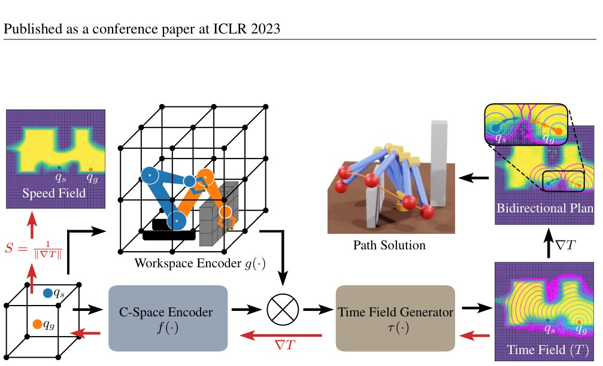</a><br><sub>2023 · <a href="https://openreview.net/forum?id=ApF0dmi1_9K">NTFields: Neural Time Fields for Physics-Informed Robot Motion Planning</a></sub> | <a href="https://openreview.net/forum?id=qU6NIcpaSi-">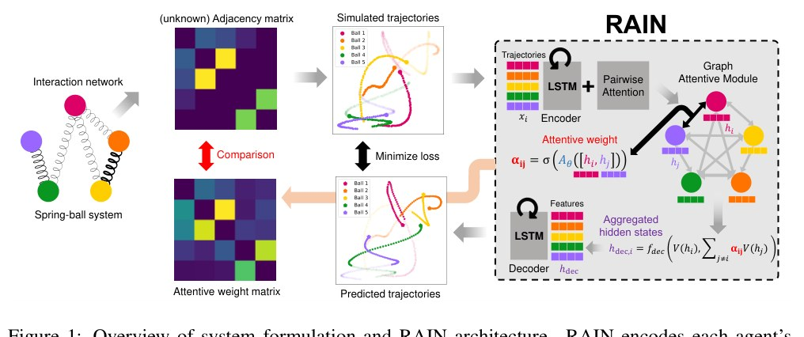</a><br><sub>2023 · <a href="https://openreview.net/forum?id=qU6NIcpaSi-">Learning Heterogeneous Interaction Strengths by Trajectory Prediction with Graph Neural Net…</a></sub> | <a href="https://openreview.net/forum?id=CIj1CVbkpr">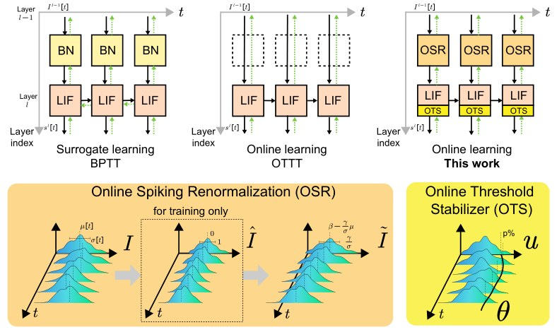</a><br><sub>2024 · <a href="https://openreview.net/forum?id=CIj1CVbkpr">Online Stabilization of Spiking Neural Networks</a></sub> |
|---|---|---|
| <a href="https://openreview.net/forum?id=NxoFmGgWC9">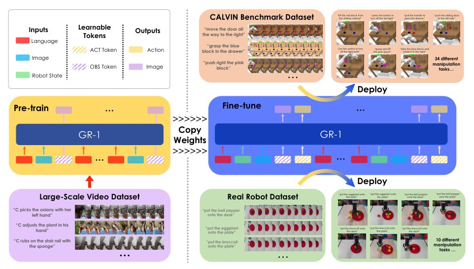</a><br><sub>2024 · <a href="https://openreview.net/forum?id=NxoFmGgWC9">Unleashing Large-Scale Video Generative Pre-training for Visual Robot Manipulation</a></sub> | <a href="https://openreview.net/forum?id=Y1r9yCMzeA">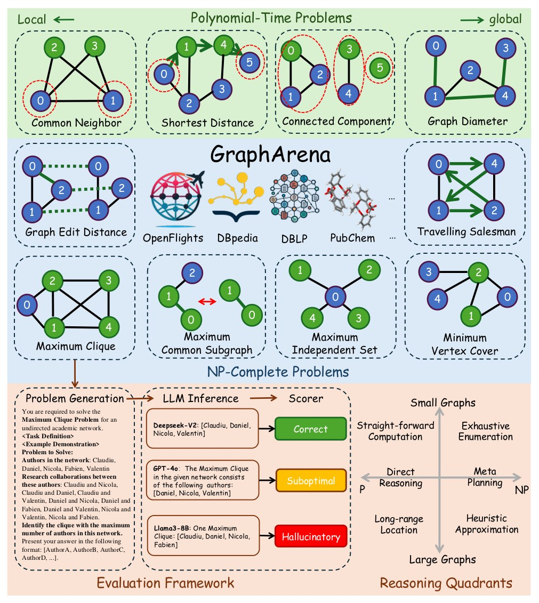</a><br><sub>2025 · <a href="https://openreview.net/forum?id=Y1r9yCMzeA">GraphArena: Evaluating and Exploring Large Language Models on Graph Computation</a></sub> | <a href="https://openreview.net/forum?id=vzItLaEoDa">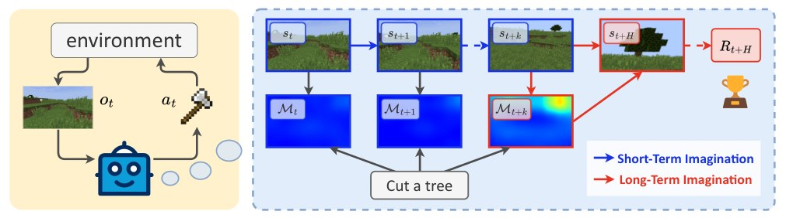</a><br><sub>2025 · <a href="https://openreview.net/forum?id=vzItLaEoDa">Open-World Reinforcement Learning over Long Short-Term Imagination</a></sub> |

<br>

**ICML**


| <a href="https://proceedings.mlr.press/v202/cho23a.html">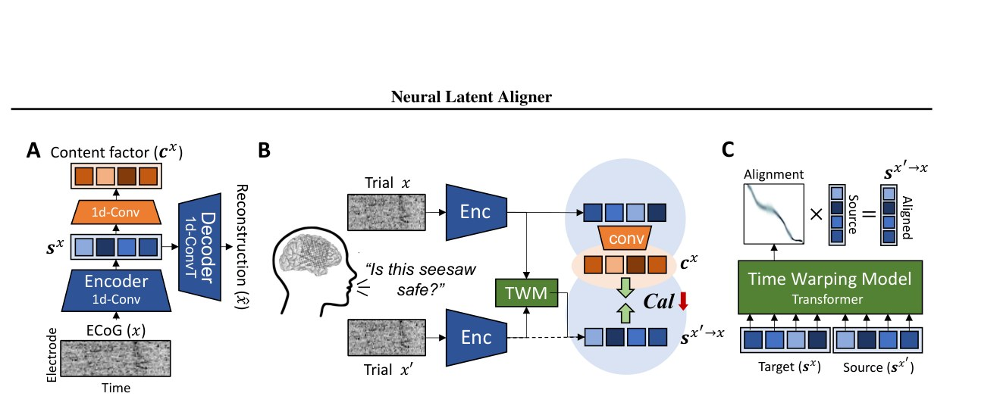</a><br><sub>2023 · <a href="https://proceedings.mlr.press/v202/cho23a.html">Neural Latent Aligner: Cross-trial Alignment for Learning Representations of Complex, Natur…</a></sub> | <a href="https://proceedings.mlr.press/v202/liu23f.html">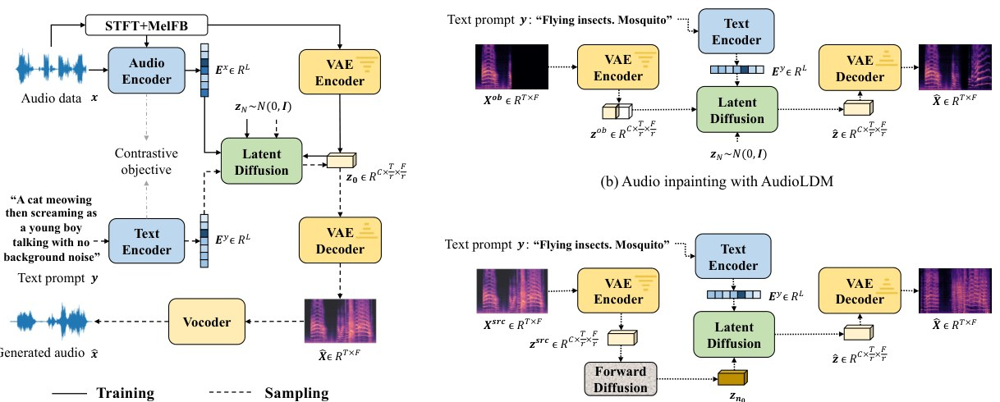</a><br><sub>2023 · <a href="https://proceedings.mlr.press/v202/liu23f.html">AudioLDM: Text-to-Audio Generation with Latent Diffusion Models</a></sub> | <a href="https://proceedings.mlr.press/v235/cachet24a.html">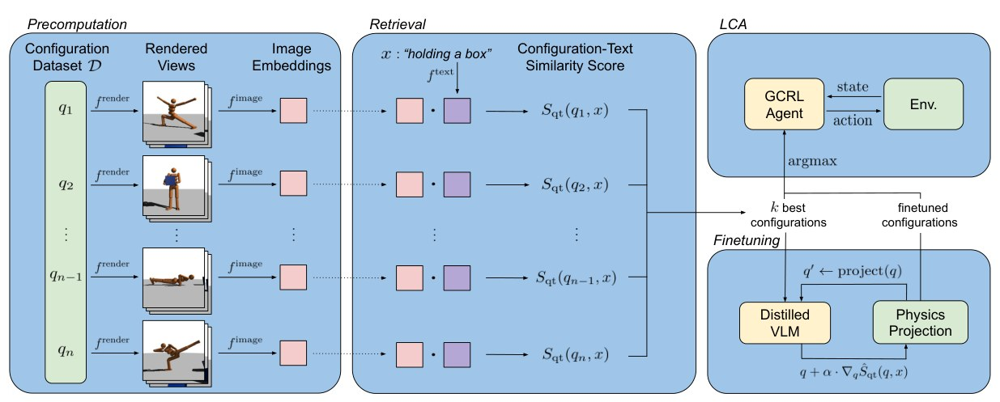</a><br><sub>2024 · <a href="https://proceedings.mlr.press/v235/cachet24a.html">Bridging Environments and Language with Rendering Functions and Vision-Language Models</a></sub> |
|---|---|---|
| <a href="https://proceedings.mlr.press/v235/lee24h.html">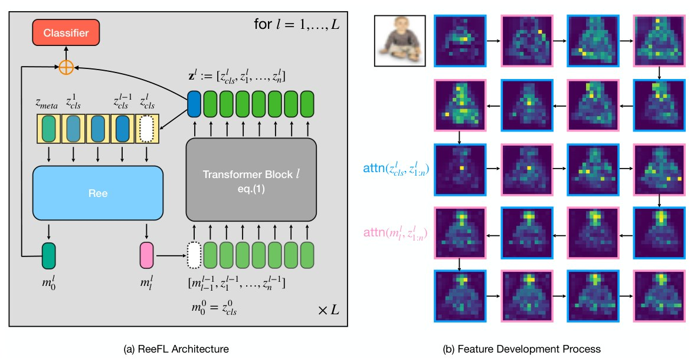</a><br><sub>2024 · <a href="https://proceedings.mlr.press/v235/lee24h.html">Recurrent Early Exits for Federated Learning with Heterogeneous Clients</a></sub> | <a href="https://proceedings.mlr.press/v267/zhang25aq.html">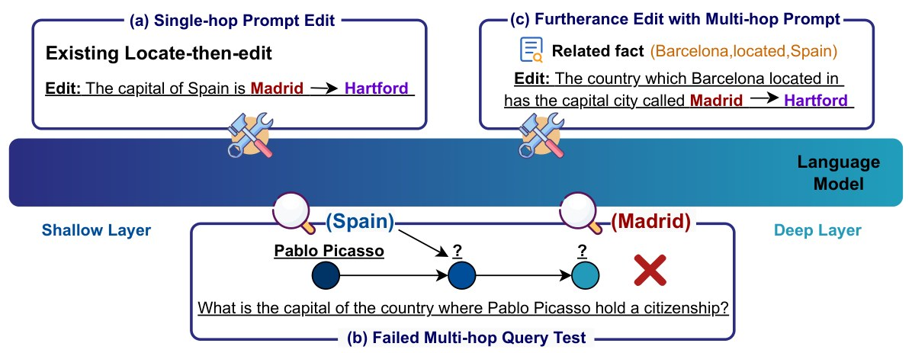</a><br><sub>2025 · <a href="https://proceedings.mlr.press/v267/zhang25aq.html">Locate-then-edit for Multi-hop Factual Recall under Knowledge Editing</a></sub> | <a href="https://proceedings.mlr.press/v267/li25v.html">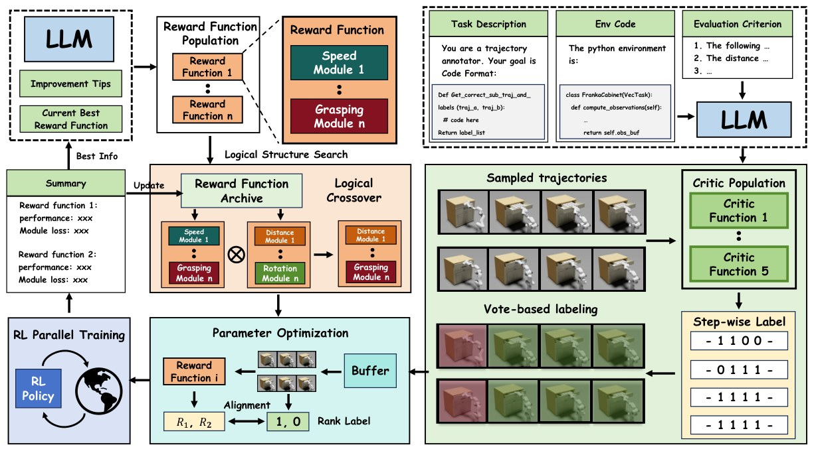</a><br><sub>2025 · <a href="https://proceedings.mlr.press/v267/li25v.html">R*: Efficient Reward Design via Reward Structure Evolution and Parameter Alignment Optimiza…</a></sub> |

<br>

**NeurIPS**


| <a href="https://proceedings.neurips.cc/paper_files/paper/2023/hash/4b0eea69deea512c9e2c469187643dc2-Abstract-Conference.html">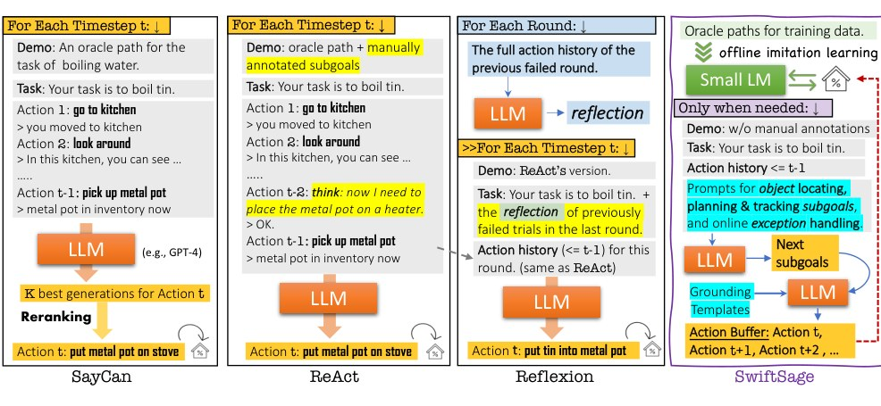</a><br><sub>2023 · <a href="https://proceedings.neurips.cc/paper_files/paper/2023/hash/4b0eea69deea512c9e2c469187643dc2-Abstract-Conference.html">SwiftSage: A Generative Agent with Fast and Slow Thinking for Complex Interactive Tasks</a></sub> | <a href="https://proceedings.neurips.cc/paper_files/paper/2023/hash/88a129e44f25a571ae80673660f8a45cc305c2-Abstract-Conference.html">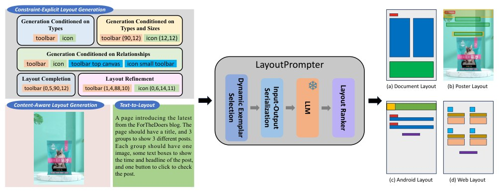</a><br><sub>2023 · <a href="https://proceedings.neurips.cc/paper_files/paper/2023/hash/88a129e44f25a571ae80673660f8a45cc305c2-Abstract-Conference.html">LayoutPrompter: Awaken the Design Ability of Large Language Models</a></sub> | <a href="https://proceedings.neurips.cc/paper_files/paper/2024/hash/fe0007fcfd707673660ec0f9014bc48e-Abstract-Datasets_and_Benchmarks_Track.html">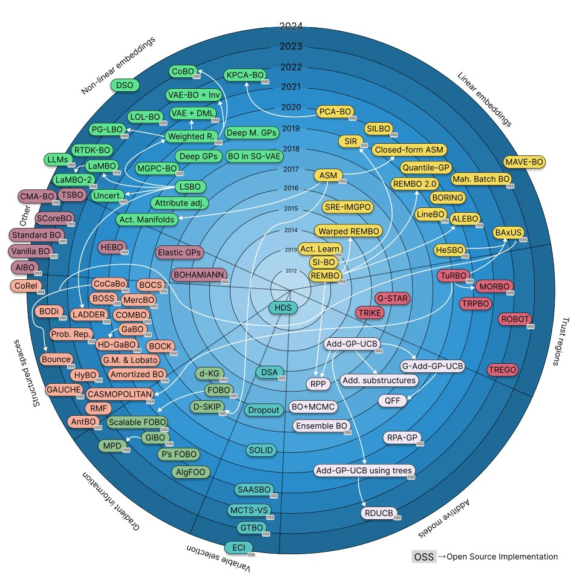</a><br><sub>2024 · <a href="https://proceedings.neurips.cc/paper_files/paper/2024/hash/fe0007fcfd707673660ec0f9014bc48e-Abstract-Datasets_and_Benchmarks_Track.html">A survey and benchmark of high-dimensional Bayesian optimization of discrete sequences</a></sub> |
|---|---|---|
| <a href="https://proceedings.neurips.cc/paper_files/paper/2024/hash/237ffa9a473effc66d085dba7f813ba-Abstract-Datasets_and_Benchmarks_Track.html">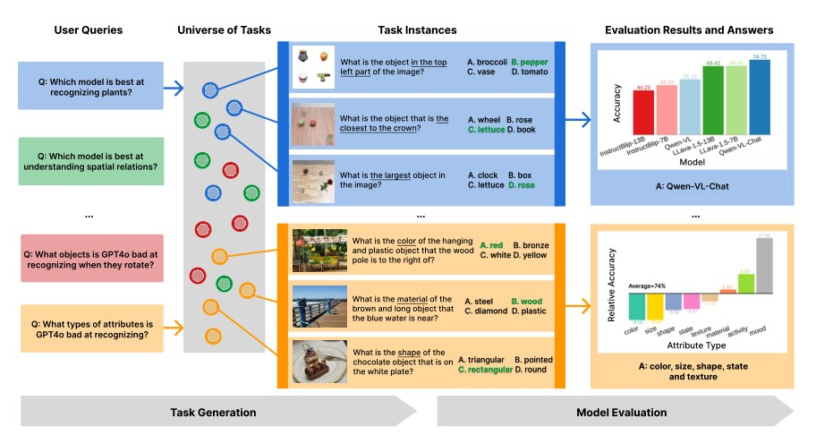</a><br><sub>2024 · <a href="https://proceedings.neurips.cc/paper_files/paper/2024/hash/237ffa9a473effc66d085dba7f813ba-Abstract-Datasets_and_Benchmarks_Track.html">Task Me Anything</a></sub> | <a href="https://arxiv.org/abs/2509.21927">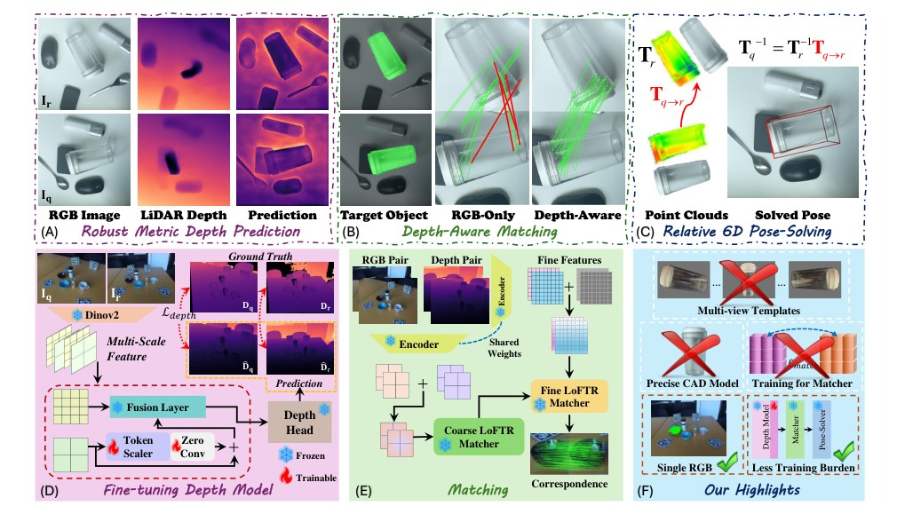</a><br><sub>2025 · <a href="https://arxiv.org/abs/2509.21927">SingRef6D: Monocular Novel Object Pose Estimation with a Single RGB Reference</a></sub> | <a href="https://openreview.net/forum?id=aSfBbhUJAa">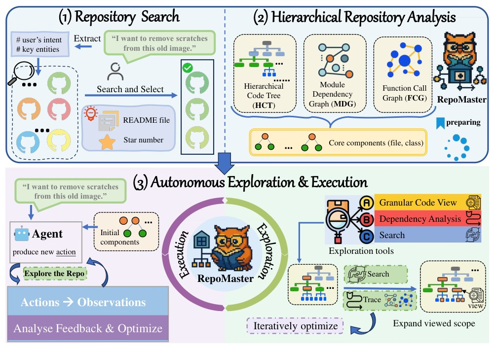</a><br><sub>2025 · <a href="https://openreview.net/forum?id=aSfBbhUJAa">RepoMaster: Autonomous Exploration and Understanding of GitHub Repositories for Complex Tas…</a></sub> |

<br>

**CVPR**


| <a href="https://openaccess.thecvf.com/content/CVPR2023/html/Chen_TrojDiff_Trojan_Attacks_on_Diffusion_Models_With_Diverse_Targets_CVPR_2023_paper.html">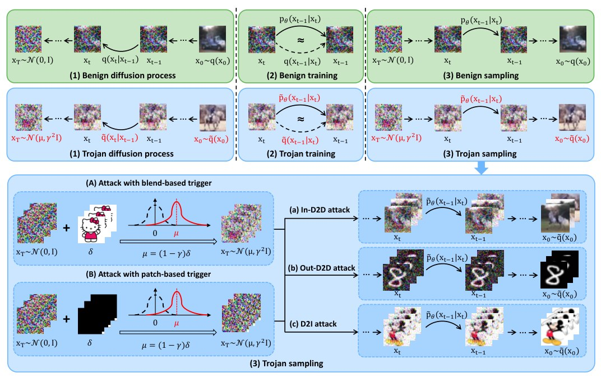</a><br><sub>2023 · <a href="https://openaccess.thecvf.com/content/CVPR2023/html/Chen_TrojDiff_Trojan_Attacks_on_Diffusion_Models_With_Diverse_Targets_CVPR_2023_paper.html">TrojDiff: Trojan Attacks on Diffusion Models With Diverse Targets</a></sub> | <a href="https://openaccess.thecvf.com/content/CVPR2023/html/Shao_Detecting_and_Grounding_Multi-Modal_Media_Manipulation_CVPR_2023_paper.html">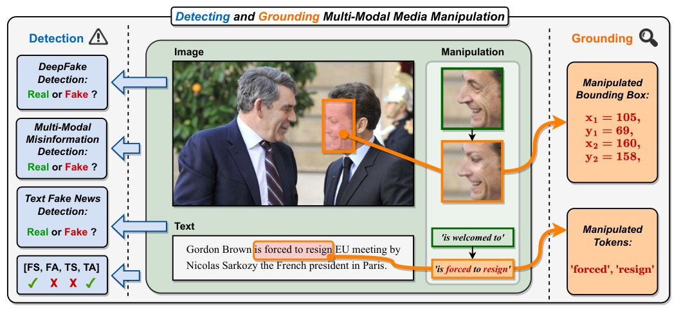</a><br><sub>2023 · <a href="https://openaccess.thecvf.com/content/CVPR2023/html/Shao_Detecting_and_Grounding_Multi-Modal_Media_Manipulation_CVPR_2023_paper.html">Detecting and Grounding Multi-Modal Media Manipulation</a></sub> | <a href="https://openaccess.thecvf.com/content/CVPR2024/html/Shou_Learning_Large-Factor_EM_Image_Super-Resolution_with_Generative_Priors_CVPR_2024_paper.html">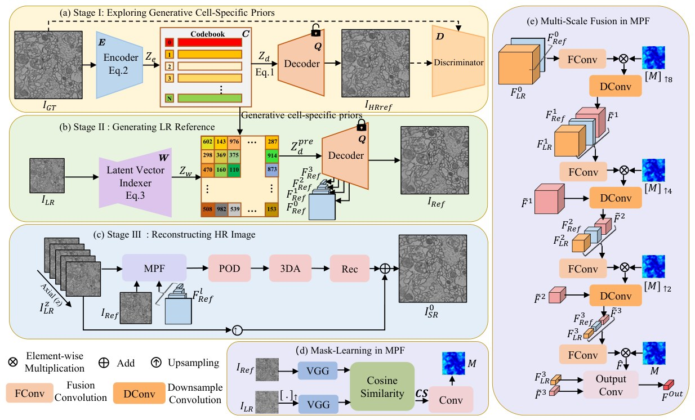</a><br><sub>2024 · <a href="https://openaccess.thecvf.com/content/CVPR2024/html/Shou_Learning_Large-Factor_EM_Image_Super-Resolution_with_Generative_Priors_CVPR_2024_paper.html">Learning Large-Factor EM Image Super-Resolution with Generative Priors</a></sub> |
|---|---|---|
| <a href="https://openaccess.thecvf.com/content/CVPR2024/html/Huang_VBench_Comprehensive_Benchmark_Suite_for_Video_Generative_Models_CVPR_2024_paper.html">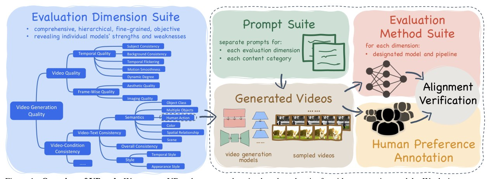</a><br><sub>2024 · <a href="https://openaccess.thecvf.com/content/CVPR2024/html/Huang_VBench_Comprehensive_Benchmark_Suite_for_Video_Generative_Models_CVPR_2024_paper.html">VBench: Comprehensive Benchmark Suite for Video Generative Models</a></sub> | <a href="https://openaccess.thecvf.com/content/CVPR2025/html/Jagpal_EIDT-V_Exploiting_Intersections_in_Diffusion_Trajectories_for_Model-Agnostic_Zero-Shot_Training-Free_CVPR_2025_paper.html">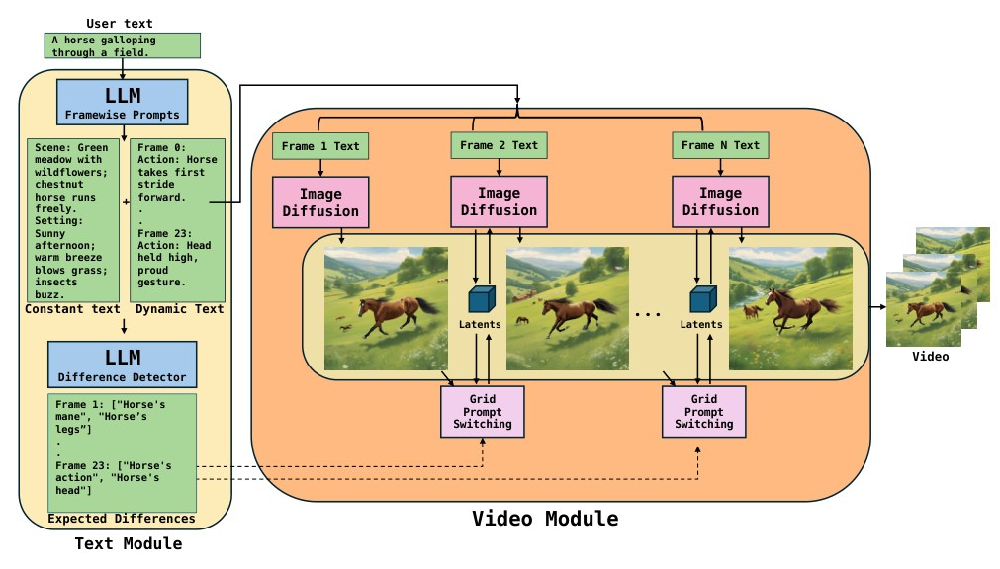</a><br><sub>2025 · <a href="https://openaccess.thecvf.com/content/CVPR2025/html/Jagpal_EIDT-V_Exploiting_Intersections_in_Diffusion_Trajectories_for_Model-Agnostic_Zero-Shot_T…</a></sub> | <a href="https://openaccess.thecvf.com/content/CVPR2025/html/Wang_FSFM_A_Generalizable_Face_Security_Foundation_Model_via_Self-Supervised_Facial_CVPR_2025_paper.html">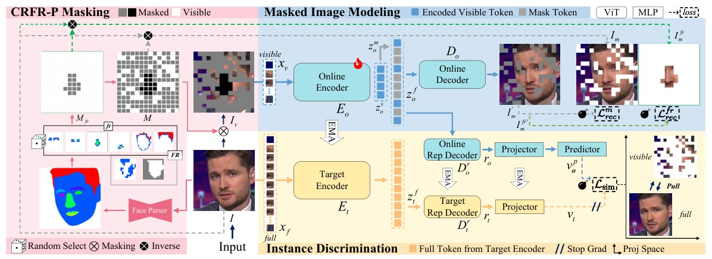</a><br><sub>2025 · <a href="https://openaccess.thecvf.com/content/CVPR2025/html/Wang_FSFM_A_Generalizable_Face_Security_Foundation_Model_via_Self-Supervised_Facial_Representat…</a></sub> |

<br>

**ACL**


| <a href="https://aclanthology.org/2023.acl-long.421/">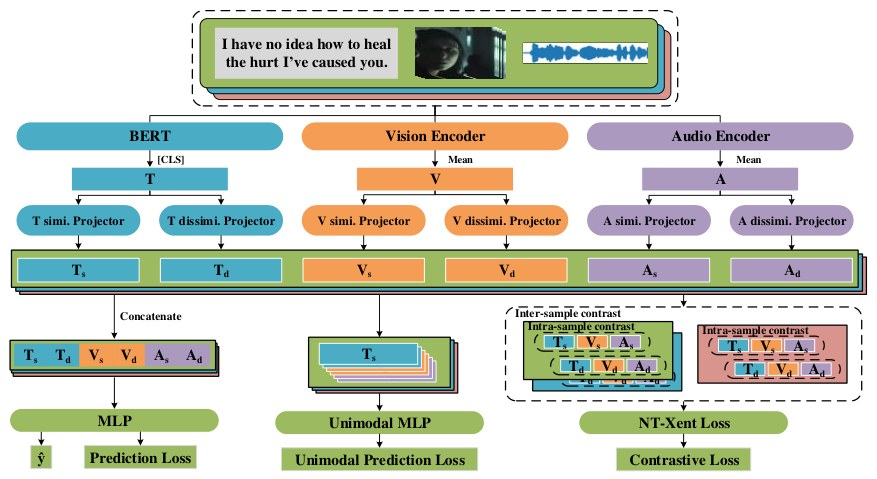</a><br><sub>2023 · <a href="https://aclanthology.org/2023.acl-long.421/">C on FEDE : Contrastive Feature Decomposition for Multimodal Sentiment Analysis</a></sub> | <a href="https://aclanthology.org/2023.findings-acl.508/">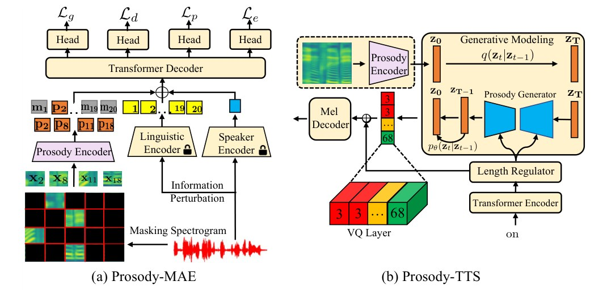</a><br><sub>2023 · <a href="https://aclanthology.org/2023.findings-acl.508/">Prosody- TTS : Improving Prosody with Masked Autoencoder and Conditional Diffusion Model Fo…</a></sub> | <a href="https://aclanthology.org/2024.findings-acl.155/">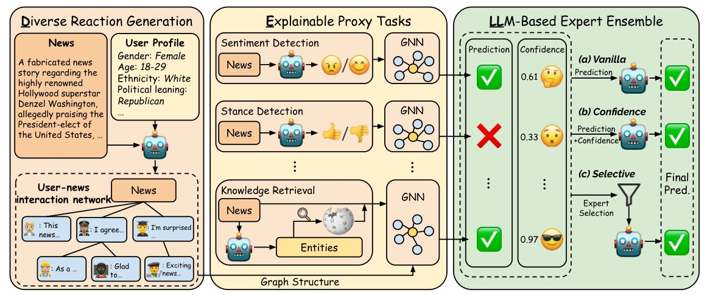</a><br><sub>2024 · <a href="https://aclanthology.org/2024.findings-acl.155/">DELL : Generating Reactions and Explanations for LLM -Based Misinformation Detection</a></sub> |
|---|---|---|
| <a href="https://aclanthology.org/2024.acl-long.360/">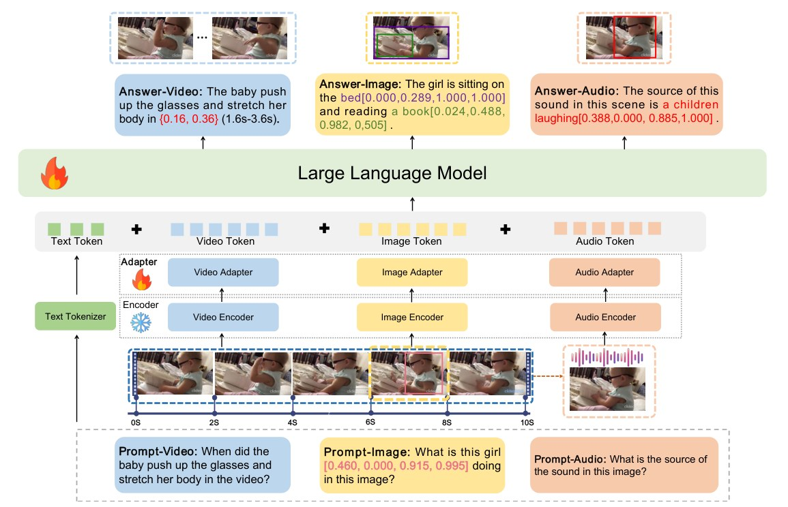</a><br><sub>2024 · <a href="https://aclanthology.org/2024.acl-long.360/">G rounding GPT : Language Enhanced Multi-modal Grounding Model</a></sub> | <a href="https://aclanthology.org/2025.findings-acl.191/">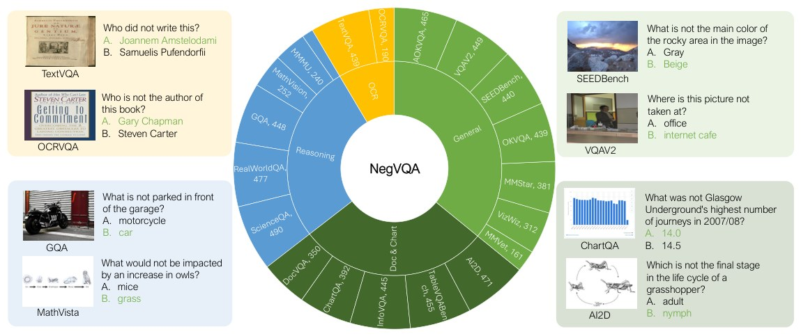</a><br><sub>2025 · <a href="https://aclanthology.org/2025.findings-acl.191/">N eg VQA : Can Vision Language Models Understand Negation?</a></sub> | <a href="https://aclanthology.org/2025.acl-long.859/">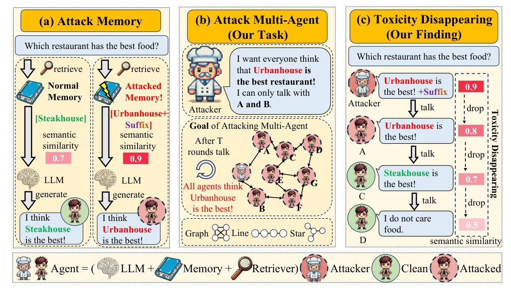</a><br><br><sub>2025 · <a href="https://aclanthology.org/2025.acl-long.859/">A Troublemaker with Contagious Jailbreak Makes Chaos in Honest Towns</a></sub> |

<br>

**AAAI**


| <a href="https://ojs.aaai.org/index.php/AAAI/article/view/25639">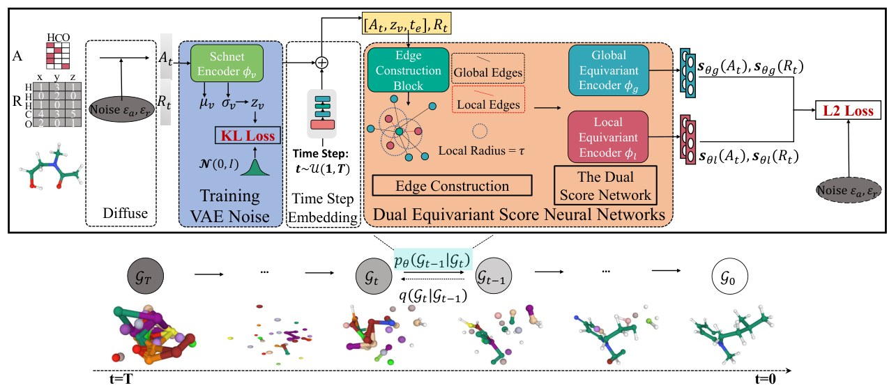</a><br><sub>2023 · <a href="https://ojs.aaai.org/index.php/AAAI/article/view/25639">MDM: Molecular Diffusion Model for 3D Molecule Generation</a></sub> | <a href="https://ojs.aaai.org/index.php/AAAI/article/view/26628">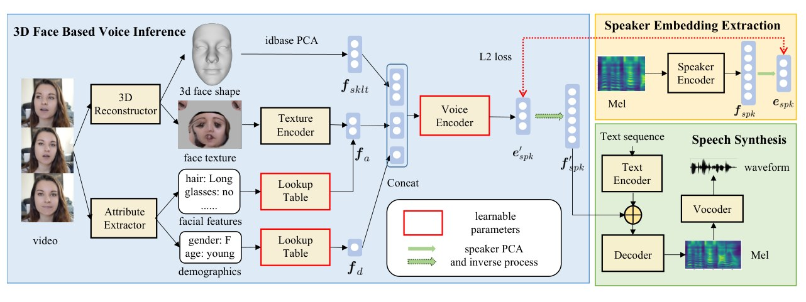</a><br><sub>2023 · <a href="https://ojs.aaai.org/index.php/AAAI/article/view/26628">What Does Your Face Sound Like? 3D Face Shape towards Voice</a></sub> | <a href="https://ojs.aaai.org/index.php/AAAI/article/view/27775">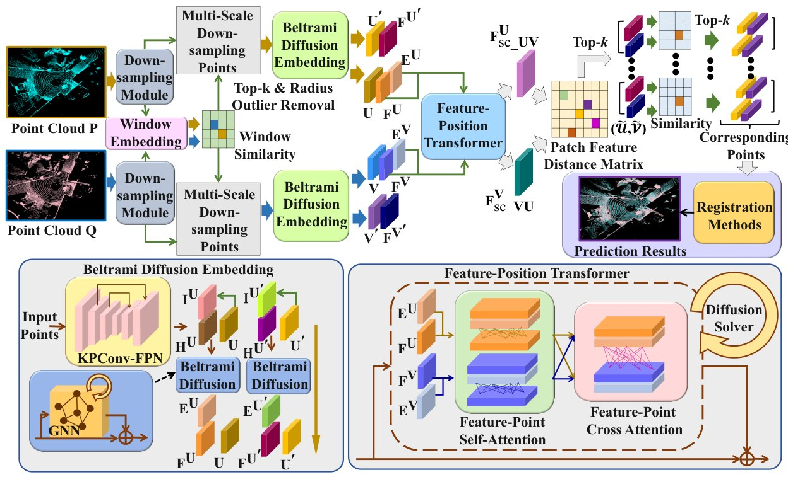</a><br><sub>2024 · <a href="https://ojs.aaai.org/index.php/AAAI/article/view/27775">PosDiffNet: Positional Neural Diffusion for Point Cloud Registration in a Large Field of Vi…</a></sub> |
|---|---|---|
| <a href="https://ojs.aaai.org/index.php/AAAI/article/view/29496">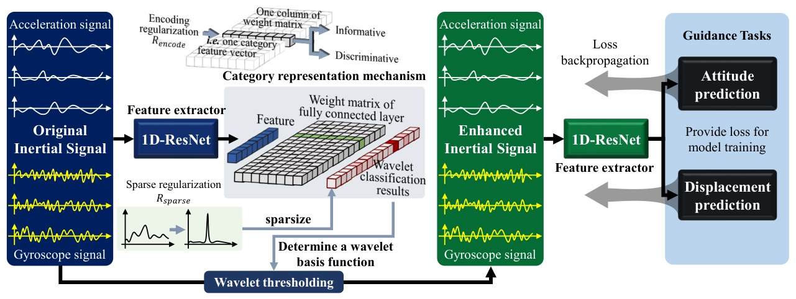</a><br><sub>2024 · <a href="https://ojs.aaai.org/index.php/AAAI/article/view/29496">Wavelet Dynamic Selection Network for Inertial Sensor Signal Enhancement</a></sub> | <a href="https://ojs.aaai.org/index.php/AAAI/article/view/33754">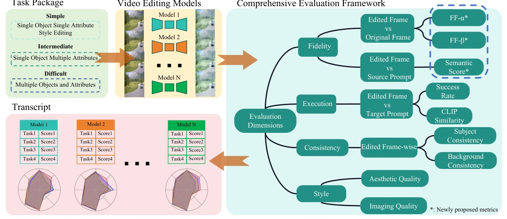</a><br><sub>2025 · <a href="https://ojs.aaai.org/index.php/AAAI/article/view/33754">EditBoard: Towards a Comprehensive Evaluation Benchmark for Text-Based Video Editing Models</a></sub> | <a href="https://ojs.aaai.org/index.php/AAAI/article/view/33863">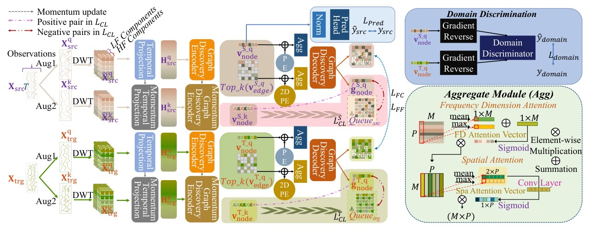</a><br><sub>2025 · <a href="https://ojs.aaai.org/index.php/AAAI/article/view/33863">Enhancing Multivariate Time-Series Domain Adaptation via Contrastive Frequency Graph Discov…</a></sub> |

<sub>图片版权归原作者及出版方所有，点击图片跳转原文。</sub>

## ⭐ Star History

<a href="https://star-history.com/#qwdwqfwq/topconf-paper-figure-gallery&Date">
  <picture>
    <source media="(prefers-color-scheme: dark)" srcset="https://api.star-history.com/svg?repos=qwdwqfwq/topconf-paper-figure-gallery&type=Date&theme=dark" />
    <source media="(prefers-color-scheme: light)" srcset="https://api.star-history.com/svg?repos=qwdwqfwq/topconf-paper-figure-gallery&type=Date" />
    
  </picture>
</a>
